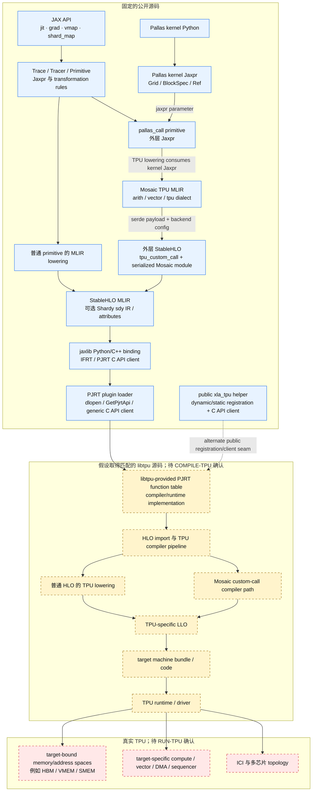
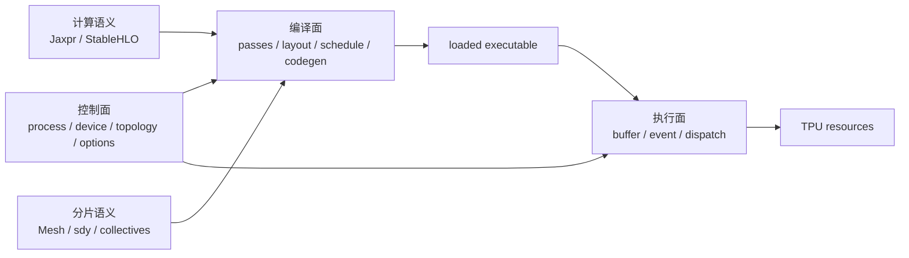

# JAX 到 TPU 的全栈地图

本文给刚进入 JAX 软件栈的 kernel 开发者一张导航图。分析从 JAX API
开始，到 TPU-specific LLO、机器码和硬件资源为止；Tokamax 和自研框架接入后只
提供 JAX/Pallas workload，不进入本文的框架层分析。概念定义见
[JAX→TPU 术语表](../index/glossary.md)，当前外部输入状态见
[`manifests/baseline.json`](../../manifests/baseline.json)。

## 证据边界

本文使用[证据约定](../contributing/evidence-conventions.md)中的六级证据；图中的静态
源码结论主要是 `SOURCE-ONLY`，未来的编译和设备结论分别需要 `COMPILE-TPU` 和
`RUN-TPU`。`VERSION-SKEW` 是来源限定，不是证据等级。

当前公开源码基线为 JAX `5832e866...`、XLA `496bd4bd...`、StableHLO
`7b1b1578...` 和 Shardy `eb23a983...`。当前 CPU 环境使用
`jaxlib==0.11.1`，不能为固定 XLA commit 提供严格的二进制执行证据。本文的固定
源码结论是 **证据：SOURCE-ONLY**；若引用当前 wheel 的运行结果，证据等级应为
`RUN-CPU`，并附 `VERSION-SKEW` qualifier。版本详情见
[执行计划的基线表](../../PLAN.md#3-当前固定基线)。

## 总图

图中蓝色部分有本仓库固定的公开源码，包括 plugin loader、generic PJRT C API client、
TPU adapter 与 C ABI glue；这些代码只定义装载和调用边界。黄色部分从 libtpu 实际
提供的函数表及其实现开始，项目取得匹配源码后再逐项确认；其中内部箭头只表示研究
假设，不声称私有实现一定采用这些阶段名或顺序。红色部分必须由目标 TPU 的可执行
产物、profile 和设备信息证明。

## 两条路径在哪里分开

普通 JAX 运算和 Pallas kernel 共用 JAX transformation、外层 StableHLO、
PJRT 及设备 runtime，但它们进入 TPU code generation 前的 kernel 表示不同。

| 路径 | JAX 侧输入 | 最后一个公开可读的主要表示 | libtpu 入口处要保留的观察面 |
|---|---|---|---|
| [普通 XLA/TPU 路径](01-regular-xla-tpu-path.md) | 普通 primitive 组成的 transformed Jaxpr | StableHLO 与 sharding metadata | 输入模块、compile options、HLO dumps |
| [Pallas/Mosaic TPU 路径](02-pallas-mosaic-tpu-path.md) | 外层 `pallas_call` 及其内层 kernel Jaxpr | Mosaic TPU MLIR，封装在外层 custom call 中 | 外层 HLO custom call 与内层 Mosaic module |

`pallas_call` 的平台分派在
[pallas_call.py](../../upstream/jax/jax/_src/pallas/pallas_call.py)，TPU rule 在
[pallas_call_registration.py](../../upstream/jax/jax/_src/pallas/mosaic/pallas_call_registration.py)。
后者明确构造 Mosaic module，再交给 `tpu_custom_call` 封装。
**证据：SOURCE-ONLY。**

Mosaic TPU dialect 是 Pallas kernel 的公开、机器相关 MLIR 表示；它不是 LLO。
本仓库的公开定义位于
[XLA Mosaic TPU dialect](../../upstream/xla/xla/mosaic/dialect/tpu/)及
[JAXlib 转接目录](../../upstream/jax/jaxlib/mosaic/dialect/tpu/)。
**证据：SOURCE-ONLY。**

LLO 目前只作为项目要追踪的 TPU-specific 层级出现。公开树的
[compiler interface](../../upstream/xla/xla/service/compiler.h)与
[Mosaic error guide](../../upstream/xla/docs/errors/error_3000.md)可以核验 low level
optimization/optimizer 的名称、阶段边界和部分 dump 入口，但没有给出 TPU LLO 的
schema、parser、printer、完整 pass pipeline 或 bundle encoding。任何具体 LLO
opcode、pass 名称、HLO-to-LLO 调用链和机器编码都必须在固定 libtpu 源码与 target
上重新取证。
**待验证：COMPILE-TPU。**

## 公开源码的锚点

| 层 | 固定源码入口 | 能由源码确认的内容 | 证据 |
|---|---|---|---|
| API | [api.py](../../upstream/jax/jax/_src/api.py) | `jit`、`grad`、`vmap`、`make_jaxpr` 的 Python 入口 | `SOURCE-ONLY` |
| JAX IR | [core.py](../../upstream/jax/jax/_src/core.py) | `Primitive`、`Trace`、`Tracer`、`Jaxpr` 的数据模型 | `SOURCE-ONLY` |
| transformation rules | [ad.py](../../upstream/jax/jax/_src/interpreters/ad.py)、[batching.py](../../upstream/jax/jax/_src/interpreters/batching.py)、[partial_eval.py](../../upstream/jax/jax/_src/interpreters/partial_eval.py) | AD、batching 与 staging 的解释规则和 registry | `SOURCE-ONLY` |
| JAX MLIR lowering | [mlir.py](../../upstream/jax/jax/_src/interpreters/mlir.py) | Jaxpr lowering context、platform rule dispatch、StableHLO module 构造 | `SOURCE-ONLY` |
| StableHLO | [StableHLO dialect](../../upstream/stablehlo/stablehlo/dialect/) | 可移植 operation、type、verifier 与 bytecode/compatibility 层 | `SOURCE-ONLY` |
| Shardy | [sdy dialect](../../upstream/shardy/shardy/dialect/sdy/ir/)、[transforms](../../upstream/shardy/shardy/dialect/sdy/transforms/) | mesh、tensor sharding、constraint、传播与 import/export passes | `SOURCE-ONLY` |
| compile dispatch | [compiler.py](../../upstream/jax/jax/_src/compiler.py) | compile options、cache 与 `backend.compile_and_load` 调用 | `SOURCE-ONLY` |
| TPU backend discovery | [xla_bridge.py](../../upstream/jax/jax/_src/xla_bridge.py) | 动态加载 `libtpu.so`、初始化 `tpu` PJRT plugin、创建 C API client | `SOURCE-ONLY` |
| PJRT ABI | [pjrt_c_api.h](../../upstream/xla/xla/pjrt/c/pjrt_c_api.h)、[C API client](../../upstream/xla/xla/pjrt/c_api_client/) | client、program、compile、executable、buffer、event 的公开 ABI 和 adapter | `SOURCE-ONLY` |
| PJRT plugin loader | [pjrt_api.cc](../../upstream/xla/xla/pjrt/pjrt_api.cc) | `dlopen`、`GetPjrtApi` 查找与函数表注册 | `SOURCE-ONLY` |
| public TPU adapters | [xla_tpu](../../upstream/xla/xla/pjrt/plugin/xla_tpu/)、[xla/tpu](../../upstream/xla/xla/tpu/) | 公开 C++ client 入口、C ABI 声明和初始化 glue；不包含 libtpu compiler 实现 | `SOURCE-ONLY` |
| Pallas | [pallas_call.py](../../upstream/jax/jax/_src/pallas/pallas_call.py)、[core.py](../../upstream/jax/jax/_src/pallas/core.py) | kernel tracing、Grid、BlockSpec、Ref 与 `pallas_call` primitive | `SOURCE-ONLY` |
| Mosaic lowering | [lowering.py](../../upstream/jax/jax/_src/pallas/mosaic/lowering.py) | kernel Jaxpr 到 Mosaic module 的 lowering rules | `SOURCE-ONLY` |
| Mosaic transport | [tpu_custom_call.py](../../upstream/jax/jax/_src/tpu_custom_call.py) | serde、backend config 与外层 `tpu_custom_call` 构造 | `SOURCE-ONLY` |

上述表只证明代码中存在这些接口；`SOURCE-ONLY` 不声称当前 Python 进程执行了表中的
C++ 实现。在 source-built jaxlib 完成前，任何当前 wheel 的运行 probe 都应标为
`RUN-CPU` 并附 `VERSION-SKEW` qualifier。

## 编译面、执行面与控制面的关系

详细的初始化、compile、load、execute、buffer 与 event 链见
[JAX、IFRT、PJRT 与 TPU runtime 控制面](03-runtime-control-plane.md)。

`Mesh` 或 `PartitionSpec` 表达逻辑分片，PJRT topology/device assignment 描述目标
设备，compiler pass 改写计算或调度。它们都不等于物理 TPU topology。公开 Shardy
IR 已定义 mesh、sharding 和 collective operations。
**证据：SOURCE-ONLY。** 物理链路选择、实际 collective 时序和 ICI 利用率仍需设备
profile。**待验证：RUN-TPU。**

## 每层应该保存什么

| 边界 | 最小归档产物 | 当前能否取得 |
|---|---|---|
| Python → Jaxpr | 输入 pytree/aval、Jaxpr、effects、source info | CPU 可取得；未来标 `RUN-CPU` |
| Jaxpr → StableHLO | MLIR text/bytecode、platforms、sharding attrs | CPU 可取得；TPU 定向 export 需单独 probe |
| StableHLO → PJRT | program bytes、format、compile options、device assignment、cache key | 公开接口可读；运行证据待补 |
| PJRT → libtpu | plugin ABI/version、build ID、compile request/response | 需固定 libtpu；`COMPILE-TPU` |
| HLO pipeline | before/after pass HLO、scheduled HLO、layout、buffer assignment | 需匹配 TPU compiler；`COMPILE-TPU` |
| Mosaic custom call | 外层 HLO、backend config、解出的 Mosaic MLIR | 公开部分可静态生成；libtpu 消费过程待补 |
| LLO | schema/version、text/proto、pass trace、source lineage | 当前不可取得；`COMPILE-TPU` |
| bundle/runtime | bundle metadata、load/launch trace、events | compiler 部分 `COMPILE-TPU`，运行部分 `RUN-TPU` |
| hardware | XProf trace、memory profile、collective trace、counters | 只能 `RUN-TPU` |

## 当前不可作出的结论

- CPU 数值一致不能证明 TPU layout、时序、memory placement、collective 或性能一致。
- Pallas interpreter 能验证部分语义和 race，不是 TPU cycle-accurate simulator。
- 公开的 PJRT ABI 不能证明 libtpu 内部类、pass 顺序或线程模型。
- Mosaic MLIR 的 operation 不能未经 libtpu 证据直接映射为某条 LLO 或目标机器指令。
- 编译得到可执行文件仍不能证明真实 TPU 上的数值、通信和性能；前者是
  `COMPILE-TPU`，后者是 `RUN-TPU`。

这些限制是证据边界，不是待用推测填充的空白。
