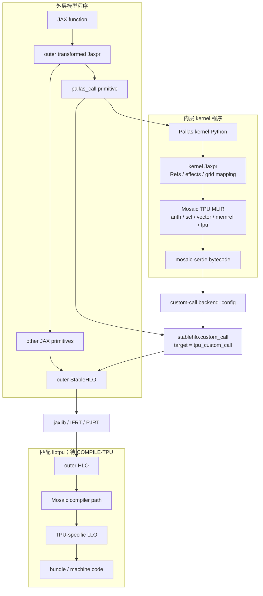
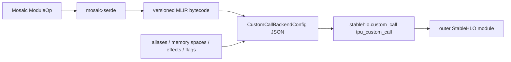

# Pallas/Mosaic 到 TPU 的编译路径

本文从一个 `pallas_call` 开始，同时追踪两个程序：调用 kernel 的外层 JAX 程序，
以及描述单个 kernel 的内层 Pallas Jaxpr。只看其中一层，会丢失 sharding、custom
call、memory space 或 kernel operation 的来源。

## 边界与证据

Pallas tracing、Mosaic lowering、TPU dialect、serde 和 `tpu_custom_call` 在本仓库有
固定公开源码，以下相应结论标为 `SOURCE-ONLY`。libtpu 如何消费 Mosaic payload、
如何生成 LLO 和 bundle 需要 `COMPILE-TPU`；真实 memory/compute/communication 行为
需要 `RUN-TPU`。当前 wheel 与源码 commit 不一致，尚有 `VERSION-SKEW`。标签定义见
[全栈地图](00-whole-stack.md#证据边界)。

## 双层程序图

外层 `pallas_call` 是一个 JAX primitive；内层 kernel 是该 primitive 参数携带的
Jaxpr。`pallas_call` 的定义、abstract evaluation、transformation rules 和平台
lowering dispatch 位于
[pallas_call.py](../../upstream/jax/jax/_src/pallas/pallas_call.py)。
**证据：SOURCE-ONLY。**

## 1. Python kernel 到 Pallas kernel Jaxpr

`pallas_call` 接收 kernel、`GridSpec`/grid、输入输出 `BlockSpec`、scratch、alias、
compiler params 等信息。构造调用时，JAX 追踪 kernel 并把数组窗口表示为 `Ref`；
最终外层 primitive 的参数包含 kernel Jaxpr 和 `GridMapping`。

固定源码入口：

- `pallas_call` primitive 与 wrapper：
  [pallas_call.py](../../upstream/jax/jax/_src/pallas/pallas_call.py)；
- `GridSpec`、`GridMapping`、`BlockSpec`、memory space 与 compiler params：
  [pallas/core.py](../../upstream/jax/jax/_src/pallas/core.py)；
- load/store、program id、atomic 等 Pallas primitives：
  [pallas/primitives.py](../../upstream/jax/jax/_src/pallas/primitives.py)；
- TPU-specific compiler params、memory spaces 与 core types：
  [mosaic/core.py](../../upstream/jax/jax/_src/pallas/mosaic/core.py)。

这些源码证明外层/内层 Jaxpr 的结构关系，但具体 Tokamax kernel 的 grid、blocks、
effects 和 aliases 要由固定 workload capture 给出。**证据：SOURCE-ONLY。**

### 需要同时保存的 Jaxpr

| 观察面 | 应看到什么 | 用途 |
|---|---|---|
| outer Jaxpr | `pallas_call` equation、global input/output avals、sharding context | 解释模型图中的调用位置和跨 kernel 数据流 |
| kernel Jaxpr | Ref avals、load/store、indexing、program ids、DMA/semaphore effects | 解释单个 program instance 的操作与同步 |
| transformed outer Jaxpr | `jit`/AD/batching/sharding 后的 `pallas_call` | 判断 transformation 是否保留、复制或拒绝 kernel call |

不要把“outer Jaxpr 中只有一个 `pallas_call` equation”误解为 kernel 只有一个硬件
operation；kernel 的细节在内层 Jaxpr。**证据：SOURCE-ONLY。**

## 2. 平台分派与解释模式

通用 `_pallas_call_lowering` 按 platform 和 `interpret` 参数选择路径；TPU 编译规则
由 Pallas backend registry 连接到
`pallas_call_tpu_lowering_rule`。注册和分派分别见
[pallas_call.py](../../upstream/jax/jax/_src/pallas/pallas_call.py)与
[pallas_call_registration.py](../../upstream/jax/jax/_src/pallas/mosaic/pallas_call_registration.py)。
**证据：SOURCE-ONLY。**

无 TPU 时有两类重要替代路径：

| 模式 | 公开实现 | 能验证 | 不能验证 |
|---|---|---|---|
| HLO interpret | [hlo_interpreter.py](../../upstream/jax/jax/_src/pallas/hlo_interpreter.py) | kernel 函数语义、索引和小 shape 数值 | Mosaic lowering、TPU layout、DMA/时序 |
| TPU interpret | [mosaic/interpret](../../upstream/jax/jax/_src/pallas/mosaic/interpret/) | 模拟 HBM/VMEM 等 memory、DMA、semaphore/barrier、部分 race | cycle timing、实际容量冲突、compiler scheduling、硬件 bug |

TPU interpret 在 CPU 上模拟 TPU 概念，结果将来应标 `SIM-TPU`，不能标
`RUN-TPU`。其参数与边界在
[interpret/params.py](../../upstream/jax/jax/_src/pallas/mosaic/interpret/params.py)
中明确说明。**证据：SOURCE-ONLY。**

## 3. Kernel Jaxpr 到 Mosaic TPU MLIR

TPU lowering rule 调用
`lower_jaxpr_to_pipelined_module`，后者为 kernel 建立 MLIR module/function，遍历
kernel Jaxpr，并从 Pallas primitive registry 选择 Mosaic lowering rule。入口位于：

- TPU `pallas_call` rule：
  [pallas_call_registration.py](../../upstream/jax/jax/_src/pallas/mosaic/pallas_call_registration.py)；
- module/function 和 equation lowering：
  [mosaic/lowering.py](../../upstream/jax/jax/_src/pallas/mosaic/lowering.py)；
- DMA、semaphore、layout 等 TPU primitives：
  [mosaic/primitives.py](../../upstream/jax/jax/_src/pallas/mosaic/primitives.py)；
- pipeline helpers：
  [mosaic/pipeline.py](../../upstream/jax/jax/_src/pallas/mosaic/pipeline.py)。

`mosaic/lowering.py` 有独立的 primitive-to-MLIR rule registry，并包含 load/store、
dot、vector、DMA、semaphore 等 rules。它不是普通 JAX Jaxpr 到 StableHLO 的
`mlir.py` registry。**证据：SOURCE-ONLY。**

Mosaic module 可以混合通用 MLIR dialect 与 TPU dialect。TPU dialect 的 operation、
type、enum 和 verifier 定义在
[xla/mosaic/dialect/tpu](../../upstream/xla/xla/mosaic/dialect/tpu/)；JAXlib 中的
[对应目录](../../upstream/jax/jaxlib/mosaic/dialect/tpu/)提供构建和兼容转接。
**证据：SOURCE-ONLY。**

### Mosaic 不是 LLO

Mosaic TPU MLIR 是当前公开源码能逐 op 阅读、验证和序列化的 kernel IR。当前树中
没有 LLO dialect、LLO schema、LLO parser/printer 或 Mosaic-to-LLO implementation。
所以不能把一个 `tpu.*` operation 直接命名为 LLO instruction，也不能从 MLIR 文本
推断最终 VLIW bundle。**证据：SOURCE-ONLY。**

Mosaic operation 到 LLO、LLO pass 和 bundle 的对应关系需要匹配 libtpu 源码、
固定 target 与 compiler dumps。**待验证：COMPILE-TPU。**

## 4. Serde 与外层 `tpu_custom_call`

Mosaic module 不作为另一个顶层 PJRT program 独立提交。公开代码先运行
`mosaic-serde`，写为 MLIR bytecode，再把 base64 payload、memory/communication
配置、alias、side-effect 等字段放入 custom call backend config；外层 JAX MLIR
lowering生成 call target `tpu_custom_call`。

实现锚点：

- serde pass：
  [serde.cc](../../upstream/xla/xla/mosaic/dialect/tpu/transforms/serde.cc)；
- `CustomCallBackendConfig`、`_lower_mosaic_module_to_asm`、
  `_tpu_custom_call_lowering` 和 `as_tpu_kernel`：
  [tpu_custom_call.py](../../upstream/jax/jax/_src/tpu_custom_call.py)；
- Pallas 参数到 custom call 的连接：
  [pallas_call_registration.py](../../upstream/jax/jax/_src/pallas/mosaic/pallas_call_registration.py)。

这些源码证明 payload 的公开生成与封装方式。**证据：SOURCE-ONLY。** libtpu 对
serde version、backend config 和每个字段的消费逻辑尚未固定。**待验证：COMPILE-TPU。**

### Sharding 与通信边界

`_tpu_custom_call_lowering` 对多设备 axis context 有显式约束，并在不能自动 partition
时要求调用方使用 `shard_map`；backend config 还携带 communication、collective id
和 side-effect 信息。具体条件见
[tpu_custom_call.py](../../upstream/jax/jax/_src/tpu_custom_call.py)。
**证据：SOURCE-ONLY。**

这说明外层 sharding 和内层 kernel 通信必须分开记录：

- 外层 Shardy/HLO 决定 arrays 如何分片及 custom call 位于哪些 devices；
- 内层 Mosaic kernel 可以包含其支持的 DMA、semaphore、barrier 或 collective 语义；
- 真实 device assignment、collective route 和 ICI 时序不能由 backend config 单独证明。

最后一项必须由 trace/profile 取得。**待验证：RUN-TPU。**

## 5. libtpu 中需要闭合的路径

公开源码只证明外层 PJRT program 携带一个 `tpu_custom_call` 及序列化 Mosaic module。
取得 libtpu 后要查明，而不是预设：

1. custom call 在 HLO import、optimization、fusion、layout 和 scheduling 的哪个阶段识别；
2. Mosaic module 在何处反序列化、verify 和升级/降级；
3. 哪些 HLO passes 可以改写 custom call 的 operands、aliases 或 placement；
4. 哪些 Mosaic passes 决定 vector layout、tiling、memory allocation 和 schedule；
5. Mosaic IR 如何映射到目标代际的 LLO；
6. LLO 如何验证、优化和打包为 executable bundle；
7. source locations、kernel name 和 metadata 如何保留到 LLO/profile。

每个答案都应附 libtpu source commit、symbol、caller/callee、pass dump 与 target manifest。
在此之前统一标记为 **待验证：COMPILE-TPU。**

## 6. 修改 kernel 或计算图的插入层级

| 修改目标 | 合适入口 | 公开源码例子 | 验证重点 |
|---|---|---|---|
| 模型中是否调用某 kernel | 外层 Python/Jaxpr 或普通 HLO pass | [xla_transform_test.py](../../upstream/jax/tests/xla_transform_test.py) | sharding、alias、effects、数值、cache |
| Pallas block/grid/indexing | Pallas Python、`BlockSpec`、kernel Jaxpr | [pallas_call.py](../../upstream/jax/jax/_src/pallas/pallas_call.py) | window、bounds、program ids、数值 |
| primitive 到 Mosaic op | Mosaic lowering rule | [mosaic/lowering.py](../../upstream/jax/jax/_src/pallas/mosaic/lowering.py) | types、layouts、memory spaces、verifier |
| Mosaic graph canonicalization | MLIR rewrite/pass，位于 serde 前 | [TPU dialect transforms](../../upstream/xla/xla/mosaic/dialect/tpu/transforms/) | round-trip、IR version、semantic equivalence |
| 外层 custom call 调度 | HLO transform/pass | [jax.extend.xla](../../upstream/jax/jax/extend/xla.py) | schedule、dependencies、side effects |
| LLO 或 bundle | libtpu pass | 当前无公开实现 | target-specific legality 与 codegen |

前三类可先在 CPU 上建立 `SOURCE-ONLY`、`RUN-CPU` 或 `SIM-TPU` 闭环。HLO 的 TPU
hook 和最后一类需要 `COMPILE-TPU`；最终 kernel 数值和性能仍需 `RUN-TPU`。

## 离线验证矩阵

| 产物或行为 | 当前无 TPU环境 | 匹配 libtpu、无设备 | 真实 TPU |
|---|---|---|---|
| outer/kernel Jaxpr | 可生成并断言 | 同左 | 与实际 workload 对照 |
| HLO interpret 数值 | 可运行 | 同左 | 只作 golden |
| TPU interpret memory/race | 可模拟，标 `SIM-TPU` | 同左 | 与真实失败对照 |
| Mosaic TPU MLIR | 可静态生成、verify、serde round-trip；需写 probe | 同左 | 对照 compiler dump |
| outer StableHLO custom call | 可生成并解包 backend config；需写 probe | 可提交编译 | 可编译执行 |
| custom call 的 HLO placement | 不可证明 | `COMPILE-TPU` dump | `RUN-TPU` profile 对照 |
| Mosaic → LLO | 不可证明 | 若 offline compiler/printer 可用则 `COMPILE-TPU` | 对照真实 compile |
| LLO → bundle | 不可证明 | 若 target bundle packer 可用则 `COMPILE-TPU` | load/launch 验证 |
| DMA、semaphore、collective 时序 | interpreter 只作模拟 | 不可证明 | `RUN-TPU` |
| latency、带宽、利用率 | 不可证明 | 静态 estimate 不能替代测量 | `RUN-TPU` |

## 每个 Tokamax kernel 的最小证据包

1. workload commit、入口、shape/dtype、sharding 和 numerical golden；
2. outer Jaxpr 与 kernel Jaxpr；
3. GridMapping、BlockSpec、Ref avals、memory spaces、aliases 和 effects；
4. 原始与 canonicalized Mosaic TPU MLIR；
5. serde version、bytecode hash、完整 custom-call backend config；
6. 含 custom call 的 outer StableHLO 与 HLO；
7. 固定 libtpu/target 下的 Mosaic pass trace、LLO 和 bundle；
8. 真实 TPU 上的数值、profile、memory 与 communication artifacts；
9. 修改前后结构 diff、编译时间、运行时间和回滚结果。

缺少第 7 项时可以完成公开 Mosaic 源码导读，不能宣称到达 LLO；缺少第 8 项时可以
宣称完成目标编译，不能宣称硬件行为或性能已经验证。
