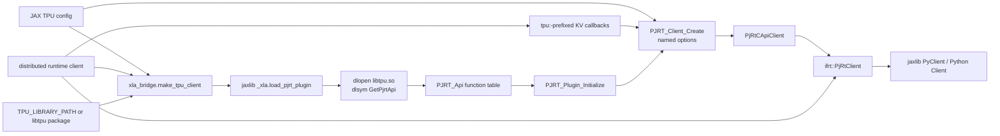
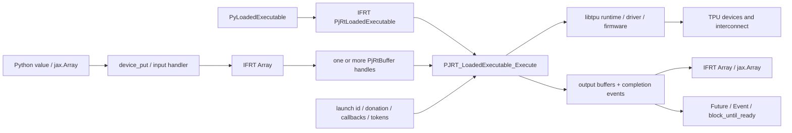

# JAX、IFRT、PJRT 与 TPU runtime 控制面

本文把“编译请求如何进入 TPU backend”和“已经加载的 executable 如何执行”拆开。
它只描述固定公开源码能够确认的边界；`libtpu.so` 内部的编译服务、设备 runtime、
driver、firmware 与 collective 实现尚未接入源码，因此对应节点保留为黑盒。
**证据：SOURCE-ONLY。**

术语和证据等级分别见[术语表](../index/glossary.md)与
[证据约定](../contributing/evidence-conventions.md)。普通 XLA/TPU 与
Pallas/Mosaic 的 payload 差异见[全栈地图](00-whole-stack.md)。

## 三条相互关联的链

### 初始化与控制链

[`xla_bridge.make_tpu_client`](../../upstream/jax/jax/_src/xla_bridge.py) 选择 TPU
动态库，加载并初始化 plugin，然后向 jaxlib 请求 C API client。
[`jaxlib/jax.cc`](../../upstream/jax/jaxlib/jax.cc) 中的 nanobind 定义调用
[`pjrt_api.cc`](../../upstream/xla/xla/pjrt/pjrt_api.cc) 的通用 loader；后者打开动态库并
解析 `GetPjrtApi`。返回的函数表先由
[`PjRtCApiClient`](../../upstream/xla/xla/pjrt/c_api_client/pjrt_c_api_client.cc)
包装，再由
[`ifrt::PjRtClient`](../../upstream/xla/xla/python/pjrt_ifrt/pjrt_client.cc)
包装，最后成为 jaxlib `PyClient`。

公开树在
[`pjrt_c_api_tpu.h`](../../upstream/xla/xla/pjrt/c/pjrt_c_api_tpu.h) 声明 TPU
入口，但不包含该入口返回的 `libtpu.so` 实现。通用 C API adapter 是公开的；opaque
handle 后的 TPU 实现才是私有边界。**证据：SOURCE-ONLY。**

### 编译 payload 链

```mermaid
flowchart LR
  MLIR["StableHLO/MLIR module"] --> CACHE["JAX compile_or_get_cached"]
  OPTIONS["CompileOptions + devices/topology"] --> CACHE
  CACHE --> PY["PyClient.CompileAndLoad"]
  PY --> HP["ifrt::HloProgram"]
  HP --> IC["IFRT default compiler<br/>PjRtCompiler"]
  IC --> PC["PjRtClient::CompileAndLoad"]
  PC --> SER["program bytes + format<br/>serialized CompileOptionsProto"]
  SER --> ABI["PJRT_Client_Compile"]
  ABI --> PRIVATE["libtpu compiler implementation"]
  PRIVATE --> EXEC["opaque PJRT_LoadedExecutable"]
  EXEC --> WRAP["PjRtCApiLoadedExecutable<br/>IFRT LoadedExecutable<br/>PyLoadedExecutable"]
```

JAX 在 [`compiler.py`](../../upstream/jax/jax/_src/compiler.py) 组装 compile
options 并处理 persistent cache。
[`py_client.cc`](../../upstream/jax/jaxlib/py_client.cc) 中的
`PyClient::CompileAndLoad` 重载会克隆 module，把它包装为 IFRT `HloProgram`，再调用
默认 IFRT compiler；其中接收 capsule host callbacks 的重载还在 Shardy 已启用而
module 带 GSPMD attrs/ops 时执行公开的 fallback 处理。固定版本在
[`pjrt_compiler.cc`](../../upstream/xla/xla/python/pjrt_ifrt/pjrt_compiler.cc)
实现这一层，并继续转发到 `PjRtClient::CompileAndLoad`。

对 C API plugin，`PjRtCApiClient` 序列化 program、format string 和
`CompileOptionsProto`，再调用 `PJRT_Client_Compile`。ABI struct 和所有权规则定义在
[`pjrt_c_api.h`](../../upstream/xla/xla/pjrt/c/pjrt_c_api.h)。普通路径传递顶层
StableHLO/MLIR program；Pallas TPU program 的外层 module 包含 `tpu_custom_call`，其
backend config 携带序列化的内层 Mosaic module。两者是在同一公开 compile 边界上的
不同 payload 形态。**证据：SOURCE-ONLY。**

### 执行与数据链

[`pxla.py`](../../upstream/jax/jax/_src/interpreters/pxla.py) 中的 Python dispatch
对象通过 input handler 转换输入，为有序 effect 添加 runtime token，然后调用
`execute_sharded`。
[`pjrt_executable.cc`](../../upstream/xla/xla/python/pjrt_ifrt/pjrt_executable.cc)
中的 IFRT adapter 收集每个 array 的 `PjRtBuffer` handle，转发 donation 和 callback
状态，调用 loaded executable，合并返回的 future，再把结果 buffer 包装成 IFRT
array。C API adapter 最终调用 `PJRT_LoadedExecutable_Execute`。

host-to-device 创建、device-to-host 复制、执行完成和错误传递在 `pjrt_c_api.h` 中由
不同的 buffer/event 调用表达。因此，返回 `jax.Array` 本身不能证明设备工作已经完成；
显式取值或 `block_until_ready` 才引入 host 同步点。TPU plugin 如何调度 launch 并
触发 event 位于 libtpu ABI 边界之后。**公开结构：SOURCE-ONLY；实际 TPU
时序：待验证 RUN-TPU。**

## 对象与所有权导航

| 层 | 公开对象 | 主要职责 | 当前证据 |
|---|---|---|---|
| JAX Python | backend、`jax.Array`、dispatch callable | 选择 backend，准备输入，维护 effect token，消费输出 | `SOURCE-ONLY` |
| jaxlib binding | `PyClient`、`PyLoadedExecutable`、`PyArray` | Python/C++ 边界与 IFRT 对象包装 | `SOURCE-ONLY` |
| IFRT | `Client`、`Compiler`、`LoadedExecutable`、`Array` | 跨 runtime 的数组、编译和执行抽象 | `SOURCE-ONLY` |
| PJRT C++ | `PjRtClient`、`PjRtLoadedExecutable`、`PjRtBuffer`、`Future` | 通用 runtime client 与异步生命周期 | `SOURCE-ONLY` |
| PJRT C API | opaque handles、argument structs、`PJRT_Api` | 版本化 plugin C ABI 与 ownership contract | `SOURCE-ONLY` |
| libtpu | opaque client/executable/buffer/event implementation | TPU compiler、load、launch、transfer、collective 与错误传播 | 源码未接入 |
| TPU runtime/hardware | driver、firmware、devices、ICI | 实际执行、同步、内存与通信 | 需要 `RUN-TPU` |

`PyArray` 在固定源码中持有 IFRT array；IFRT 的 PJRT implementation 又持有一个或
多个 `PjRtBuffer`。逻辑 array、shard、device buffer 和物理内存不是同一个对象。
删除、donation、alias、host cache 与 readiness 必须分别跟踪，不能只看 Python 引用
计数。**证据：SOURCE-ONLY。**

## 多 host 与 collective 控制面

固定版本的 TPU 专用 `make_tpu_client` 把 `distributed.global_state.client` 传给
`get_c_api_client`。jaxlib 从它建立带 `tpu:` 前缀的 key-value store callbacks，交给
`PJRT_Client_Create`，并把同一个 distributed client、可选 transfer-server factory、
cross-host transfer flag 和 device-sort flag 放入 IFRT create options。该 TPU 专用路径
没有在这里把 `process_id`/`num_processes` 显式加入 named create options；通用
`make_pjrt_c_api_client` 是另一条路径，不能混用两者的参数结论。

IFRT create options 还显式设置 `use_kv_store_for_topology_exchange = false`，因此不能把
这条 wiring 描述成 IFRT 自行通过 KV store 完成 topology exchange。公开源码只证明
参数、callbacks 和对象的传递；plugin 如何使用 KV callbacks 建立 TPU topology 或
rendezvous，仍在 libtpu 边界之后。HLO collective 描述计算语义，PJRT topology 描述
参与设备，实际链路选择、launch barrier 和错误恢复由 backend/runtime 实现。三者必须
保留独立 capture。**证据：SOURCE-ONLY。**

当前可以在 CPU 上验证多 device 的 Python、IFRT/PJRT 公开语义，也可以静态检查 TPU
扩展 ABI。没有真实 TPU 时不能声称已经验证多 host 初始化、ICI 路由、collective
时序或 hang 恢复。**CPU 部分：待补 RUN-CPU；TPU 部分：待补 RUN-TPU。**

## 需要建立的两个 TPU 验收闭环

`COMPILE-TPU` dossier 至少要关联：

- `libtpu.so` version、build ID、SHA-256、源码 revision 与 PJRT ABI version；
- program bytes/format、compile options、target topology 和 device assignment；
- compiler 返回的 executable fingerprint/serialization 与所有可用阶段 dump；
- 普通 StableHLO payload 或外层 custom call + 内层 Mosaic payload 的分支身份；
- 每个缺失的 private stage 明确标记 `unavailable` 或 `blocked`。

`RUN-TPU` dossier 在上述内容之外还要关联：

- process、slice/pod topology、runtime/firmware 和实际可寻址设备；
- host-to-device、launch、completion event、device-to-host 的时间线；
- buffer donation/alias、峰值内存、collective trace、错误与取消传播；
- 数值/gradient 断言、profile counters，以及同一 executable 的重复运行行为。

编译成功只证明生成了目标 executable，不证明真实设备上的执行、通信或性能。

## 首批源码入口

| 问题 | 固定源码入口 |
|---|---|
| TPU library 从哪里选择 | [`cloud_tpu_init.py`](../../upstream/jax/jax/_src/cloud_tpu_init.py) |
| backend 如何注册和创建 | [`xla_bridge.py`](../../upstream/jax/jax/_src/xla_bridge.py) |
| Python 如何进入 plugin loader | [`xla_client.py`](../../upstream/jax/jaxlib/xla_client.py)、[`jax.cc`](../../upstream/jax/jaxlib/jax.cc) |
| `dlopen` 和 `GetPjrtApi` 在哪里 | [`pjrt_api.cc`](../../upstream/xla/xla/pjrt/pjrt_api.cc) |
| PJRT ABI 有哪些 entry | [`pjrt_c_api.h`](../../upstream/xla/xla/pjrt/c/pjrt_c_api.h) |
| C API 如何包装为 C++ client | [`pjrt_c_api_client.cc`](../../upstream/xla/xla/pjrt/c_api_client/pjrt_c_api_client.cc) |
| IFRT 如何包装 PJRT | [`pjrt_client.cc`](../../upstream/xla/xla/python/pjrt_ifrt/pjrt_client.cc)、[`pjrt_compiler.cc`](../../upstream/xla/xla/python/pjrt_ifrt/pjrt_compiler.cc)、[`pjrt_executable.cc`](../../upstream/xla/xla/python/pjrt_ifrt/pjrt_executable.cc) |
| Python compile/execute 在哪里进入 | [`compiler.py`](../../upstream/jax/jax/_src/compiler.py)、[`py_client.cc`](../../upstream/jax/jaxlib/py_client.cc)、[`pxla.py`](../../upstream/jax/jax/_src/interpreters/pxla.py) |

这些入口构成公开控制面的第一版源码骨架。取得匹配 libtpu 源码后，应从每个 C ABI
entry 建立实现端 caller/callee 索引，再补齐 compiler service、load/launch、buffer、
event、distributed runtime、driver 和 firmware 的内部路径。
