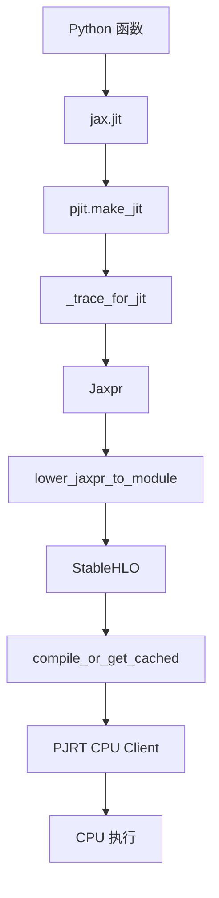

# Lab 001：追踪 `jax.jit` 的 CPU 执行路径

> **核心结论**：对本 Lab 的函数，`jax.jit` 会把 Python 函数 trace 成 Jaxpr，再 lower 为 StableHLO，最后通过编译后端和 PJRT 在 CPU 上执行。在这里的缓存键不变时，第二次相同 shape/dtype 调用不会重新 tracing，但仍会执行函数计算；输入 shape 改变会触发新的 tracing。是否复用或重新生成编译产物，需要另行捕获编译日志或 cache 行为证明。

| 交互 | Trace | Run | Hack | 手动编译 | Use |
|:---:|:---:|:---:|:---:|:---:|:---:|
| ✅ | ✅ | ✅ | ✅ | 不需要 | ✅ |

## JupyterLab：交互式 Notebook

JupyterLab 与当前项目环境一起锁定在 uv 的 `notebook` 依赖组中。首次使用先同步该组：

```bash
uv sync --group notebook --locked
```

然后打开本 Lab 的 [`jupyter.ipynb`](jupyter.ipynb)：

```bash
uv run --group notebook jupyter lab labs/001-jit-cpu/jupyter.ipynb
```

Notebook 提供两组交互控件：第一组可以切换 Jaxpr、StableHLO 和执行结果并调整输入参数；第二组可以直接浏览当前 editable JAX 安装中的关键 symbol。它和命令行探针共同调用 `lab_core.py`，并包含一格可以无界面执行的断言，用于检查分析结论是否仍然成立。

可以用下面的命令完成与 CI 类似的无界面执行；生成的已执行副本写到 `/tmp`，不会污染仓库：

```bash
uv run --group notebook jupyter nbconvert \
  --to notebook --execute labs/001-jit-cpu/jupyter.ipynb \
  --output-dir /tmp --output jax-jit-cpu-executed.ipynb
```

如果 WSL 没有自动打开浏览器，使用 `--no-browser`，然后在 Windows 浏览器中打开终端打印的 URL。

## Marimo：响应式实验台

分析和修改 Lab 时，推荐直接打开 Marimo 的 Web IDE：

```bash
uv run marimo edit labs/001-jit-cpu/notebook.py
```

页面中可以：

- 直接修改 Python/Markdown cell，并响应式地重新运行依赖它的 cell；
- 拖动滑块改变输入 shape、`scale` 和 `bias`；
- 在页签间切换实时生成的 Jaxpr 与 StableHLO；
- 显示当前 editable 安装中真实 symbol 的文件和行号；
- 点击按钮运行三次函数，观察 tracing cache；
- 展开真实 Hack patch 和复现命令；
- 把修改保存回仓库中的 `notebook.py`，和普通源码一起进行 diff、review 和提交。

如果 WSL 没有自动打开浏览器：

```bash
uv run marimo edit labs/001-jit-cpu/notebook.py --headless --port 2718
```

然后打开终端输出的、带 `access_token` 的 URL。

只想让读者运行成品、不允许在页面中修改代码时，再使用展示模式：

```bash
uv run marimo run labs/001-jit-cpu/notebook.py
```

## 第二种表达：在编辑器里走读真实源码

[`CodeTour`](https://github.com/microsoft/codetour) 是开源的 VS Code 扩展。仓库中的
[`001-jit-cpu.tour`](../../.tours/001-jit-cpu.tour) 把分析组织成 12 个步骤，直接在
`upstream/jax` 和本 Lab 的真实代码行之间跳转，而不是复制一份源码到网页里。

本仓库已在 `.vscode/extensions.json` 中推荐该扩展。也可以安装与本 Demo 验证一致的版本：

```bash
code --install-extension vsls-contrib.codetour@0.0.61
code .
```

在 VS Code 中打开命令面板，运行 `CodeTour: Start Tour`，选择
`01 · jax.jit 的 CPU 执行路径`。Tour 中的 `>>` 命令可以点击运行，因此阅读过程中可以：

- 从 `jax.jit` 逐步跳到 `pjit._trace_for_jit`、MLIR lowering、编译缓存和 CPU client；
- 随时修改当前打开的真实源码；
- 在对应步骤直接运行 Jaxpr、StableHLO、cache probe；
- 最后打开、应用并撤销真实 Hack patch。

它和 Marimo 的分工不同：Marimo 适合调参数和观察产物；CodeTour 适合沿代码路径讲解、修改和
review。CodeTour 不取代可执行探针，探针仍是结论的验证层。

## 命令行探针

`probe.py` 是供自动化验证和调试使用的同一套分析后端，不是主要展示界面。它和交互页面共同调用 [`lab_core.py`](lab_core.py)，避免两套结果发生漂移。

在仓库根目录执行完整探针：

```bash
uv run python labs/001-jit-cpu/probe.py
```

也可以只观察某个阶段：

```bash
uv run python labs/001-jit-cpu/probe.py --stage sources
uv run python labs/001-jit-cpu/probe.py --stage jaxpr
uv run python labs/001-jit-cpu/probe.py --stage stablehlo
uv run python labs/001-jit-cpu/probe.py --stage run --log-compiles
```

`--size N` 可以改变输入长度。运行阶段会连续执行相同 shape 两次，再执行一个不同 shape，用函数体中的计数器直接观察 tracing cache：

```text
call=1 shape=(4,) trace_count=1 result=[1.0, 3.0, 5.0, 7.0]
call=2 shape=(4,) trace_count=1 result=[1.0, 3.0, 5.0, 7.0]
call=3 shape=(5,) trace_count=2 result=[1.0, 3.0, 5.0, 7.0, 9.0]
```

`run` 阶段会先检查 shape 和 tracing 计数，不满足上述不变量时返回非零状态。生成可审查
的 capture 时，还可以记录运行结束后实际映射的 jaxlib shared objects：

```bash
.venv/bin/python labs/001-jit-cpu/probe.py --stage run \
  --baseline-manifest manifests/baseline.json \
  --native-binaries-manifest /tmp/jaxlib-native-binaries.json
```

probe 会原样复用 baseline 中已经核验的 jaxlib distribution identity，因此锁定 wheel、
仓库内 wheel 和 source build manifest 三种来源不会被重新猜测。提交为 capture 时，把输出
写入 capture 目录；inventory 只保存 package-relative path、可用的仓库相对路径、文件大小、
SHA-256 和 runtime roles，不写入进程或主机的绝对路径。

## 执行路径



## 源码地图

这些链接固定到本仓库锁定的 JAX commit，避免上游代码移动后指向错误位置。`--stage sources` 还会从当前 editable 安装中动态打印本地文件和行号。

| 阶段 | Symbol | 固定源码 | 本实验如何观察 |
|---|---|---|---|
| 用户 API | `jax.jit` | [`api.py:204`](https://github.com/jax-ml/jax/blob/5832e866449a41c3eea6333416528039119a0fde/jax/_src/api.py#L204) | 创建 compiled function |
| 包装与参数处理 | `pjit.make_jit` | [`pjit.py:447`](https://github.com/jax-ml/jax/blob/5832e866449a41c3eea6333416528039119a0fde/jax/_src/pjit.py#L447) | `sources` 阶段定位 |
| Tracing | `pjit._trace_for_jit` | [`pjit.py:485`](https://github.com/jax-ml/jax/blob/5832e866449a41c3eea6333416528039119a0fde/jax/_src/pjit.py#L485) | trace counter 与 Hack 日志 |
| MLIR lowering | `mlir.lower_jaxpr_to_module` | [`mlir.py:1324`](https://github.com/jax-ml/jax/blob/5832e866449a41c3eea6333416528039119a0fde/jax/_src/interpreters/mlir.py#L1324) | `stablehlo` 阶段输出 IR |
| 编译与缓存 | `compiler.compile_or_get_cached` | [`compiler.py:429`](https://github.com/jax-ml/jax/blob/5832e866449a41c3eea6333416528039119a0fde/jax/_src/compiler.py#L429) | `--log-compiles` 输出日志 |
| CPU client | `xla_bridge.make_cpu_client` | [`xla_bridge.py:314`](https://github.com/jax-ml/jax/blob/5832e866449a41c3eea6333416528039119a0fde/jax/_src/xla_bridge.py#L314) | 强制把输入放到 CPU device |

## 观测结果

这个函数：

```python
def affine(x):
  return x * 2 + 1
```

首先被表示为 Jaxpr：

```text
{ lambda ; a:f32[4]. let
    b:f32[4] = mul a 2.0:f32[]
    c:f32[4] = add b 1.0:f32[]
  in (c,) }
```

继续 lowering 后，可以在 StableHLO 中看到对应的 `stablehlo.multiply` 和 `stablehlo.add`。这里不复制整份 IR，运行 `--stage stablehlo` 可以直接从当前源码和环境重新生成。

## Hack：观察真正的 tracing 入口

[`patches/trace-pjit.patch`](patches/trace-pjit.patch) 在 `_trace_for_jit` 开头增加一个环境变量控制的诊断输出。因为 JAX 是 editable 安装，这个 Python-level Hack 不需要手动编译。

先确认并应用补丁：

```bash
git -C upstream/jax apply --check ../../labs/001-jit-cpu/patches/trace-pjit.patch
git -C upstream/jax apply ../../labs/001-jit-cpu/patches/trace-pjit.patch
```

启用诊断并运行：

```bash
JAX_SOURCE_ANALYSIS_TRACE_JIT=counted_affine \
  uv run python labs/001-jit-cpu/probe.py --stage run
```

环境变量的值是要观察的函数名。相同 shape 的第二次调用不会再次出现 `counted_affine` 诊断行；改变 shape 后会再次进入 `_trace_for_jit`。这把文档中的缓存结论连接到了真实源码执行路径，而不只是观察最终数值。

实验结束后撤销补丁，恢复锁定的上游基线：

```bash
git -C upstream/jax apply -R ../../labs/001-jit-cpu/patches/trace-pjit.patch
git -C upstream/jax status --short
```

最后一条命令应当没有输出。

## 这个 Demo 尚未覆盖什么

- StableHLO 到优化后 HLO 的 pass pipeline；
- XLA CPU backend 如何生成 LLVM IR；
- PJRT executable 如何调度 CPU runtime；
- 修改 C++/XLA 后构建新的 `jaxlib` wheel。

这些内容适合拆成后续 Lab，而不是继续扩张当前实验。
