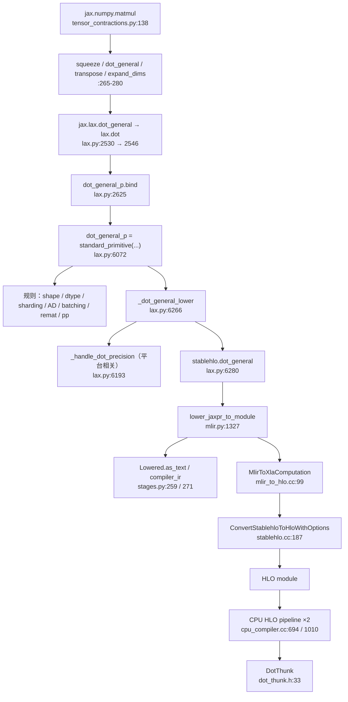

# matmul lowering 源码走读：JAX Python → Jaxpr → StableHLO → HLO → CPU 后端

本文件是 kickoff 第二组交付物「matmul 源码与 API 索引」的 **Markdown 源码导读**：
沿 `matmul` 一个算子，从 JAX Python 入口走到后端运行时的完整链路，逐段给出源码位置、
职责、输入输出与约束，并标出中间产物在哪里观察。

**本次走读的证据级别是 `SOURCE-ONLY`**：只读固定源码、核对行号，未新增编译或执行。
已存在的运行产物（CPU 数值、pass dump、thunk）来自更早的 capture，其 revision 与本
文件的 pin **不同**，引用时另行标注。

```text
JAX  2d66622450e2c8633cda2307688ef7aa294bd6eb   （tag jax-v0.11.1）
XLA  dcf304bc5dca1932b99f740b911dbd73631a1a69
```

行号均按上述 revision 核对。**换 pin 后行号已发生漂移**：例如 `dot_general` 从 2528 变
2530、`_dot_general_lower` 从 6264 变 6266，因此旧文档中的行号不能直接沿用。

配图：[matmul lowering 全链路图](figures/matmul-lowering-chain.svg)（由
`render_matmul_walkthrough.py` 生成，图中 30 个源码锚点由 `--check` 对工作区复核）。

## 1. 完整链路



一句话概括这条链路的**形状**：Python 层的 `matmul` 只是形状整理，**它不产生新的数学**——
把多维/批量情形规约成一次 `dot_general`；真正决定"这是矩阵乘"的是 `dot_general_p` 这个
primitive；而它的 lowering 规则**直接发出 `stablehlo.dot_general`**，中间没有自定义 IR。

## 2. 逐段走读

### 2.1 入口：`jax.numpy.matmul` 只做形状规约

`upstream/jax/jax/_src/numpy/tensor_contractions.py:138`。函数体尾部（265–280）：

```python
perm = np.argsort(np.concatenate([idx_batch, idx_a_other, idx_b_other]))
a = lax.squeeze(a, tuple(a_squeeze))
b = lax.squeeze(b, tuple(b_squeeze))
out = lax.dot_general(
  a, b, (((np.ndim(a) - 1,), (np.ndim(b) - 1 - b_is_mat,)), (a_batch, b_batch)),
  precision=precision, preferred_element_type=preferred_element_type,
  out_sharding=out_sharding)
result = lax.transpose(out, perm)
if both_squeeze:
  result = lax.expand_dims(result, tuple(both_squeeze))
return lax._convert_element_type(result, preferred_element_type, output_weak_type)
```

要点：

- **这个函数不是 primitive**，它是一段 Python 组合：`squeeze → dot_general → transpose
  → expand_dims → convert`。所以 `matmul` 在 Jaxpr 里不会作为单个算子出现。
- 批量维、非收缩维、收缩维都被折进 `dot_general` 的 `dimension_numbers`，再靠
  `transpose` / `expand_dims` 把形状还原。**形状错的代价在 transpose 上，不在 dot 上。**
- 因此"vmap 之后变成一个高秩 dot_general"这个现象，起点就在这里：batch 维是显式进入
  `dimension_numbers` 的。

### 2.2 规范化：`dot_general` 是 `dot` 的别名

- `lax.dot_general` — `upstream/jax/jax/_src/lax/lax.py:2530`，docstring 明确写
  "Alias of :func:`jax.lax.dot`"，函数体只有一行转发（2542–2543）。
- `lax.dot` — `lax.py:2546`。它的 docstring 是第一处**关于 lowering 的断言**：

  > This operation lowers directly to the `stablehlo.dot_general`_ operation.

  这句话在下文 2.5 得到源码验证。
- `dot` 的函数体在 2625 落到 primitive：

```python
lhs, rhs = core.auto_insert_reshard(lhs, rhs)          # lax.py:2624
return dot_general_p.bind(lhs, rhs,                     # lax.py:2625
                          dimension_numbers=(cdims, bdims),
                          precision=canonicalize_precision(precision),
                          preferred_element_type=preferred_element_type,
                          out_sharding=out_sharding)
```

注意 2624 的 `core.auto_insert_reshard`：**分片不一致时会在 bind 之前插入 reshard**。
这是分片信息影响图的第一个位置，早于 lowering。

### 2.3 Primitive：`dot_general_p`

`lax.py:6072`：

```python
dot_general_p = standard_primitive(
    _dot_general_shape_rule,
    _dot_general_dtype_rule,
    'dot_general',
    sharding_rule=_dot_general_sharding_rule,
    vma_rule=partial(core.standard_vma_rule, 'dot_general'),
    ur_rule=_dot_general_ur_rule,
)
```

`standard_primitive` 的实现在 `upstream/jax/jax/_src/lax/utils.py:46`，它只做三件事：

```python
prim = core.Primitive(name)                                    # utils.py:50
prim.def_impl(partial(dispatch.apply_primitive, prim))         # :51
prim.def_abstract_eval(partial(standard_abstract_eval, prim,    # :52-55
    shape_rule, dtype_rule, weak_type_rule, sharding_rule, vma_rule,
    ur_rule, memory_space_rule))
```

所以 `dot_general_p` 本身**只有抽象求值规则**；eager 实现走 `dispatch.apply_primitive`
（即交给后端），**具体 lower 到哪由 lowering 规则决定**，两者是分开注册的。

### 2.4 变换规则：`jit` / `grad` / `vmap` 各自挂在哪

这是走读中信息量最大的一段，因为 kickoff 要求"结合 jit/grad/vmap 确认 lowering 全过程"。
四条规则各自注册在 `lax.py` 的不同位置：

| 变换 | 注册点 | 规则函数 | 作用 |
|---|---|---|---|
| 抽象求值 | `utils.py:52` | `_dot_general_shape_rule` (5685) / `_dot_general_dtype_rule` | 推导输出形状与 dtype |
| 分片 | `utils.py:52` | `_dot_general_sharding_rule` (5764) | 推导输出 sharding |
| **grad**（微分） | `lax.py:6114-6115` | `_dot_general_transpose_lhs` (5906) / `_dot_general_transpose_rhs` (5935) | **双线性**微分 |
| **vmap**（批量化） | `lax.py:6116-6119` | `_dot_general_batch_rule`（`_dot_batch_rule` 的 partial） | 改写 `dimension_numbers` 并提升 batch 维 |
| remat | `lax.py:6102` | `_dot_general_remat` (6082) | 重物化策略 |
| pretty-print | `lax.py:6120` | `_dot_general_pp_rule` (6062) | Jaxpr 打印 |

**grad 的关键是 `ad.defbilinear`（6114）**，而不是普通的 `defjvp`/`deftranspose`：

```python
ad.defbilinear(dot_general_p,
               _dot_general_transpose_lhs, _dot_general_transpose_rhs)
```

这解释了为什么 `grad` 不需要为 `matmul` 写专门的 VJP：`dot_general` 对两个操作数都是线性的，
**转置规则本身就是另一个 dot_general**（用对侧操作数与转置后的 cotangent 再做一次收缩）。
所以"求导后的程序"仍然是 dot_general 的形状，而不是一组逐元素乘加。

**vmap 走的是 `fancy_primitive_batchers`（6119）**，不是 `primitive_batchers`：

```python
_dot_general_batch_rule = functools.partial(
    _dot_batch_rule, _dot_general_batch_unpack_args,
    _dot_general_batch_unpack_dims, dot_general)          # lax.py:6116-6118
batching.fancy_primitive_batchers[dot_general_p] = _dot_general_batch_rule  # :6119
```

"fancy" 的含义是：批量化**不是**简单地在每个操作数前插一维，而是要重算
`dimension_numbers`——batch 维要提升到最前，并与既有的 batch 维合并。这正对应
旧 capture 观察到的现象：`vmap(matmul, in_axes=(0,None))` 在 StableHLO 里表现为
**一个高秩 dot_general**，批维被折进 dot 自身，而不是发射 N 个独立 dot。
该观察来自更早的 CPU capture（见 2.10 的版本说明），本次没有重新生成 IR。

### 2.5 Lowering：直接发出 `stablehlo.dot_general`

`lax.py:6266`：

```python
def _dot_general_lower(ctx, lhs, rhs, *, dimension_numbers,
                       precision, preferred_element_type, out_sharding,
                       platform: str = "default"):
  del preferred_element_type                     # Implied by the output aval
  lhs, rhs, accumulation_aval, algorithm_kwarg = _handle_dot_precision(
      ctx, lhs, rhs, precision, platform)                          # 6270
  (lhs_contracting, rhs_contracting), (lhs_batch, rhs_batch) = dimension_numbers
  dot_dnums = hlo.DotDimensionNumbers.get(                          # 6274
      lhs_batching_dimensions=list(lhs_batch),
      rhs_batching_dimensions=list(rhs_batch),
      lhs_contracting_dimensions=list(lhs_contracting),
      rhs_contracting_dimensions=list(rhs_contracting))
  acc_type = mlir.aval_to_ir_type(ctx.module_context, accumulation_aval)
  result = hlo.dot_general(acc_type, lhs, rhs, dot_dnums,           # 6280
                           precision_config=precision_attr(precision),
                           **algorithm_kwarg)
  aval_out, = ctx.avals_out
  result = mlir.lower_with_sharding_in_types(ctx, result, aval_out)  # 6289
  if accumulation_aval.dtype != aval_out.dtype:                      # 6291
    result = mlir.convert_hlo(ctx, result, accumulation_aval, aval_out)
  return [result]
```

**`hlo` 就是 `stablehlo`** —— 这不是推断，`upstream/jax/jax/_src/lib/mlir/dialects/__init__.py:62` 写着：

```python
from jaxlib.mlir.dialects import stablehlo as hlo
```

所以 6280 行发出的就是 `stablehlo.dot_general`，与 2.2 中 docstring 的断言一致。
**JAX 到 XLA 之间没有私有的 dot 表示**；`dimension_numbers` 直接映射成
`DotDimensionNumbers` 的四个字段。

注册点有两组（`lax.py:6294-6299`）：

```python
mlir.register_lowering(dot_general_p, _dot_general_lower)              # 6294 默认
for platform in ["cpu", "tpu"]:
  mlir.register_lowering(dot_general_p,
                         partial(_dot_general_lower, platform=platform),
                         platform=platform)                            # 6296-6299
```

**默认、cpu、tpu 三套注册共用同一函数体**，唯一差别是 `platform` 参数——它只影响
`_handle_dot_precision` 的分支。这一点很重要：**dot 的 lowering 本身没有平台分叉，
分叉只发生在精度/类型规整**。

### 2.6 平台分支：`_handle_dot_precision`（`lax.py:6193`）

这是全链路里**唯一一处 CPU/TPU 行为不同的 lowering 逻辑**，因此值得单独记录。
两条路径：

**路径 A：显式算法**（`precision` 是 `DotAlgorithm` / `DotAlgorithmPreset`）：

- CPU **会拒绝**它不支持的算法，抛 `ValueError`，白名单是
  `DEFAULT, F16_F16_F16, F32_F32_F32, F64_F64_F64, BF16_BF16_F32, BF16_BF16_F32_X3,
  BF16_BF16_F32_X6`。源码注释直说 "The CPU backend silently ignores the algorithm spec,
  so we check here"——**即 CPU 不是不支持就报错，而是会静默忽略，所以 JAX 在前端先拦**。
- 按算法把输入 cast 到目标类型，并可能改变 `accumulation_aval`。
- 非 `DEFAULT` 时把算法作为 `algorithm` 属性传给 `hlo.dot_general`。

**路径 B：普通 precision**（`None` 或 `Precision` 枚举）。当 `lhs_dtype != rhs_dtype`
（混合类型）时按平台插入 `ConvertOp`：

```python
if lhs_dtype != rhs_dtype:
  if platform == "tpu":
    handled = lambda dt: (dtypes.issubdtype(dt, np.floating) or
                          dtypes.issubdtype(dt, np.integer))
    if not (handled(lhs_dtype) and handled(rhs_dtype)):
      lhs = mlir.convert_hlo(..., aval_out.dtype)   # 两侧都转成输出类型
      rhs = mlir.convert_hlo(..., aval_out.dtype)
  else:  # cpu and gpu
    if not _is_fp8_mixed_precision_matmul(lhs_dtype, rhs_dtype):
      lhs = mlir.convert_hlo(..., aval_out.dtype)
      rhs = mlir.convert_hlo(..., aval_out.dtype)
```

差异总结：

| 情形 | TPU | CPU / GPU |
|---|---|---|
| 混合 float/int | **不转换**（TPU 原生接受） | 转成输出类型 |
| 混合 fp8 | 不在上面的 `handled` 白名单内 → 转换 | **不转换**（显式排除） |
| 其他混合类型 | 转换 | 转换 |

源码注释给出了这条分叉的理由：JAX 的 `dot_general` 接受与 XLA `shape_inference.cc`
相同的类型组合，但**各平台在 codegen 阶段对不同的合法组合会失败**，于是 JAX 在 lowering
期就按平台插入 `ConvertOp` 规避。这是一条纯 `SOURCE-ONLY` 的结论，本次没有在真机上验证
各组合的实际行为。

### 2.7 模块组装

`lower_jaxpr_to_module` — `upstream/jax/jax/_src/interpreters/mlir.py:1327`。
它按 primitive 的 lowering 规则遍历 Jaxpr、累积 MLIR，产出外层 module。走读中只需确认
一件事：**`matmul` 到这里已经不存在了**，module 里是若干 `stablehlo.*` 算子 +
可能插入的 `stablehlo.convert`。

### 2.8 MLIR → HLO

两个入口，职责不同：

- `MlirToXlaComputation` — `upstream/xla/xla/pjrt/mlir_to_hlo.cc:99`。PJRT 侧入口，
  把 MLIR module 转成 `XlaComputation`。
- `ConvertStablehloToHloWithOptions` — `upstream/xla/xla/hlo/translate/stablehlo.cc:187`。

**必须注意的一个命名陷阱**：这条转换路径**不经过 MHLO**。`stablehlo.cc:115` 设置

```cpp
options.direct_stablehlo_to_hlo = true;
```

因此"StableHLO → MHLO → HLO"这种三段式说法在本 revision 是**错的**，是直接
StableHLO → HLO。`_cached_lowering_to_hlo` 之类的函数名也容易误导：名字里有 HLO，
但实际调用的是 MLIR lowering。

### 2.9 CPU HLO pipeline：两段，围绕 layout assignment 切分

`upstream/xla/xla/service/cpu/cpu_compiler.cc`：

| 阶段 | 入口 | pipeline 名 | 行号 |
|---|---|---|---|
| layout 之前 | `RunHloPassesThroughLayoutAssn` | "HLO passes through layout assignment" | 596 / 694 |
| layout 之后 | `RunHloPassesAfterLayoutAssn` | "HLO passes after layout assignment" | 998 / 1010 |
| 总入口 | `RunHloPasses` | — | 1183 |

按源码顺序提取的实际 pass（`pipeline.AddPass<...>`），**与 matmul 直接相关**的加粗：

**layout 之前**：`BatchedGatherScatterNormalizer`、`ResultCaster`、**`DotDecomposer`**、
`OperandUpcaster`、`RngExpander`、`ZeroSizedHloElimination`、`DynamicIndexSplitter`、
`ConditionalToSelect`、`MapInliner`、`TopkDecomposer`、`PermutationSortExpander`、
`CallInliner`、**`BatchDotSimplification`**、**`DotDecomposer`**（第二次）、
**`OneDnnOpsRewriter`**、`FloatNormalization`×多、**`BatchDotSimplification`**、
`ConvolutionGroupConverter`…

**layout 之后**：`ReshapeDecomposer`、`ReduceDecomposer`、`BroadcastCanonicalizer`、
`SimplifyFPConversions`、**`OneDnnContractionRewriter`**、**`DotDecomposer`**、
**`LibraryRewriter`**、**`CpuInstructionFusion`**、`FusionWrapper`、
**`CpuMultiOutputFusion`**、`TupleSimplifier`、`FlattenCallGraph`、`CallInliner`、
`CpuAllReduceCombiner`、**`AlgebraicSimplifier`**、`HloDCE`、`HloCSE`、
`ParallelTaskAssigner`、**`OptimizeInputOutputBufferAlias`**、`CopyInsertion`、
`SmallWhileLoopHoistingPass`、**`ApplyXlaTransforms`**、`HloDCE`。

三个值得单独说明的 pass：

1. **`DotDecomposer`** — 位置 `upstream/xla/xla/hlo/transforms/expanders/dot_decomposer.h`。
   自述："converts dots into a canonical form where non-contracting and contracting
   dimensions are reshaped together and batch dimensions are the most major dimensions."
   即**把 dot 归一成规范形**，让后续库改写/融合只需面对一种形状。它在两段 pipeline 里
   各出现一次。
2. **`LibraryRewriter`** — 位置 `upstream/xla/xla/backends/cpu/transforms/library_rewriter.cc`
   （**注意路径已从 `xla/service/cpu/` 迁到 `xla/backends/cpu/`**）。`:63` 的注释是
   "Creates a new custom library fusion instruction containing a single…"，`:329` 有
   `if (fuse_dot_ && (*it)->opcode() == HloOpcode::kDot)`。**这是 dot 被交给库（Eigen /
   oneDNN）的地方**，也是 matmul 在 CPU 上"变成一次库调用"的转折点。
3. **`ApplyXlaTransforms`** — 出现在两处：`cpu_compiler.cc:1177-1178` 的
   `PipelineStage::kPreScheduler`，以及 `:1832-1833` 的 `post_scheduler_pipeline` 中的
   `kPostScheduler`。实现见 `xla/service/xla_transform.cc:109,132,138`。**这正是
   [软件栈图](../../software-stack/overview/overview-software-stack.svg) 里 D 接口（可写 HLO hook）的落点**，
   与图中的 `cpu_compiler.cc:1178 / 1833` 两处引用一致。

### 2.10 运行时：`DotThunk`

`upstream/xla/xla/backends/cpu/runtime/dot_thunk.h:33`（`class DotThunk final : public Thunk`）。
HLO 里**没被融合/库改写吃掉的** dot 会以 `DotThunk` 形式进入 CPU runtime，由 Eigen
contraction 执行。这一点在更早的 capture 中已单独取证：两处剩余 dot 均保存为 `DotThunk`
（见 [CPU executable 与 trace](../../software-stack/runtime/cpu-executable-and-trace.md)、
[LLVM 与对象](../../software-stack/compiler/llvm-and-objects.md)）。

> **版本说明**：上述 thunk/Eigen 观察来自**源码构建 003 的 CPU capture**，其 JAX/XLA
> revision 是**换 pin 之前**的 0.11.2 快照，相对本文件是 `VERSION-SKEW`。本文件的
> 源码行号是换 pin 之后核对的；两者不能混引。

## 3. 中间产物与观察点

| 阶段 | 观察方式 | 产物性质 | 边界 |
|---|---|---|---|
| Jaxpr | `jax.make_jaxpr(f)(...)` | Python 层的 primitive 方程 | 不是 backend HLO |
| StableHLO | `lowered.as_text("stablehlo")` 或 `compiler_ir("stablehlo")` | 外层 MLIR module | 默认方言；含 sdy |
| 导出 HLO | `lowered.as_text("hlo")` / `compiler_ir("hlo")` | `XlaComputation` 文本 | **显式转换分支，不等于后端实际 pass 输入** |
| 后端 pass 边界 | `--xla_dump_to=DIR --xla_dump_hlo_as_text --xla_dump_hlo_pass_re=.+` | 每个 pass 前后文本 | 受 flags/过滤控制 |
| 编译后程序 | `compiled.as_text()` | 优化后 HLO | 后端可能不提供 |
| emitter | `--xla_dump_emitter_re=mlir-fusion\|llvm` | MLIR fusion / LLVM IR | 不保证每个算子都有 |
| 成本/内存 | `compiled.cost_analysis()` / `memory_analysis()` | 静态估计 | 不是实测峰值 |

**`Lowered` 只支持两种方言**（`upstream/jax/jax/_src/stages.py:259-292`）：`"stablehlo"`
（默认）和 `"hlo"`，其他字符串抛 `ValueError`。同时 `compiler_ir` 的 docstring 明确声明
它"不是可靠序列化"、"跨调用没有一致性保证"，要可移植序列化应用 `jax.export`。

`--xla_dump_hlo_pass_re` 的一个已知陷阱：用 `.*` 会**跳过未改变 HLO 的 pass dump**
（`HloPassPipeline` 里对正则的特判），要看到全部边界得用 `.+`。

## 4. `jit` / `grad` / `vmap` 组合的表示变化

| 组合 | 前端变化 | 对 lowering 的影响 |
|---|---|---|
| `matmul` | 形状整理成一次 `dot_general` | 一次 `stablehlo.dot_general` |
| `jit(matmul)` | tracing → Jaxpr → 上述 lowering | 无额外算子；编译缓存按 shape 复用 |
| `grad` | `ad.defbilinear` 的转置规则 | **VJP 本身又是一个 dot_general**（对侧操作数 + 转置 cotangent），不是逐元素乘加 |
| `vmap` | `fancy_primitive_batchers` 改写 `dimension_numbers` | **一个高秩 dot_general**，不是 N 个 dot |
| `jit∘grad∘vmap` | 三者依次作用，再整体 lower | 图里是多条 dot_general + transpose/reshape |

需要强调：**这些是规则层面的结论（`SOURCE-ONLY`）**。旧 capture 曾在 CPU 上观察过
`vmap` 样本的优化后 HLO 把前两维组织成 `[12,8] @ [8,6]` 再恢复 `[3,4,6]`，
但那批产物对应换 pin 前的 revision，本文件不把它当作当前 pin 的证据。

## 5. Pallas 路径的差异

同一"矩阵乘"，两条链路的**分叉点在 primitive 层**就出现了：

| | 普通 JAX | Pallas |
|---|---|---|
| 入口 | `matmul` → `dot_general_p` | `pallas_call` → `pallas_call_p` |
| Jaxpr 里 | `dot_general` 方程 | 一个 `pallas_call` 方程，**kernel 计算体是独立 Jaxpr** |
| lowering 产物 | `stablehlo.dot_general` | 内层 **Mosaic TPU MLIR** |
| 外层表示 | 就是算子本身 | 外层 `stablehlo.custom_call @tpu_custom_call`，kernel IR 序列化进 `backend_config` |
| 后端可见性 | XLA 直接看到 dot | XLA 只看到一个 opaque custom call |

关键差异：**Pallas 把计算体藏进了 custom call 的 payload**，所以外层的 HLO pass
（包括 2.9 里的 `DotDecomposer`、`LibraryRewriter`）**看不到 kernel 内部的运算**——
内层 kernel 是由 libtpu 内部的 Mosaic 编译路径处理的。这直接决定了：
绕开后端去分析 Pallas kernel 的"融合"是做不到的，只能在 lowering 之前（JAX 层）或
在 Mosaic MLIR 层观察。

`pallas_call_p` 本身也注册了 lowering（走 Mosaic），所以它和 `dot_general_p` 是
**同一层的两个不同 primitive**，不是"高层 vs 低层"关系。

## 6. 本次未验证

- 所有平台分叉（2.6）只是源码结论，**没有在 CPU/TPU 上实测各类型组合的实际行为**。
- CPU HLO pipeline（2.9）是从源码顺序列出的，**没有验证某次具体编译实际启用了哪些 pass、
  顺序如何**（那需要 pass dump，属 `REPLAY-OFFLINE` 的另一批材料）。
- `DotThunk`/Eigen 的运行路径只有换 pin 前的证据。
- TPU 侧完全不可见：从 `PJRT_Client_Compile` 之后进入 libtpu，`MlirToXlaComputation`
  之后的 TPU HLO pass、LLO、代码生成都不在开源可读范围内。**Mosaic TPU MLIR ≠ LLO。**
- 索引里的 `dot_general` 相关条目在换 pin 后仍未重新核对 `source_sha256`，
  见 [索引导读](../../software-stack/source/source-index-digest.md) 顶部的漂移提示。

## 7. 与其它材料的关系

- [matmul 的实际 CPU pass 改写](matmul-pass-walkthrough.md)：已有 capture 上的**逐 pass** 审计，
  对应本文 2.9 的后半段，但基于换 pin 前的产物。
- [源码与 API 索引导读](../../software-stack/source/source-index-digest.md) / [source-index.json](../../software-stack/tools/source-index.json)：
  按组件列出的入口清单；本文是沿**一条链路**的纵切。
- [软件栈与入口总览](../../software-stack/index.md)：组件与分支的全局视图。
- [交互 Notebook](matmul-lowering.ipynb)：Jaxpr / StableHLO / HLO 的对照。
