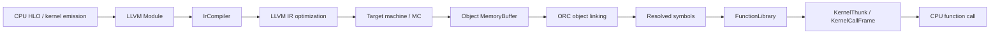

# 从 LLVM IR 到对象文件、ORC 符号和 CPU 调用

对应 R01/R02，继续沿同一 matmul/gradient 的真实产物走到底。这里把固定源码调用链
与产物证据分开：源码入口为 `SOURCE-ONLY`，字节审计为 `REPLAY-OFFLINE`；
原始计算与同进程 reload 是 `RUN-CPU`。旧 wheel 的 capture 带 `VERSION-SKEW`；
新增源码构建 003 的 capture 与实际 native reader 均通过身份绑定，没有该 qualifier。

## 源码构建 003 的三个对象

[source-codegen-results.json](source-codegen-results.json) 复查了匹配源码的 20 个派生产物。
来自 `source-runtime-002/suite/matmul` 的三个对象如下；生产与当前复查进程都使用
[source-built wheel 003](source-runtime-baseline.md)，包含新增的 native reader 身份核对。

| 样本 | 函数 | 对象 bytes | 函数 bytes | 序列化包偏移 |
|---|---|---:|---:|---:|
| grad_matmul | broadcast_multiply_fusion | 968 | 62 | 5162 |
| jit_grad_vmap_matmul | broadcast_multiply_fusion | 1048 | 143 | 6718 |
| jit_grad_vmap_matmul | copy_bitcast_fusion | 1152 | 250 | 7837 |

对象大小和符号长度在这两次 capture 中相同，序列化包的位置不同；不能沿用旧偏移。
每个对象的完整字节都在自己的包中恰好出现一次。这里只读字节，没有反序列化加载。
前向样本的库 fusion、梯度图剩余 dot 与普通 fusion 的区别见
[逐 pass 导读](matmul-pass-walkthrough.md)。后续 [CPU executable/trace](cpu-executable-and-trace.md)
已确认两处剩余 dot 的 DotThunk/Eigen 路径，并将源码中的入口与新运行的事件对应。

## 保留的旧 wheel 对象记录

[codegen-results.json](codegen-results.json) 绑定了 HLO fusion 名称、优化前后 LLVM
module/函数、ELF global function，以及序列化 executable 中的完整 `.o` 字节。
审计读取文件、调用 readelf/objdump，没有 unpickle、加载或执行历史文件。

| 原始样本 | 函数符号 | ELF 文件 bytes | 函数 bytes | 序列化包中的字节偏移 |
|---|---|---:|---:|---:|
| grad_matmul | broadcast_multiply_fusion | 968 | 62 | 5142 |
| jit_grad_vmap_matmul | broadcast_multiply_fusion | 1048 | 143 | 7921 |
| jit_grad_vmap_matmul | copy_bitcast_fusion | 1152 | 250 | 6698 |

每个完整对象在对应包中恰好出现一次；ELF 均为 little-endian ELF64、x86-64、ET_REL。
这些偏移是文件内位置，不是运行时函数地址。两个纯前向样本没有相应 `.ll/.o` dump，
不能据此推断没有执行机器码；其库/runtime 路径与本节生成的 fusion kernels 分开分析。

一个可直接复查的例子：grad 的优化后 LLVM IR 包含 `<24 x float>` 的乘 2；对应
62-byte 函数反汇编包含三条使用 YMM 寄存器的 `vaddps`。LLVM 向量形状没有直接对应为
一条“24 lane”机器指令。这只是该对象的静态编码，不是硬件流水线、实测吞吐或 TPU ISA。
原始反汇编位于 `artifacts/jax-stack/codegen-artifacts-001/`，工具版本和 SHA-256 均已记录。

## 固定源码中的生成与观察点



1. [GetIRModuleHooks](../../upstream/xla/xla/service/cpu/cpu_compiler.cc#L1245) 创建 LLVM
   优化前后观察 hook。[IrCompiler::operator()](../../upstream/xla/xla/backends/cpu/codegen/ir_compiler.cc#L289)
   依次获取 TargetMachine、调用 pre hook、运行 IR passes、调用 post hook、生成对象。
   `ir-no-opt.ll` 是这段 LLVM 优化前的状态，之前已有 HLO/MLIR/kernel lowering。
2. [RunIrPasses](../../upstream/xla/xla/backends/cpu/codegen/ir_compiler.cc#L354) 注册新 pass
   manager 的 analyses，按等级选择 O0 或
   [buildPerModuleDefaultPipeline](../../upstream/llvm-project/llvm/lib/Passes/PassBuilderPipelines.cpp#L1755)。
   当前源码还显式将 SLPVectorization 设为 false；不能仅根据选项名称断言实际打开了 SLP。
3. [EmitMachineCode](../../upstream/xla/xla/backends/cpu/codegen/ir_compiler.cc#L477) 使用
   **legacy codegen PassManager**，调用
   [addPassesToEmitMC](../../upstream/llvm-project/llvm/lib/CodeGen/CodeGenTargetMachineImpl.cpp#L262)，
   返回对象 MemoryBuffer。它与前一步的新 IR pass manager 是不同阶段。
4. [post-codegen hook](../../upstream/xla/xla/service/cpu/cpu_compiler.cc#L1406) 将对象字节
   留存在 ObjFileProto，并按 dump 条件写 `.o`。CpuExecutable 保存这些对象，支持后续导出。

这些接口解释了产物的位置；旧 wheel 与索引源码不匹配，其差异不能逐项归因于固定 LLVM。
源码构建 003 新增了匹配身份的产物；仍没有对每个内部 LLVM pass 分别插桩。构建使用“基础 LLVM pin + XLA
补丁集”，详见 [构建依赖审计](source-build.md)，不能只写一个 pristine revision。

## ORC 加载与 CPU ABI

[JitCompiler::AddModule](../../upstream/xla/xla/backends/cpu/codegen/jit_compiler.cc#L173)
为 ThreadSafeModule 设置 data layout、target triple 和 dylib index，再加入 IRCompileLayer。
[JitCompiler::Compile](../../upstream/xla/xla/backends/cpu/codegen/jit_compiler.cc#L193)
通过 lookup 请求所需符号，并等待派发的编译任务完成。AddModule 本身不是“全部代码已生成”。

固定 [LLVM IRCompileLayer::emit](../../upstream/llvm-project/llvm/lib/ExecutionEngine/Orc/IRCompileLayer.cpp#L28)
调用被配置的 Compile 对象（XLA 中为 IrCompiler），成功后把 buffer 交给对象层。
当前 [XLA 对象层](../../upstream/xla/xla/backends/cpu/codegen/execution_engine.cc#L37) 是
RTDyldObjectLinkingLayer；不要因为使用 ORC 就称其使用了 JITLink。

[ObjectLoader::LookupSymbols](../../upstream/xla/xla/backends/cpu/codegen/object_loader.cc#L172)
按目标 data layout 修饰名字，在 dylibs 中查找 exported symbols；
[CreateFunctionLibrary](../../upstream/xla/xla/backends/cpu/codegen/object_loader.cc#L206)
将解析后的类型标识、名字和地址连同 ExecutionEngine 的所有权保存到函数库。
JIT code memory 的 [finalizeMemory](../../upstream/xla/xla/backends/cpu/codegen/contiguous_section_memory_manager.cc#L157)
设置代码区 READ|EXEC、只读区 READ，并更新 instruction cache；这不是 tensor 的 BufferAssignment。

[KernelThunk::ExecuteInternal](../../upstream/xla/xla/backends/cpu/runtime/kernel_thunk.cc#L166)
从 tensor allocation slices 取得参数地址，按 kernel_name 从函数库解析函数。单 workgroup
可走 [CallOnce](../../upstream/xla/xla/backends/cpu/runtime/kernel.h#L118)，否则走线程池或
[同步 Launch 循环](../../upstream/xla/xla/backends/cpu/runtime/kernel.cc#L147)。后者构造
KernelCallFrame，再执行 `(*kernel_)(&call_frame)`。这是公开 CPU 调用合同，不能推导 TPU ABI。

## 验证与范围

```bash
.venv/bin/python -B research/jax-stack/audit_codegen_artifacts.py \
  --output artifacts/jax-stack/codegen-artifacts-new
.venv/bin/python -B research/jax-stack/verify_codegen_and_patch.py --selftest
```

默认复查 capture 001 的 19 个派生产物及所有引用输入，重读 ELF symbols，校验三个
对象的唯一嵌入、LLVM/HLO 名字对应和原始 CPU capture。原始 producer 的同进程 reload
已验证；本次字节审计不新增 runtime load 或 kernel timing 证据。
匹配源码的复查在固定镜像/003 venv 中运行 `verify_codegen_and_patch.py --codegen-only`，
并传 `--codegen-capture artifacts/jax-stack/source-lowering-audit-001/codegen`。
`--codegen-only` 跳过独立的历史补丁准备审计；默认历史入口保持兼容。
源码入口及选定调用关系已进入 [source-index.json](source-index.json)。
[ORC 官方设计说明](https://llvm.org/docs/ORCv2.html) 可作背景阅读，具体接口以本节固定源码为准。
