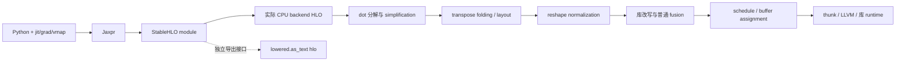

# matmul 的实际 CPU pass 改写

这次沿 **源码构建 003** 的四个 matmul 样本逐步解释中间 HLO。原始计算是
`RUN-CPU`，本次读取已有 dump 是 `REPLAY-OFFLINE`，两者均无 `VERSION-SKEW`。
生产与复查进程的 native payload 都绑定到同一 wheel；构建身份见
[源码运行基线](source-runtime-baseline.md)。本次没有重新执行 HLO，也没有 TPU/LLO 证据。

原始 capture：`artifacts/jax-stack/source-runtime-002/suite/matmul/`。
派生记录：`artifacts/jax-stack/source-lowering-audit-001/passes/`；
[复查结果](pass-transition-results.json) 登记 59 个派生产物。
每组变化有原始文件指纹、完整 unified diff，以及 native HLO reader 解析的
computation、opcode、operand 和逐条指令文本。模块序号只用于定位这次 capture。

## 先明确输入和观察点

`A[4,8]`、`W[8,6]`、`X[3,4,8]` 均为 float32；batch 共享 W，precision 为 HIGHEST。
前向结果是 `Y=AW` 与 `Z=XW`。平方和损失的梯度为
`dA=2YWᵀ`、`dW=2AᵀY`；batch 情形是 `dX=2ZWᵀ`、`dW=2∑ᵦXᵦᵀZᵦ`。
原始生产和独立 NumPy float64 数值复查均已通过。



导出 HLO 是独立观察接口，不能把它直接当成后端第一个 pass 的输入。
Jaxpr/StableHLO 对照继续见 [Notebook](matmul-lowering.ipynb) 与 [总览](overview.md)。
本次重点是实际 backend 的中间改写；schedule/buffer 见 [内存实验](fusion-and-memory.md)。

## 如何配对 pass，而不重复计数

原 capture 使用 `--xla_dump_hlo_pass_re=.+`。
[RunPassesInternal](../../upstream/xla/xla/hlo/pass/hlo_pass_pipeline.cc#L141)
先输出 `after_pipeline-start.before_第一个pass`，运行 pass 后输出
`after_当前pass.before_下一个pass`。相同 pipeline 内上一条的 `before` 必须等于
下一条的 `after`，才组成一组。新 `pipeline-start` 会重新开始配对。
字面量 `.*` 有“仅 pass 报告 changed 时输出”的特判，不能拿它保证所有边界都出现。

外层的 `after_simplification` 包含整个嵌套 pipeline 的结果；子 pipeline 内还有
algsimp、dce 等边界。因此它单列为汇总，不再算一个叶子 pass。
另有每个样本 3 份 copy-insertion 内部编号 dump，缺少此配对格式，只登记原文件。

| 样本 / module | pipeline 边界文件 | 配对组数 | 文本变化的叶子组 | 变化的嵌套汇总 |
|---|---:|---:|---:|---:|
| matmul / 0004 | 144 | 131 | 1 | 0 |
| vmap_matmul / 0014 | 160 | 146 | 5 | 1 |
| grad_matmul / 0024 | 160 | 146 | 4 | 1 |
| jit_grad_vmap_matmul / 0034 | 176 | 161 | 12 | 1 |
| 合计 | 640 | 584 | 22 | 3 |

“文本变化”是两份 dump 的字节比较，不是 pass 返回值，也不是性能收益。
完整配对表保存于每个样本的 `timeline.json`，未变化的组也保留。
native 节点比较包含操作数关系；只看 opcode 数量不足以说明图没变。

## 共享 W 的 vmap：batch 如何变成 12 行

`module_0014` 的五个变化边界如下。表中编号是 **after** 文件的序号。

| 编号 / pass | 本例的实际变化 | 固定源码入口 |
|---|---|---|
| 0016 / dot_decomposer | `[3,4,8] × [8,6] → [3,4,6]` 改成 reshape 后的 `[12,8] × [8,6] → [12,6]`，再 reshape 回去 | [CanonicalizeOperand](../../upstream/xla/xla/hlo/transforms/expanders/dot_decomposer.cc#L68) |
| 0055 / dynamic-dimension-simplifier | RHS 的 `[8,6]→[8,6]` identity reshape 的使用者直接引用其 operand；原节点暂时仍在 | [IdentityReshapeRemoving](../../upstream/xla/xla/hlo/transforms/simplifiers/dynamic_dimension_simplifier.cc#L158) |
| 0064 / algsimp | 删除恒等 transpose 和不再需要的 reshape，dot 直接使用 W | [HandleTranspose](../../upstream/xla/xla/hlo/transforms/simplifiers/algebraic_simplifier.cc#L9795) 等规则 |
| 0128 / reshape-decomposer | 输入与输出的两个 reshape 都成为 bitcast | [HandleReshape](../../upstream/xla/xla/hlo/transforms/expanders/reshape_decomposer.cc#L34) |
| 0133 / dot-library-rewriter | 主 computation 的 dot 被 `kCustom`、`__ynn_fusion` 包装；dot 移入 fusion computation | [CreateLibraryFusion](../../upstream/xla/xla/backends/cpu/transforms/library_rewriter.cc#L66) |

0055 的 opcode 计数前后相同，但 dot 的 operand 已变；这是验证器专门检查的反例。
0128 能只产生 bitcast，是因为这次输入/输出 layout 满足条件。
同一源码的其他分支会加入一个或两个 copy，不能推广为“reshape 总是免费”。
这里的高秩收缩被展平，也不能解释为实际执行了 3 次独立 matmul launch。

## 梯度：转置、layout 与普通 fusion

单样本梯度的变化发生在 0064/algsimp、0123/layout-assignment、
0133/dot-library-rewriter、0138/fusion；0095 是 simplification 汇总。
algsimp 除了清理恒等操作，还将 dW 的 `transpose(dot(...))` 改写为交换操作数的 dot。
layout-assignment 将 dW 的 `[8,6]{0,1}` 改为 `[8,6]{1,0}`，输出 tuple 的相应 layout 一起变化。
普通 fusion 随后把标量 2、broadcast 和 multiply 收入 `broadcast_multiply_fusion`。

batch 梯度多出下面几段可直接看 diff 的过程：

| 编号 / pass | 观察到的变化 |
|---|---|
| 0076 / reshape-mover | 乘 2 从 `[3,4,6]` 移到 `[12,6]`，两侧 reshape 随之调整 |
| 0080 / algsimp | 合并连续 reshape，并把 broadcast 调整到 `[12,6]` |
| 0082 / dce | 删除已经无使用者的额外 broadcast |
| 0135 / transpose-folding | dX 的 dot 不再引用 `W.T[6,8]`，改用 `W[8,6]`，rhs contracting dimension 从 0 改为 1 |
| 0136 / cse | 两份相同的 `X[3,4,8]→[12,8]` reshape 合并，dW 的 dot 改用同一结果 |
| 0139 / layout-assignment | `[6,3,4]` transpose 的 layout 改为 `{0,2,1}`，其后新增 copy 回 `{2,1,0}`；dW 输出 layout 也改变 |
| 0144 / reshape-decomposer | 布局确定后的相关 reshape 改为 bitcast |
| 0149 / dot-library-rewriter | 两个 dot 改为 YNN custom fusion，dW dot 留在 ENTRY |
| 0154 / fusion | 产生两个普通 kLoop fusion：乘 2，以及包含 transpose/copy/bitcast 的结果重排 |

另有 0016、0055、0064 三组与前向展开相关的改写；0111 是嵌套汇总。
上述 reshape 移动入口是 [ReshapeMover::RunImpl](../../upstream/xla/xla/hlo/transforms/simplifiers/reshape_mover.cc#L399)，
transpose folding 会先检查[后端合法性回调](../../upstream/xla/xla/service/transpose_folding.cc#L221)，
layout 约束入口是 [CpuLayoutAssignment](../../upstream/xla/xla/service/cpu/cpu_layout_assignment.cc#L133)。
这些布局和 copy 是编译表示，不是实测内存流量或峰值。

两个普通 fusion 的 computation 里都包含乘 2，可在 0154 的 native 节点记录中看到；
这不代表把前向 dot 重算两次。fusion 的判定还受
[CPU 专用条件](../../upstream/xla/xla/service/cpu/cpu_instruction_fusion.cc#L403)
和通用 InstructionFusion 条件共同约束。

## 最终图有三类入口

这里仅计 ENTRY，不能把 fusion 内部保留的 dot 再算成独立入口。

| 样本 | YNN custom fusion | 普通 kLoop fusion | 留在 ENTRY 的 dot |
|---|---:|---:|---:|
| matmul | 1 | 0 | 0 |
| vmap_matmul | 1 | 0 | 0 |
| grad_matmul | 2 | 1 | 1 |
| jit_grad_vmap_matmul | 2 | 2 | 1 |

源码中，`__ynn_fusion` 分支进入
[EmitYnnFusionThunk](../../upstream/xla/xla/service/cpu/thunk_emitter.cc#L1410)，
收集 allocation slices 并构建 YNN subgraph；其
[Invoke](../../upstream/xla/xla/backends/cpu/runtime/ynnpack/ynn_fusion_thunk.cc#L90)
设置参数/结果地址和线程池，再调用 `ynn_invoke_runtime`。
这是源码调用关系；本次没有采样实际 runtime dispatch，也没有追踪 YNN 内部代码生成。

两个前向样本没有选定 emitter 的 `.o`，不能推断它们没有机器码。
普通 fusion 的三个 `.o` 已逐个绑定 LLVM 与序列化字节，见
[匹配源码的对象结果](source-codegen-results.json) 和 [LLVM 导读](llvm-and-objects.md)。
梯度中剩余的 dot 则由
[EmitDotThunk](../../upstream/xla/xla/service/cpu/thunk_emitter.cc#L985)
调用 [GetDotImplementationStrategy](../../upstream/xla/xla/service/cpu/dot_op_emitter.cc#L1413)，
选择 LLVM kernel 或 Eigen DotThunk；本次没有仅根据缺少对象 dump 就把该选择写成实测事实。

## 复查入口

以下命令在[固定镜像与源码 003 环境](source-runtime-baseline.md)中运行；`PY` 指该独立
venv 的 Python。宿主机旧 wheel 不能充当匹配源码的 native reader。
容器启动的精确 argv 保存在本次 raw 目录的 `pass-launch.json`、`pass-verification.json`
与 `codegen-verification.json`，root/source 只读，输出目录单独可写。

```bash
"$PY" -B research/jax-stack/audit_pass_transitions.py \
  --output artifacts/jax-stack/source-pass-audit-new
"$PY" -B research/jax-stack/verify_pass_transitions.py --selftest
"$PY" -B research/jax-stack/verify_codegen_and_patch.py --codegen-only \
  --codegen-capture artifacts/jax-stack/source-lowering-audit-001/codegen
```

验证器重读源 capture、完整清单、640 份 native HLO、配对与 diff，并检查形状改写、
operand forwarding、layout copy 和最终图。六个反例覆盖错误哈希、漏文件、提升证据等级、
不相邻 pass、误称全部 dot 已库融合，以及漏记 operand 重接。
Notebook 另用真实 Jupyter 内核复查归档与数学参考；它没有在旧 wheel 中重跑源码 reader。
