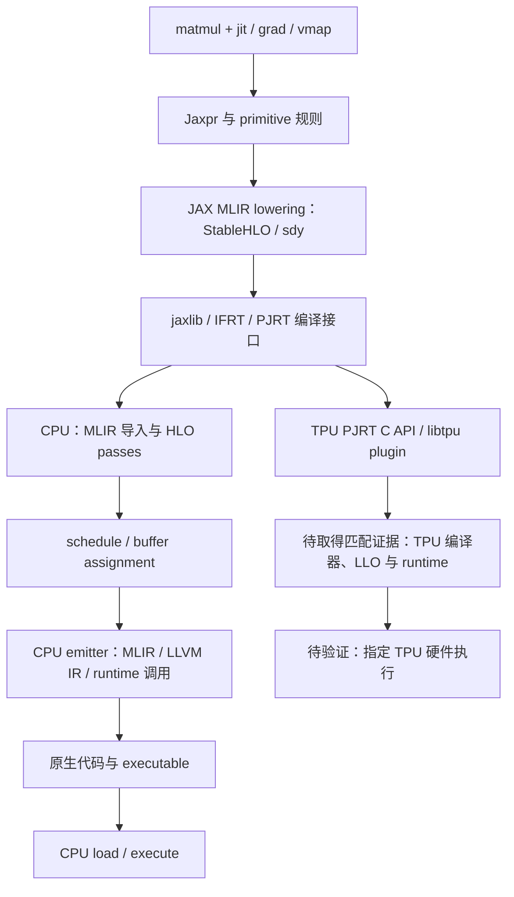
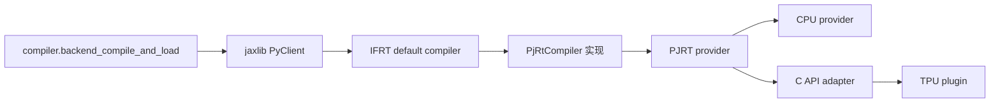
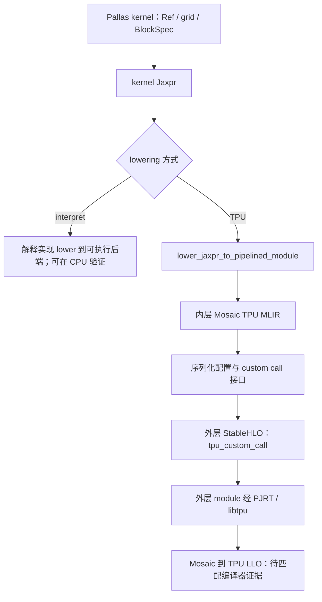

# 软件栈与入口总览：第一轮源码核对

依据 [kickoff revision 51](https://outline.infiscale-tech.com/doc/research-plan-jax-kickoff-ib5QULKSS4)。
当前索引有 166 个经过文件指纹和行号核对的入口、53 条带调用位置的关系，见
[source-index.json](source-index.json)。这是入口索引；完整调用图、私有 libtpu/LLO、
实际推理业务和 TPU 执行验收仍未完成。

## 组件的职责和边界

| 组件 | 本次确认的职责 | 已定位的入口 |
|---|---|---|
| JAX Python | 将 NumPy 风格表达、jit/grad/vmap 和 primitive 规则组织成可 lowering 的程序 | [`matmul`](../../upstream/jax/jax/_src/numpy/tensor_contractions.py#L138)、[`jit`](../../upstream/jax/jax/_src/api.py#L204)、[`_trace_for_jit`](../../upstream/jax/jax/_src/pjit.py#L485) |
| JAX MLIR lowering | 根据 Jaxpr、平台、sharding、effects 等上下文创建 MLIR module | [`lower_jaxpr_to_module`](../../upstream/jax/jax/_src/interpreters/mlir.py#L1324)、[`_dot_general_lower`](../../upstream/jax/jax/_src/lax/lax.py#L6264) |
| jaxlib | Python/native 绑定、client 与 executable 的包装 | [`PyClient::CompileAndLoad`](../../upstream/jax/jaxlib/py_client.cc#L475)；此 revision 的源码位于 JAX 仓库 |
| StableHLO | 操作、类型和属性的方言定义；本例矩阵收缩以 dot_general 表达 | [`StableHLO_DotGeneralOp`](../../upstream/stablehlo/stablehlo/dialect/StablehloOps.td#L2740) |
| Shardy | 分片表示以及 import、propagation、export 的 pass 组织 | [`addPropagationPipeline`](../../upstream/shardy/shardy/dialect/sdy/transforms/propagation/propagation_pipeline.cc#L62) |
| XLA | MLIR/HLO 转换，以及后端 HLO 优化、调度、buffer assignment 和代码生成 | [`MlirToXlaComputation`](../../upstream/xla/xla/pjrt/mlir_to_hlo.cc#L99)、[`CpuCompiler`](../../upstream/xla/xla/service/cpu/cpu_compiler.cc#L1188) |
| IFRT/PJRT | 编译、设备和 executable 接口；在具体 provider 上完成 compile/load 等操作 | [`PjRtCompiler`](../../upstream/xla/xla/python/pjrt_ifrt/pjrt_compiler.cc#L91)、[`PjRtLoadedExecutable::Create`](../../upstream/xla/xla/python/pjrt_ifrt/pjrt_executable.cc#L744) |
| LLVM/MLIR | CPU 编译器使用 MLIRContext、LLVMContext、LLVM Module 和目标代码生成设施 | [`CompileCpuExecutable`](../../upstream/xla/xla/service/cpu/cpu_compiler.cc#L1727)；内部 LLVM API 索引待继续展开 |
| Pallas/Mosaic | kernel Jaxpr、grid/Ref/块访问表达，以及 Mosaic TPU module 与外层 custom call 的衔接 | [`pallas_call`](../../upstream/jax/jax/_src/pallas/pallas_call.py#L1135)、[`pallas_call_tpu_lowering_rule`](../../upstream/jax/jax/_src/pallas/mosaic/pallas_call_registration.py#L393) |
| libtpu | 公开可读部分是 PJRT plugin 的加载与 C API 边界；内部编译器/runtime 尚未取得对应实现证据 | [`make_tpu_client`](../../upstream/jax/jax/_src/xla_bridge.py#L198)、[`PjRtCApiClient::CompileAndLoad`](../../upstream/xla/xla/pjrt/c_api_client/pjrt_c_api_client.cc#L763) |

源码依赖的固定值来自 `upstream-sources.lock`：JAX 的
[`MODULE.bazel`](../../upstream/jax/MODULE.bazel#L32) 固定 XLA；XLA 的
[StableHLO](../../upstream/xla/third_party/stablehlo/workspace.bzl#L22)、
[Shardy](../../upstream/xla/third_party/shardy/workspace.bzl#L21) 和
[LLVM](../../upstream/xla/third_party/llvm/workspace.bzl#L22) 定义继续固定其依赖。
这些构建定义还列有补丁；固定 pristine checkout 不等于已经证明构建依赖闭包。

## 程序表示与后端分支

下图表示公开源码中的衔接关系。TPU 私有部分只标边界；CPU 原始产物位于
`artifacts/jax-stack/cpu-matmul-003/`，不能用来证明 TPU 分支。

`_cached_lowering_to_hlo` 虽然名字含 HLO，当前函数实际调用
`mlir.lower_jaxpr_to_module`。另外，导出路径里的 `StablehloToMhlo` 也不能仅按名称解释：
[`ConvertStablehloToHloProtoInternal`](../../upstream/xla/xla/hlo/translate/stablehlo.cc#L103)
设置了 `direct_stablehlo_to_hlo=true`。索引需要根据函数体和实际产物建立关系。

## 编译控制链

普通 client 路径中，Python 的
[`backend_compile_and_load`](../../upstream/jax/jax/_src/compiler.py#L335)
调用 `backend.compile_and_load`。jaxlib 克隆 MLIR module、包装 IFRT HloProgram，
再调用 default compiler。选用 PjRtCompiler 时，它通过 PjRtLoadedExecutable 进入
PJRT provider；只有 provider 是 C API adapter 时，才继续到 `PJRT_Client_Compile`。
这些分支不能画成所有 backend 都必经的单一直线。

jaxlib 的 [`CompileAndLoadIfrtProgram`](../../upstream/jax/jaxlib/py_client.cc#L372)
在 IFRT 调用和等待 future 的代码范围内释放 GIL。这是固定源码事实；它不能单独
说明历史挂起案例的触发条件、修复状态或当前 wheel 的线程行为。

## Pallas 的两层表示

[`_pallas_call_lowering`](../../upstream/jax/jax/_src/pallas/pallas_call.py#L844)
明确区分 interpret 与平台 lowering；CPU 非 interpret 路径报错。TPU lowering 先构建
Mosaic module，再通过 helper 进入 custom call 接口。
[`_tpu_custom_call_lowering`](../../upstream/jax/jax/_src/tpu_custom_call.py#L409)
把 backend config、effects、alias 与 layout 信息放到外层调用。**Mosaic TPU MLIR 不是 LLO。**

## 本轮可以验证到哪里

- 源码：166 个入口和 53 条调用/分派关系的路径、revision、行号与 SHA-256，含已锁定的 XProf tooling 源码。
- CPU：四组 matmul 变换的数值、实际 native HLO dump、部分 MLIR/LLVM 代码生成、
  ELF 目标文件，以及四个序列化 executable 的同进程重新加载。
- Pallas/profiling：两种解释路径、host 生命周期及统计、现有 wheel 的编译 pass 事件，
  以及开放源码 TPU lowering 生成的配对 Mosaic 标记，见 [profiling.md](profiling.md)。
- 属性/cost：六种 metadata 情形、直接编辑 IR 的属性传递边界、native HLO 属性 API、
  add→subtract 改写后的真实执行，以及已定位的 XProf roofline 处理链，见 [attributes-and-cost.md](attributes-and-cost.md)。
- Fusion/memory：11 组 CPU 对照，包含实际 pass 前后结构、独占/外部 view donation、reshape
  counterfactual、allocation/offset/liveness 与 peak 诊断重算，见 [fusion-and-memory.md](fusion-and-memory.md)。
- 仍未证明：完整源码调用图、匹配源码构建/加载、libtpu 编译与 TPU runtime/LLO、真实业务
  fusion/Pallas 注入、split 降低运行峰值、通信 overlap、设备 trace 与自建编译器标记。

当前 CPU binary 带 `VERSION-SKEW`。上表的 native 源码入口是源码定位，不能以名称相同
为由宣称当前 wheel 执行了该固定 XLA revision。完整范围与待确认输入仍以
[PLAN.md](PLAN.md) 为准。
