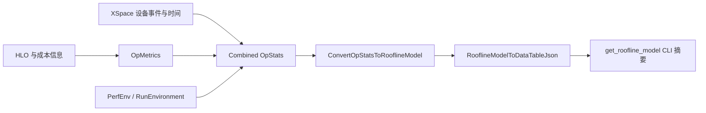

# Roofline：已有模块、输入与修正位置

R10 的直接答案：**已有模块，但一张 StableHLO 只足以提供部分静态成本输入。**
还需要目标设备峰值与内存带宽，才能给出理论上限；定位实际运行点还需要匹配 workload、
设备/核心和时间范围的运行数据。不能把 `cost_analysis()` 的字典直接称为实测 roofline。

本节固定源码为 JAX/XLA 的既定 revisions，以及 `upstream-sources.lock` 已登记的 XProf
`68dba1826c37986af41f6119930ec315592a51f6`。本轮补齐了此前为空的 XProf 子模块，
版本未更新、源码树干净。XProf 部分为 `SOURCE-ONLY`，没有安装或执行其 native converter。
CPU 成本输入的实际实验见 [attributes-and-cost.md](attributes-and-cost.md)。

新 checkout 需要补齐这个已固定的可选源码后再运行完整索引校验：

```bash
git submodule update --init --depth 1 --filter=blob:none -- upstream/tooling/xprof
```

## 可以复用的处理链



图中 cost 来源因 backend 而异，不能假定所有 TPU 数据都由开源 CPU analyzer 重新计算。

| 层 | 固定源码入口 | 输入与职责 |
|---|---|---|
| JAX 静态分析 | [MeshComputation.cost_analysis](../../upstream/jax/jax/_src/interpreters/pxla.py) | 转成 HLO，调用 backend cost analyzer；部分 PJRT C API backend 的 lowering 分析不支持，提示用 compiled 分析 |
| XLA 模型 | [HloCostAnalysis](../../upstream/xla/xla/service/hlo_cost_analysis.cc) | 指令成本和可选 rates；shape 字节不是实测 HBM 流量 |
| XProf session | [RooflineModelProcessor](../../upstream/tooling/xprof/xprof/convert/roofline_model_processor.cc) | 多 XSpace 合并成 OpStats，生成包含/排除 infeed/outfeed 的两组记录 |
| XProf 计算 | [SetRooflineMetrics](../../upstream/tooling/xprof/xprof/convert/op_metrics_to_record.h) | 计算吞吐、各级内存强度和资源瓶颈，读取 PerfEnv/RunEnvironment |
| XProf 汇总 | [ConvertOpStatsToRooflineModel](../../upstream/tooling/xprof/xprof/convert/op_stats_to_roofline_model.cc) | program/step/op 记录、资源效率与 JSON 表 |
| CLI 摘要 | [get_roofline_model](../../upstream/tooling/xprof/plugin/xprof/cli/tools/get_roofline_model_tool.py) | session_id → 查询 roofline_model.json，fallback roofline_model，再整理 JSON |

CLI 签名包含 `top_n=15`、`group_by="program"`、`bypass_cache=False`。
**这个固定版实际执行 `del group_by`**，参数存在不代表已支持 program/step 切换。
前端/CLI 部分缺失数字会转为零或 `N/A`，应联查原表和诊断，不能只看格式化摘要。

## 计算口径

对于统一字节口径的模型，令静态工作量为 `F`，字节估计为 `B`，设备峰值为 `P` FLOP/s，
带宽为 `W` byte/s：

\[
I=F/B,\qquad P_{roof}=\min(P, W I),\qquad
t_{bound}=\max(F/P,B/W).
\]

本例普通 matmul 提供 `F=384`、`B=416`，所以模型强度为 `12/13≈0.9231 FLOP/byte`。
没有给出目标 `P/W`，也没有相同设备事件范围的时间，本节不填造 roofline 曲线或利用率。
XProf 的 [RidgePoint](../../upstream/tooling/xprof/xprof/utils/roofline_model_utils.cc) 还显式转换
GiB/s 与 GB/s；实现和调用时不能混用二进制/十进制单位。

固定 XProf 的 `measured_flop_rate` 字段由 `flops_v2 / time_ps` 导出。
名称含 measured 不足以证明分子来自硬件计数器：需要进一步检查 flops_v2 的来源、精度归一化
及动态频率处理。Program 聚合跳过可能包含内层操作的记录，避免父子重复计数。
`roofline_efficiency` 采用计算与各内存利用率的最大值；异步 copy 的字节/时间估计可能
产生大于 1 的数，固定源码有相应说明。

另一个边界是：缺少内存访问分解时，此版 `SetRooflineMetrics` 把全部字节作为 HBM 处理。
这是一种实现上的回退规则，不是已证实所有流量都访问了 HBM。

## Unknown 不能解释为零成本

CPU reference analyzer 对本次外层 `tpu_custom_call` 返回 `-1`，没有可用的模型 FLOPs/字节。
XProf [ValidHloCost](../../upstream/tooling/xprof/xprof/utils/cost_utils.h) 把 `-1` 转成 `0`，
[PerformanceInfoWrapper](../../upstream/tooling/xprof/xprof/utils/performance_info_wrapper.h)
部分 getter 使用它。下游出现零值，不能据此证明设备没有做计算。

固定版 [custom-call 文档](../../upstream/tooling/xprof/docs/custom_call_profiling.md) 也讨论
Pallas 的 roofline 缺失情况。这属于该工具版本的说明；本轮既没有执行 TPU profiler，也
没有验证当前 libtpu，不能推广成所有版本和后端永远不支持 custom-call 成本。
实际源码 [XSpace→OpStats](../../upstream/tooling/xprof/xprof/convert/xplane_to_op_stats.cc) 在此
TPU 分支把 cost-analysis factory 设为 nullptr，GPU 分支则从 registry 获取 analyzer；
不能直接用 CPU HandleCustomCall 的行为替代整条 TPU 数据来源调查。

## 如何修正、还需要什么

- **补模型语义**：已有标准 HLO 优先修对应 XLA/backend handler。自定义 kernel 需要明确
  工作量、内存层级和 dtype 口径的 cost provider，再接入 PerformanceInfo/OpMetrics。
  不能只写一个自定义 `flops` 标签或把整个 kernel 用单个外层 custom-call 的 shape 估算。
- **保留可用性信息**：在 cost wrapper/OpMetrics 到 UI/CLI 的链上区分 unknown、zero 和
  measured/model；同时报告缺失成本的算子或时间覆盖率，避免 `-1→0` 被当成高效率或零负载。
- **正确选择记录**：若要支持 `group_by`，CLI 必须选择对应 record_type/step，而非丢弃参数。
  同时固定 infeed/outfeed、core 数、频率归一化和时间范围。
- **设备验收**：取得 U03 的 TPU 型号、libtpu 与 profiler 版本后，验证同一 workload 的
  HLO/cost 来源、设备 trace、PerfEnv、内存分解和结果；用独立算量检查交叉验证分子。

这些是已定位的实现和后续修改范围，尚未宣称修改了 XProf 或取得真机 roofline。
官方 [Roofline Model Tool 文档](https://openxla.org/xprof/roofline_model) 可用作界面说明，
具体语义仍以上述固定源码与将来的目标运行记录为准。
