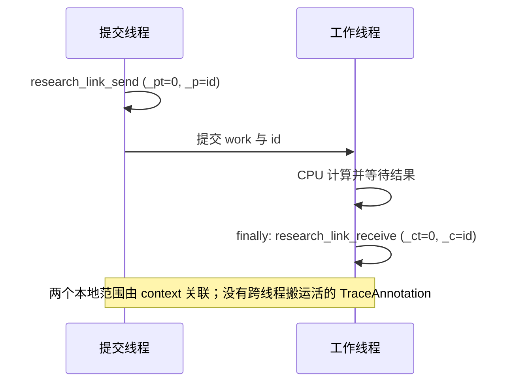

# XSpace：关联起点、完成点与跨线程任务

固定源码 wheel `kickoff-cpu-source-003` 的五份 CPU trace 共验证 **49 组一对一关联，
其中 13 组跨线程**。关联来自原始 XSpace 的 context 字段；事件名、相邻位置、
producer 的本地 `duration` 都不足以确定异步完成点。新增四个受控任务按 0→3 发出、
按 3→0 完成；其中一个在计算完成后抛出预期异常，`finally` 仍记录终点。

结果见 [xspace-context-results.json](xspace-context-results.json)，交互复查见
[xspace-contexts.ipynb](xspace-contexts.ipynb)。原始采集为 `RUN-CPU`，解析与派生为
`REPLAY-OFFLINE`。两组 producer 均核对 Git identity、成功构建、实际加载 native 字节与
wheel；无 `VERSION-SKEW`。这不是 TPU 执行或性能验收。

## 1. 哪个字段表示“同一项工作”

[TraceMeProducer](../../upstream/xla/third_party/tsl/tsl/profiler/lib/connected_traceme.h#L76)
写 `_pt` / `_p`，
[TraceMeConsumer](../../upstream/xla/third_party/tsl/tsl/profiler/lib/connected_traceme.h#L99)
写 `_ct` / `_c`，分别表示 context type 和 context ID。`Generic=0` 是有效类型；
不能通过真假值检查丢弃 type、ID 或 PID 为零的事件。

本审计使用 `(原始 XSpace SHA-256, 有效 process_id, context_type, uint64 context_id)`
作为键。事件本身使用 `(plane 索引, line 索引, event 索引)` 定位：这些文件的三个 plane
都可有 `id=0`，所以 plane ID 不是唯一坐标。线程比较使用原始 process/line ID，
不会用 JSON 中截断后的显示 ID。

固定源码的 [GroupingEventStats](../../upstream/xla/xla/tsl/profiler/utils/group_events.cc#L103)
读取事件 occurrence stats；consumer 的 `_pid` 可覆盖有效 PID。这里仅覆盖 Generic 和
ThreadpoolEvent，未推广到 TPU/GPU launch 的特殊 PID 规则、多 host 或实际跨进程采集。
`_pid` 覆盖只做了合成数据检查。原生 [ConnectContextGroups](../../upstream/xla/xla/tsl/profiler/utils/group_events.cc#L200)
允许多对多连接；本实验只接收恰好一个 producer 和一个 consumer，歧义或缺失直接失败。

[NewActivityId](../../upstream/xla/xla/tsl/profiler/backends/cpu/traceme_recorder.cc#L259)
由线程和事件计数器组成，有计数复用边界，不能当作跨文件永久唯一 ID。
[XStat](../../upstream/xla/third_party/tsl/tsl/profiler/protobuf/xplane.proto#L118) 保留
int64/uint64 两种 wire value；本解析器用十进制字符串保存身份，再按源码的
`IntOrUintValue()` 规则转换 signed ID。负一与 uint64 最大值可以表示同一 ID；
先转浮点会破坏这个关系。



## 2. 实际观察到了哪些关联

| Capture | CPU thunk | 线程池 Record→StartRegion | Future Await | 自定义任务 | 跨线程 |
|---|---:|---:|---:|---:|---:|
| matmul | 3 | 0 | 0 | 0 | 0 |
| vmap_matmul | 3 | 3 | 3 | 0 | 3 |
| grad_matmul | 12 | 3 | 0 | 0 | 3 |
| jit_grad_vmap_matmul | 15 | 3 | 0 | 0 | 3 |
| explicit_host | — | — | — | 4 | 4 |
| 合计（选定范围） | 33 | 9 | 3 | 4 | 13 |

前四份原始 trace 来自 [CPU thunk 实验](cpu-executable-and-trace.md)。每个样本执行三次，
33 个 thunk producer 都找到对应 `end: ...`；这些小样本中的 thunk 起止均在同线程。
九个线程池 handoff 则确实跨线程。
[RecordEvent / StartRegion](../../upstream/xla/xla/tsl/profiler/backends/cpu/threadpool_listener.cc#L56)
是瞬时调度/接收事件；`StopRegion` 没有该 context ID，不能据此把 handoff 算成整段任务执行。

三个 `CommonPjRtBuffer::Await` 关联的两端同名但坐标不同。
[CreateProfiledFuture](../../upstream/xla/xla/pjrt/common_pjrt_client.cc#L817) 在 block start/end
回调间传递 ProfilingKeys。本地 producer 范围与整个等待区间不同。

新增 [host_context_probe.py](host_context_probe.py) 使用四个 `A[16,16] @ W[16,24]`，
先编译并 warm，再开 profiler。barrier 确保任务已开始，completion gate 控制逆序完成。
四份输出都通过 NumPy float64 参考，最大绝对误差不超过 `1.74e-8`；work 3 在结果 ready
后抛出预期异常。发出与完成使用独立 `TraceAnnotation`，通过固定版本的内部 metadata 关联。
这不是承诺稳定的公开异步事件 API。

| Work | 原始 context ID（十进制） | 完成次序 | 结果 |
|---|---|---:|---|
| 0 | `1152921504606846976` | 4 | success |
| 1 | `1152921504606846977` | 3 | success |
| 2 | `9223372036854775815` | 2 | success |
| 3 | `18446744073709551615` | 1 | expected-error |

前两个相邻 ID 都超过浮点精确整数范围，仍分别匹配正确 work；四条关系均跨线程。
所有 send 起点都早于第一个 receive。此处区间含 barrier、gate、Python 调度和 profiler
开销，不能报告为 kernel latency、硬件并发度或加速收益。

## 3. 为什么普通 JSON 不足以还原关联

本次 98 个选定原始事件均找到唯一 JSON 对应项。对应过程检查名称、显示 PID/TID、
绝对 ps 时间及导出后的 duration，并拒绝重复匹配。关键差异如下：

- `_pt/_p/_ct/_c/program_id` 被
  [IsInternalStat](../../upstream/xla/xla/tsl/profiler/utils/xplane_schema.cc#L615) 过滤；
  `work/outcome/hlo_op/hlo_module/run_id/_src` 等公开字段仍可核对。
- 原始时间按 [TimestampPs](../../upstream/xla/xla/tsl/profiler/utils/xplane_visitor.h#L199)
  计算 `line.timestamp_ns * 1000 + event.offset_ps`。导出 `ts/dur` 使用微秒；
  `displayTimeUnit=ns` 不改这些数字的单位。
- [AddTraceEvent](../../upstream/xla/xla/tsl/profiler/convert/trace_events_to_json.cc#L87)
  把零 duration 显示为 1 ps。本次选定事件有 18 个这样的值，不能当成实测耗时。
- JSON 的 host `pid=701` 是 viewer device ID，原始 capture 的 `process_id=7` 才是该
  容器采集中的进程身份。显示 TID 取 DisplayId 后再转 uint32，不能替代原始 signed64 line ID。
- 同一 occurrence 可有重复 `_src`：先是 `thunk.cc`，后是 `thunk_executor.cc`。
  [ConvertXPlaneToTraceEvents](../../upstream/xla/xla/tsl/profiler/convert/xplane_to_trace_events.cc#L62)
  对参数依次赋值，最后一个生效。全部 rows 中有 37 处该覆盖记录，选定 thunk 中 33 处。
  解析器保留覆盖历史；相冲突的 context 字段仍拒绝。

这也解释了保留的首次审计失败：`xspace-context-audit-001` 错把普通 stat 的重复视为非法，
遇到 `_src` 后退出。修正后在新目录 `002` 重新采集，原失败记录未改写。

## 4. 派生 flow 与 XProf 原生路径

原 JAX 导出 JSON 没有 legacy `s/t/f` 或 FlowV2 `bind_id/flow_in/flow_out`。
审计为每对关联另加 `s/f` 记录，共 98 条，保存为各 case 的 `derived-trace.json`。
ID 使用本工具的 SHA-256 派生十六进制字符串，原始 context ID 留在 args 的十进制字符串中。
Chrome JSON 的 `s/t/f` flow 格式由 [Perfetto 官方文档](https://perfetto.dev/docs/getting-started/other-formats)
列为支持类型；本轮只验证数据生成与格式字段，没有启动 viewer 检查箭头渲染。

这份 overlay 没有执行 XProf。锁定 XProf `68dba182` 的
[PreprocessSingleHostXSpace](../../upstream/tooling/xprof/xprof/convert/preprocess_single_host_xplane.cc#L34)
在 `step_grouping` 且尚未分组时调用 `AddFlowsToXplane(..., connect_traceme=true)`。
其 context hash、flow stat、[trace container](../../upstream/tooling/xprof/xprof/convert/xplane_to_trace_container.cc#L98)
及 [FlowV2 writer](../../upstream/tooling/xprof/xprof/convert/trace_viewer/trace_events_to_json.h#L317)
是另一条源码路径；未验证匹配的 XProf 构建、预处理结果或 UI。

## 5. 复跑与独立检查

依赖已有源码构建 003 的独立环境、固定 Docker 镜像、原始 thunk capture 002，以及
[CPU proto/schema 工具](cpu-executable-and-trace.md)。生产器要求未设置 `XLA_FLAGS`，
只接受新的输出目录。不要用宿主机旧 wheel 代替 source-bound producer。

下面的函数在固定镜像中运行命令，源码与已有证据只读，只允许指定输出父目录写入。
两个输出父目录均应先选未使用的名字；`capture` 由工具创建。

```bash
TASK_ROOT="$PWD"
TASK_IMAGE=sha256:abad11bf00a9611382e946ab243d7e3d105a4019ba3cf6bd542223debb18d6e8
TASK_PY="$TASK_ROOT/artifacts/jax-stack/source-runtime-002/baseline-env/venv/bin/python"
run_context_check() {
  local task_output="$1"
  shift
  docker run --rm --init --pull=never --network none --read-only \
    --cap-drop ALL --security-opt no-new-privileges --cpus 4 --memory 12g \
    --pids-limit 1024 --tmpfs /tmp:rw,exec,nosuid,nodev,size=3g --user "$(id -u):$(id -g)" \
    --mount "type=bind,src=$TASK_ROOT,dst=$TASK_ROOT,readonly" \
    --mount "type=bind,src=$TASK_ROOT/artifacts/environment/docker-venv,dst=$TASK_ROOT/.venv,readonly" \
    --mount "type=bind,src=$TASK_ROOT/$task_output,dst=$TASK_ROOT/$task_output" \
    --workdir "$TASK_ROOT" "$TASK_IMAGE" "$TASK_PY" -B "$@"
}
mkdir artifacts/jax-stack/host-context-runtime-new
run_context_check artifacts/jax-stack/host-context-runtime-new \
  research/jax-stack/host_context_probe.py \
  --output artifacts/jax-stack/host-context-runtime-new/capture \
  --jaxlib-build-manifest manifests/build-fingerprints/kickoff-cpu-source-003.json
mkdir artifacts/jax-stack/xspace-context-audit-new
run_context_check artifacts/jax-stack/xspace-context-audit-new \
  research/jax-stack/audit_xspace_contexts.py \
  --host-capture artifacts/jax-stack/host-context-runtime-new/capture \
  --output artifacts/jax-stack/xspace-context-audit-new/capture
run_context_check artifacts/jax-stack/xspace-context-audit-new \
  research/jax-stack/verify_xspace_contexts.py \
  --capture artifacts/jax-stack/xspace-context-audit-new/capture --selftest \
  --result artifacts/jax-stack/xspace-context-audit-new/verified.json
```

本轮正式输入是 `host-context-runtime-001/capture`（17 个产物）与
`cpu-thunk-runtime-002/capture`（39 个产物）；输出为 `xspace-context-audit-002/capture`
（45 个产物），另引用 94 个 schema 工具产物。源码 XPlane schema 只有一份 proto，
原路径与快照生成的 descriptor 相同；C++ protoc 的 decode→text→encode 与 Python
动态 protobuf 解析逐事件相等。验证器重新生成 rows、分组、关联、JSON 对应与 overlay，
再与保存的结果比较。

20 个拒绝样本覆盖哈希/缺文件/证据级别、跨进程/跨文件误连、缺终点、歧义、时间倒置、
浮点 ID、告警、metadata 缺失/冲突、零时长显示、JSON 歧义、内部字段误导出、错误 `_src`
覆盖顺序和两种已有 flow 格式。六个正向边界涵盖零值、signed/uint64、类型命名空间、
合成 PID 覆盖、1 ps 显示与 `_src` 覆盖历史。

[Notebook](xspace-contexts.ipynb) 在真实 Jupyter kernel 中复查归档、关联、数值和反例。
它不重新采集 trace、不加载 executable，也不声称当前宿主机 kernel 使用了源码 wheel。
TPU 标记编译保留、设备 plane/core、LLO 与真机事件继续留待 U03。
