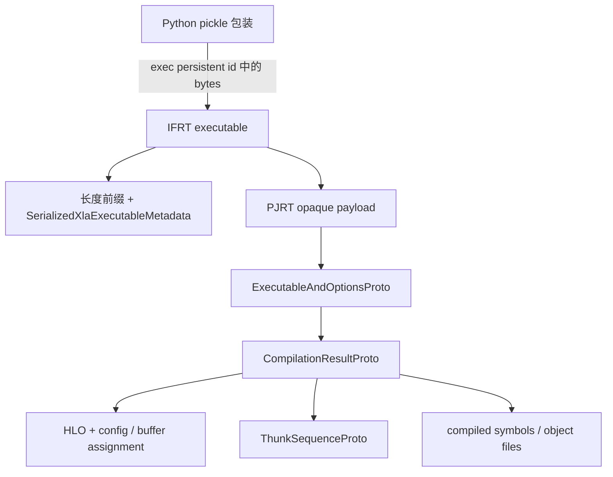

# 从 CPU executable 确认 thunk，再对照实际执行事件

本例的两个梯度图中，剩余 dot 都走 **DotThunk / Eigen contraction 路径**。
依据是匹配源码构建 003 的序列化 thunk 类型、HLO/维度对应，以及同一新编译对象的
warm 执行 trace。前向的 YNN fusion、普通 LLVM kernel 与 DotThunk 分别取证，
没有根据“缺少 `.o` dump”判断实现选择。

[cpu-thunk-results.json](cpu-thunk-results.json) 保存完整复查结果。原始 matmul
来自 `source-runtime-002/suite/matmul`，新增运行来自 `cpu-thunk-runtime-002/capture`；
二者都是无 `VERSION-SKEW` 的 `RUN-CPU`。本次只读联合审计是 `REPLAY-OFFLINE`，
包含 62 个派生产物；新运行有 39 个产物，schema/tooling 有 94 个产物。
这不是 TPU device/core trace，也没有内部 Eigen/YNN microkernel 或性能测量结论。

## 四层包装，不把 `.bin` 当成 ELF



- [JAX persistent_id](../../upstream/jax/jax/experimental/serialize_executable.py#L93)
  把 executable 转成 `('exec', bytes)`。审计仅用 `pickletools.genops` 读取 opcode，
  提取本 revision 的明确字节模式；不调用 Unpickler、REDUCE、构造函数或 native loader。
- [IFRT Serialize](../../upstream/xla/xla/python/pjrt_ifrt/pjrt_executable.cc#L455)
  先写长度分隔的 metadata，再追加 PJRT 字节。本例 metadata 的版本号是 3，
  `runtime_name` 为 `pjrt_ifrt`；这不是硬件或 jaxlib 版本号。
- [CPU SerializeExecutable](../../upstream/xla/xla/pjrt/cpu/cpu_client.cc#L524)
  调用 compiler Export，并将结果与 CompileOptions 放入 wrapper。
- [CompilationResultProto](../../upstream/xla/xla/service/cpu/executable.proto#L45)
  中 `obj_files_kind=KERNELS`。即使没有 object file，YNN thunk 也可保存在 executable 中。
  [CpuAotCompilationResult::Create](../../upstream/xla/xla/service/cpu/cpu_aot_compilation_result.cc#L76)
  从实际 thunk sequence 生成 proto，记录范围超过 HLO 本身。

使用固定 XLA 的 28 份 proto 定义及其导入生成 descriptor，再从独立源码副本重放，
descriptor 字节完全相同。Python protobuf 7.34.0 以纯 Python 模式读取；缓存中的
protoc 32.1 另做 C++ decode→encode 对照。工具及全部输入有指纹，宿主机环境未安装或替换包。
该 parser 有大小上限和格式/字段检查，只支持本例需要的 CPU 包装与 thunk；不是通用 pickle loader。

## 实际保存了哪些 thunk

| 样本 | YNN fusion thunk | LLVM kernel thunk | DotThunk | 每次调用合计 |
|---|---:|---:|---:|---:|
| matmul | 1 | 0 | 0 | 1 |
| vmap_matmul | 1 | 0 | 0 | 1 |
| grad_matmul | 2 | 1 | 1 | 4 |
| jit_grad_vmap_matmul | 2 | 2 | 1 | 5 |

原 capture 与新增 capture 都满足这张表，共各 11 个 thunk。module ID 从旧样本的
`4/14/24/34` 变成新样本的 `0/3/6/9`，因此不能沿用旧 module ID 连接新 trace。
审计比较每份包内部的 module/ENTRY、指令名与 ID、opcode、operand、shape、收缩维度，
以及 symbol 和完整对象字节；buffer slice 还检查尺寸及 allocation 边界。

两个 DotThunk 保存的矩阵形状如下：

| 样本 | lhs / 收缩维 | rhs / 收缩维 | 输出 |
|---|---|---|---|
| grad | `[4,8]` / 0 | `[4,6]` / 0 | `[8,6]` |
| jit/grad/vmap | `[12,8]` / 0 | `[6,12]` / 1 | `[8,6]` |

batch 梯度 RHS 的 slice 在本次原 capture 中为 allocation 5、offset 320、size 288 bytes。
它对应前面 `copy_bitcast_fusion` 输出的 `[6,12]` 形状。这里记录的是编译产物中的坐标，
不是运行时指针或实际内存流量；完整 layout/offset 见 JSON 与 proto 文本。

[DotThunkToProto](../../upstream/xla/xla/backends/cpu/runtime/thunk_serdes/dot_thunk_serdes.cc#L42)
直接序列化 DotThunk 的维度和 slices；
[YnnFusionThunkToProto](../../upstream/xla/xla/backends/cpu/runtime/thunk_serdes/ynn_fusion_thunk_serdes.cc#L57)
保存关联 HLO instruction ID。普通 kernel 还要与 compiled symbol list 对应。
因此 `kind="dot" + dot_thunk oneof` 是具体实现记录，不能把它读成“仍未选择后端的普通 HLO dot”。

固定源码中，[EmitDotThunk 的 kEigen 分支](../../upstream/xla/xla/service/cpu/thunk_emitter.cc#L1030)
创建 DotThunk；[DotThunk::Execute](../../upstream/xla/xla/backends/cpu/runtime/dot_thunk.cc#L74)
取得地址、处理 layout/transpose 后调用
[TypedMatMul](../../upstream/xla/xla/backends/cpu/runtime/dot_lib.h#L91)，最终进入
[Eigen contraction](../../upstream/xla/xla/backends/cpu/runtime/dot_lib.h#L53)。
本次没有继续采样内部对齐分支、SIMD microkernel 或 Eigen 线程池任务。

## 用同一个新编译对象做 warm trace

[cpu_thunk_probe.py](cpu_thunk_probe.py) 对每个样本先编译并序列化，再 warm 一次；
随后启动 profiler，连续执行 3 次，每次 `block_until_ready`，分别保存输出。
同一 compiled 对象的包装和执行来源是明确的，没有加载任何历史包。
12 次调用全部通过独立 NumPy float64 参考，最大绝对误差约 `1.43e-7`。

实际观察到 **33 个 thunk producer 事件、33 个 `end: op_name` 完成事件**。
每次调用的事件集合与对应 executable 的 thunk 集合一致；每组有三个不同 run_id。
基础 matmul 的事件在 Python 调用线程，其余三个样本在不同工作线程。
这些都是 CPU host-thread 观测，不能当成 TPU 执行或多核重叠的证明。

[TracedExecute](../../upstream/xla/xla/backends/cpu/runtime/thunk_executor.cc#L222)
创建 TraceMeProducer，调用 `thunk.Execute`，然后在 ExecuteEvent 的完成回调中创建
TraceMeConsumer。[TraceMeEncode](../../upstream/xla/xla/backends/cpu/runtime/thunk.cc#L181)
为起点附加 HLO op/module、program_id、run_id 和 device ordinal。
本例导出 JSON 不含 program_id；完成事件也没有 run_id，且没有导出的 flow 事件。

因此，当前对应关系依赖 **三次互不重叠的阻塞调用窗口**，逐窗口检查每个起点和完成事件
恰好出现一次。不能把同名 end 事件任意接到并发起点上，也不能把 producer 的 `dur`
一般化为异步操作完整时长。后续 [原始 XSpace 审计](xspace-contexts.md) 已用 context 字段复查 33 对 thunk
起止，并另确认 9 条跨线程 handoff；本次仍不报告 kernel timing。

## 真实失败与验证

首次运行 `cpu-thunk-runtime-001` 在环境检查处退出 1。它在编译/序列化之后额外映射
`mlir/_mlir_libs/_mlirHlo.so`，所以完整环境对象前后不相等。该失败保留。
第二次采集记录前后状态，只允许新增映射库；原有库字节、源码、设备和其余环境必须一致，
两次映射清单分别与同一个源码 wheel 绑定。新增库的字节通过校验，第二次才计入验收。

[verify_cpu_thunks.py](verify_cpu_thunks.py) 重读原 capture、新运行、schema、完整清单、
proto 原字节/文本、native HLO 图与 trace，并执行 19 个反例，覆盖错误持久化标签、
歧义/尾随字节、非法长度、未知 proto 字段、kind/oneof 冲突、维度/指令/symbol 不一致、
越界 slice、重复对象、缺失执行事件、合并 run_id、错误完成窗口，以及源码/native 字节变化。
另在固定镜像的旧 wheel 进程中实际检查了两次拒绝：producer 在生成输入前失败，
verifier 没有写出通过结果，均报告 jaxlib revision 与 build manifest 不一致。

schema 通过 [prepare_cpu_thunk_schema.py](prepare_cpu_thunk_schema.py) 在新目录重建。
精确 protoc 路径、include roots 和输入包参数见 `cpu-thunk-schema-002/manifest.json`；
运行与审计的完整 Docker argv 保存在各 raw 父目录的 `launch.json` / `verification.json`。
下面的运行/复查使用固定镜像中的源码 003 venv（`PY`），不能用宿主机旧 wheel 替代：

```bash
"$PY" -B research/software-stack/cpu_thunk_probe.py \
  --output artifacts/jax-stack/cpu-thunk-runtime-new \
  --jaxlib-build-manifest manifests/build-fingerprints/kickoff-cpu-source-003.json
"$PY" -B research/software-stack/audit_cpu_thunks.py \
  --runtime-capture artifacts/jax-stack/cpu-thunk-runtime-new \
  --output artifacts/jax-stack/cpu-thunk-audit-new
"$PY" -B research/software-stack/verify_cpu_thunks.py \
  --capture artifacts/jax-stack/cpu-thunk-audit-new --selftest
```

不传路径参数时，联合审计默认复查本次已封存的原/新 capture。
`--runtime-capture` 和 `--origin-capture` 显式选择输入；验证器从审计记录恢复这两个路径，
新采集不会覆盖历史证据。
[Notebook](cpu-thunk-execution.ipynb) 可逐层查看包装、thunk 和 trace 对应，使用实际 Jupyter
内核做归档/数值复查；源码 CPU 编译执行与完整 native 复查仍由独立进程记录。
