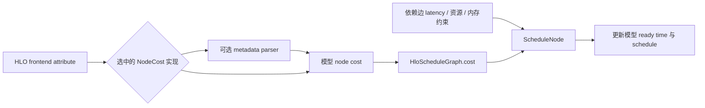

# 已有属性如何进入模型：latency_metadata 的实际边界

对应 R11，连接 R08 的调度研究。固定源码中存在会被模型消费的属性键
`latency_metadata`；它提供节点耗时提示，**并非通用 FLOPs/字节覆盖接口，也不会仅因
出现在 HLO 中就影响任意 backend 的调度**。

本轮核对了完整的公开调用链，并执行 8 个 CPU 标签/成本对照。运行结果见
[latency-metadata-results.json](latency-metadata-results.json)，source contract 见
[latency-model-contract.json](latency-model-contract.json)。CPU capture 为
`artifacts/jax-stack/latency-metadata-001`，45 个登记产物；GPU estimator 和 TPU
runtime 均未执行。该历史 capture 保留 `RUN-CPU + VERSION-SKEW`。
源码 wheel 003 的新增 8 组对照、51 个产物与当前 native reader 绑定均通过，
标签、拥有者及 CPU 成本观察一致，无 `VERSION-SKEW`，见 [源码复验](source-metadata-baseline.md)。
随后已运行固定源码的 [原生 latency parser 测试](latency-parser-native.md)：原测试和
14 个边界样本全部通过，确认零/负数接受、int64 越界拒绝及单位缩放。
原 SOURCE-ONLY contract 保留当时的快照；新的 C++ 运行结果独立记录，不计为 GPU/TPU 执行。

## 解析器与模型消费者是两层

[LatencyEstimator::GetLatencyFromMetadata](../../upstream/xla/xla/service/latency_hiding_scheduler.cc#L376)
从 `frontend_attributes` 取该字符串，用 `absl::SimpleAtoi` 解析为 `int64_t latency_ns`，
再计算 `latency_ns * CyclesPerMicrosecond() / 1000.0`。缺失时返回 `nullopt`；
解析失败时记 warning 后返回 `nullopt`。函数没有额外的非负或正值校验。

这里的缩放不能当成硬件频率测量：ApproximateLatencyEstimator 明确使用抽象单位，
`CyclesPerMicrosecond()` 返回 1；SOL 从其包裹的 estimator 继承换算。对这条配置而言，
字符串 `"30000"` 的公式结果数值为 30，SOL 使用的量纲是微秒。本轮未调用此 C++ parser；
以上是固定源码语义，不是 CPU 实验测得了 30 µs。

搜索固定 `xla/xla` 树中的 `.cc/.h`，该 helper 的非测试直接调用点有两处：

| 实现 | 在 NodeCost 中如何使用标签 | 未命中时 |
|---|---|---|
| [GpuLatencyEstimator](../../upstream/xla/xla/service/gpu/gpu_latency_hiding_scheduler.cc#L870) | 先将 nop 计为 0；仅 custom-call 分支读取标签 | custom-call 使用近似 medium cost，其他指令交给 ApproximateLatencyEstimator |
| [SolLatencyEstimator](../../upstream/xla/xla/service/gpu/model/sol_latency_estimator.cc#L521) | 第一分支尝试标签，不先限制 opcode | 再判断特殊同步 collective、async pair、matmul 表、fusion 模型与 fallback |
| [AnalyticalLatencyEstimator](../../upstream/xla/xla/service/gpu/model/analytical_latency_estimator.cc#L58) | 该 NodeCost 未调用上述 helper | async collective start/done 使用低成本；其余使用 GPU performance model |
| [ProfileGuidedLatencyEstimator](../../upstream/xla/xla/service/profile_guided_latency_estimator.cc#L137) | 先处理 async collective 的低成本，再按指令名查 profile | 只有 profile cost 缺失时调用被包裹 estimator，才可能进入 metadata 分支 |

所以不能把“手写属性总是优先”作为统一规则。也不能因为 NodeCost 支持该键，就假设
async start→done 的 **edge latency** 也被同一个键覆盖；GetLatencyBetween 是另一条接口，
需单独追踪其 profile/collective model 路径。私有 libtpu 的实现不在本次可搜索边界内。

## 从属性到调度还经过哪些选择



固定 [GetLatencyEstimator](../../upstream/xla/xla/service/gpu/gpu_hlo_schedule.cc#L491) 的选择
顺序包括：可用 PGLE profile、显式 analytical estimator、受设备/模块条件约束的 SOL、
近似 fallback。PGLE 内部也可能使用 SOL 或近似 estimator 作缺失数据的 fallback。
不能只凭一个 flag 名称跳过这些分支。

[IsLHSEnabled](../../upstream/xla/xla/service/gpu/gpu_hlo_schedule.cc#L863) 是另一个 gate：
显式 true/false 优先，其后才看 opt effort、SOL 支持和有效 profile。
[RunLatencyHidingSchedulerPasses](../../upstream/xla/xla/service/gpu/gpu_hlo_schedule.cc#L680)
把选中的 estimator 置入 SchedulingContext，并加入 LHS pass。

[HloScheduleGraph](../../upstream/xla/xla/service/latency_hiding_scheduler.cc#L2938) 实际把
`NodeCost(instr)` 存入节点。[ScheduleNode](../../upstream/xla/xla/service/latency_hiding_scheduler.cc#L2582)
将依赖与资源约束下的 `schedule_time` 加上 node cost，更新模型时钟。它不是按
latency_metadata 数字做一次简单排序，也不是读取真实设备 trace 的当前时间。

上游还有 [GPU 调度测试](../../upstream/xla/xla/service/gpu/gpu_hlo_schedule_test.cc#L508)：
改变 7 个 custom calls 的 latency 字符串，比较它们在两组 all-reduce start/done 之间的
分布。测试源码明确断言两种输入产生不同分布；**本轮只阅读了该测试，没有构建执行它**。
因此它可定位后续 native 验证入口，不能记为本轮 GPU 调度成功或实际 overlap 加速。

## CPU 实验明确证明了什么

使用相同 `A[4,8] @ W[8,6]`，通过 `set_xla_metadata` 为 dot 添加标签，实际编译执行。
8 组输出均符合 NumPy float64 参考，最大绝对误差约 `1.70e-8`。

| Python 输入 | 导出 HLO 标签 | CPU lowered / compiled FLOPs | bytes accessed |
|---|---|---:|---:|
| 不设置 | 无 | 384 | 416 |
| `30000` 或 `"30000"` | `"30000"` | 384 | 416 |
| `0` | `"0"` | 384 | 416 |
| `-1` | `"-1"` | 384 | 416 |
| `30000.5` | `"30000.5"` | 384 | 416 |
| `"slow"` | `"slow"` | 384 | 416 |
| `2**63` | `"9223372036854775808"` | 384 | 416 |

七个带标签样本在导出 HLO 中各有 1 个 tagged dot；当前 CPU 优化后 inner dot 与
outer fusion 各保留一份，不能把这两份标签当成两次 matmul 耗时。标签的非法/溢出文本
被保留不等于模型认可其数值；这个 CPU 路径没有执行上面的 latency parser。

[PjRtCpuClient::GetHloCostAnalysis](../../upstream/xla/xla/pjrt/cpu/cpu_client.cc#L470) 创建的是
通用 HloCostAnalysis。这条 API 给出本例的静态工作量和字节估计，不是 GPU LHS 的
NodeCost 读取接口。独立 verifier 重新解析 MLIR/HLO 标签及归属，重新调用当前 CPU
cost analyzer，并核对数值、产物和 native binary 身份。

另一个传递边界来自 [HostOffloadingPrepare](../../upstream/xla/xla/hlo/transforms/host_offloading_prepare.cc#L102)：
创建 `HostExecute` 时，只复制 inner computation 中**第一个带任意 frontend attributes**
的 custom call，然后 break。它既不合并所有标签，也不累加多个内部 kernel 的 latency；
是否刚好复制到目标标签，要检查实际改写图。该条是 source-only，未在本轮执行。

## 对 kickoff 的实现含义

已有键说明“前端属性→特定模型消费”这条链可以存在；但用户要求的“可并行维度”还需要
独立定义语义。它涉及维度编号、合法分块、padding、重复读、通信和合并成本，不能用单个
latency 数字代替。扩展应区分：属性的定义/验证、变换后的归属、目标 cost consumer、
调度 gate 和目标运行效果。相同标签还可能在变换后复制到多处，需要明确计数范围。

公开 [LHS cost model 文档](https://openxla.org/xla/lhs_cost_model) 描述了性能表和分析模型的
组合，可作背景；本节分支与优先级以锁定的 XLA 源码为准，不能以该在线说明替代 libtpu 取证。
CPU 标签验证命令如下；通用 parser 的原生测试另见新记录，GPU 模型消费者、目标调度
和真实业务分块验收仍未完成。

```bash
.venv/bin/python -B research/software-stack/latency_metadata_probe.py \
  --output artifacts/jax-stack/latency-metadata-new
.venv/bin/python -B research/software-stack/verify_latency_metadata.py --selftest
```

交互实验并入现有 [属性/cost Notebook](attributes-cost.ipynb)，无需另建业务模型。
