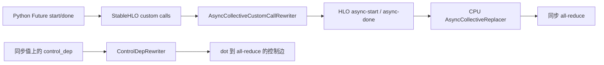

# 通信、控制依赖与调度：CPU 参考和未验证边界

对应 R08，关联 R11/R12。当前确认的是 API、IR 转换和 CPU 数值；没有测量 TPU overlap
或加速比。结果见 [overlap-results.json](../tools/overlap-results.json)，原始 capture 为
`artifacts/jax-stack/overlap-cpu-005`：593 个登记产物，3 个数值通过样本、4 个预期失败。

## 同一程序经过哪些阶段

单进程强制创建 2 个逻辑 CPU 设备，mesh 为 `d=2`。`X[128,64]` 沿第 0 维分片，
每个设备看到 `x[64,64]`；`W[64,64]` 复制。局部程序为：

```python
total = jax.lax.psum(x, 'd')
math = w @ w
return total + math
```

输出按 `P('d', None)` 拼接为 `[128,64]`，两半相同。NumPy float64 参考为
`concat([X[:64] + X[64:] + W@W] * 2)`；三组最大绝对误差均约 `1.46e-7`。
这里特意使用 replicated `w@w`，使其结果和 psum Future 在 `d` 上的 VMA 一致；
使用局部 `x@w` 的情况另存为失败实验。

| 版本 | 写法 | StableHLO / 导出 HLO | 实际 CPU pass 结果 |
|---|---|---|---|
| sync | `lax.psum` 与 `w@w` | 同步 all-reduce | 最终 1 个同步 all-reduce |
| async | 私有 `parallel.psum_start`，计算后 `.done()` | `all-reduce-start/done` 两个 custom calls | custom-call rewriter 生成 generic async pair；replacer 删除 pair，最终同步 |
| sync-control | 同步 psum，加 `overlap.schedule([math, total])` | 1 个 `control_dep` custom call | ControlDepRewriter 消耗标记，形成 dot→all-reduce 控制边 |

`async` 的实际 dump 连续记录了三个边界，不是仅凭最终文件猜测中间过程。replacer
之后暂时还有未清理的旧 wrapper computation，所以整个 module 的 all-reduce opcode
计数可为 2；后续优化后才是 1。这不表示运行了两次 collective。



控制边只约束先后关系。在 sync-control 中，它要求 math 在 collective 前完成，
不能解释为 overlap 已发生。Python 提交的异步性、HLO 的 async 表达和设备实际重叠
是不同问题；本实验没有计时，也没有跨主机网络。
JAX 官方的 [asynchronous dispatch 说明](https://docs.jax.dev/en/latest/async_dispatch.html)
讨论的是 Python 可先返回、通过 `block_until_ready()` 等待结果的提交行为。

## 四个不能跳过的失败

1. **VMA 不匹配**：使用 `x@w` 后，Future 的 varying axes 为 `{}`、math 为 `{'d'}`。
   `overlap.schedule` 内的 FFI abstract evaluation 要求两者相同，tracing 报错。
2. **关闭检查仍失败**：`check_vma=False` 时，固定 `_psum` 分支直接绑定同步 `psum_p`，
   没有传播 `is_async`。返回普通 array，`.done()` 不存在；报错中的通用建议不适用于此组合。
3. **默认 Future layout 无效**：换成 replicated `w@w` 可以通过 VMA，但 FFI
   `_aval_shape(AbstractFuture)` 返回 `()`，生成空 operand layout；async lowering
   却把 Future 表达为 rank-2 tensor，因此 MLIR verifier 拒绝该 `control_dep`。
4. **显式 layout 只推进了一层**：用 `jax.ffi.ffi_call('control_dep', (),
   has_side_effect=True, input_layouts=((0,1),(0,1)))` 保留相同 target，显式指定本例
   major-to-minor layout。StableHLO 验证通过，出现 start/done 和 2 个控制提示；
   当前 CPU wheel 在 native 编译时仍报 `instruction->IsDead()`，start 仍有 uses 而无法删除。

以上均已保存错误阶段和文本。第四项不是可用 workaround；本轮没有修改上游。
固定 XLA `FinishRewrite` 删除 start 前已有 `user_count()==0` 检查，因此不能把当前
wheel 的该报错直接归因于同版源码，更不能据此声称固定版本已修好。需要匹配 wheel 复验。

前三次探索 capture 保留失败日志与原始 producer；第四次把已确认失败纳入预期结果，
第五次修正第三项错误的阶段标签为 `MLIR-verification` 并重新执行全部样本。
没有覆盖或把旧失败改写成通过。独立 verifier 复查字节、数值、有效 MLIR、native HLO
和控制边；错误复现由 producer 完成，不是 verifier 再次执行失败编译。

## 固定源码入口

各入口的 revision、文件指纹和调用位置已加入 [source-index.json](../tools/source-index.json)。

| 入口 | 作用及边界 |
|---|---|
| [parallel._psum](../../../upstream/jax/jax/_src/lax/parallel.py#L155)、[psum_start](../../../upstream/jax/jax/_src/lax/parallel.py#L3120) | 区分 VMA 分支与同步/异步 primitive；`psum_start` 不在 `jax.lax` 公开导出中 |
| [overlap.schedule](../../../upstream/jax/jax/experimental/overlap.py#L23) | 逐对生成 FFI 控制提示；是 experimental helper |
| [FFI Future shape](../../../upstream/jax/jax/_src/ffi.py#L179) | 默认 layout 的空 shape 来自这里 |
| [CPU pipeline](../../../upstream/xla/xla/service/cpu/cpu_compiler.cc#L596) | 明确先重写 async custom calls，再以全真 predicates 将 collectives 转同步 |
| [FinishRewrite](../../../upstream/xla/xla/service/async_collective_custom_call_rewriter.cc#L83) | 转移 uses/control edges，条件删除旧 start |
| [AsyncCollectiveReplacer](../../../upstream/xla/xla/hlo/transforms/collectives/async_collective_replacer.cc#L71) | 源码会删除参与被替换 pair 的 `control_dep` calls；这项源码策略尚未由成功的 async-control CPU 样本验证 |
| [ControlDepRewriter](../../../upstream/xla/xla/service/control_dep_rewriter.cc#L32) | 将两个 operands 转成真正的 HLO 控制边，并删除标记 |
| [CPU CreateHloSchedule](../../../upstream/xla/xla/service/cpu/cpu_compiler.cc#L2441) | memory-optimized 选择 DFSMemoryScheduler，其他枚举分支选择 BFScheduler |
| [SchedulerConfig](../../../upstream/xla/xla/service/latency_hiding_scheduler.h#L143)、[LatencyEstimator](../../../upstream/xla/xla/service/latency_hiding_scheduler.h#L198) | 通用 LHS 的 memory limit、collective/resource overlap limits、node cost 与 edge latency 接口 |

`xla_cpu_enable_concurrency_optimized_scheduler` 在固定 flags 定义中映射到 CPU scheduler
枚举；名字含 concurrency 不能证明选择了 `LatencyHidingScheduler`。同样，开源 LHS 的
资源模型、模型统计和配置默认值不能当作 libtpu 的实际配置或实测通信时间。
[OpenXLA LHS cost model 文档](https://openxla.org/xla/lhs_cost_model) 描述了性能表与分析模型
的组合；这是补充背景（读取于 2026-09-15 CST），不替代上述固定源码或目标环境取证。

## 复现与下一步

```bash
.venv/bin/python -B research/software-stack/tools/overlap_probe.py \
  --output artifacts/jax-stack/overlap-cpu-new
.venv/bin/python -B research/software-stack/tools/verify_overlap.py --selftest
```

脚本要求新目录，在 import JAX 前配置双 CPU 设备。历史默认 verifier 指向 capture 005；
新 capture 可通过 `verify_overlap.verify(path)` 复查。交互入口见
[overlap-scheduling.ipynb](overlap-scheduling.ipynb)。

运行证据为 `RUN-CPU + VERSION-SKEW`：editable JAX 来自固定 pin，native jaxlib 为
0.11.1（build `2d66622450e2c8633cda2307688ef7aa294bd6eb`）。后续先在自建 wheel 上
复验异步控制路径，再依据 U03 的 TPU/libtpu、设备拓扑和原始 trace 检查真正 overlap。
真机验收至少要关联 collective start/done、独立计算、依赖等待和设备时间区间；
HLO 文本顺序或 host 提交时长不足以完成 R08/R12。
