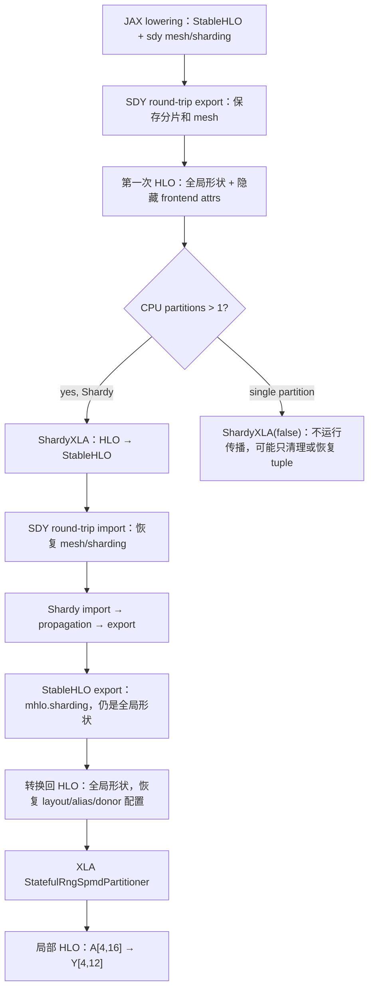

# Shardy：往返表示、分片传播与真正分区

**Shardy 的传播阶段为中间张量补齐分片信息；本例随后由 XLA SPMD 把全局形状改为局部形状。**
这两步可以从实际产物分开观察。固定源码 wheel 003 上，同一
`max(A[8,16] @ W[16,12] + bias[12], 0)` 分别使用 Shardy 和 GSPMD，在两个逻辑 CPU
设备、一个进程中各运行三次，结果逐元素相同并通过 NumPy float64 参考。

本例 A 和输出沿行分片，W/bias 复制；每设备实际输出 `[4,12]`，最大绝对误差
`3.484e-8`。这不是 TPU、自动选择分片、通信 overlap 或降低业务显存峰值的实验。
65 个新产物已独立复查，见 [shardy-results.json](shardy-results.json)；[Notebook](shardy-round-trip.ipynb) 的五个代码单元已在真实 Jupyter kernel 中通过归档复查。

固定 JAX/XLA/Shardy revisions 由 [source-index.json](source-index.json) 约束；本节新增
21 个源码入口、15 条关系。运行 producer 与当前 native MLIR/HLO reader 均绑定
[source wheel 003](source-runtime-baseline.md)，无 `VERSION-SKEW`。源码分支说明为
`SOURCE-ONLY`；原始采集为 `RUN-CPU`；下面的独立解析为 `REPLAY-OFFLINE`。

## 1. 不是只从 StableHLO 向 HLO 转一次



[JAX sharding 表示](../../upstream/jax/jax/_src/interpreters/mlir.py#L1203) 随
`jax_use_shardy_partitioner` 选择 SDY 或传统 OpSharding；
[get_compile_options](../../upstream/jax/jax/_src/compiler.py#L180) 同时设置后端开关。
这些 flags 决定候选路径，并不单独证明传播已经执行。

[MlirToXlaComputation](../../upstream/xla/xla/pjrt/mlir_to_hlo.cc#L99) 首先执行
[SDY round-trip export](../../upstream/xla/xla/service/spmd/shardy/sdy_round_trip/pipelines.cc#L52)，
还处理 CHLO、常量控制流等，再转 HLO。保存 round-trip 信息的 export 与传播后最终
[StableHLO export](../../upstream/xla/xla/service/spmd/shardy/stablehlo_round_trip/stablehlo_export.cc#L31)
是两套不同 pipeline，不能都简写成“删除 sdy 属性”。

本轮采集里，原始 StableHLO 含 `sdy.mesh @mesh <["rows"=2]>`；第一次 HLO 以及导回
StableHLO 的 `00.input_module.mlir` 保存 `xla.sdy.meshes`、`xla.sdy.sharding` 等 payload。
[import](../../upstream/xla/xla/service/spmd/shardy/sdy_round_trip/pipelines.cc#L72)
随后恢复具名 mesh、分片属性和临时操作。最终 export 移除 SDY 辅助表示，保留给后续
HLO 使用的 `mhlo.sharding`。这不是任意 MLIR 属性都会保留的保证。

## 2. 五个实际保存点告诉我们什么

Shardy 模式的目录为
`artifacts/jax-stack/shardy-runtime-001/shardy/xla-dump/shardy/module_0002.jit_row_matmul/`。

| 保存点 | 本例观察 | 仍不能据此声称 |
|---|---|---|
| `00.input_module.mlir` | 从 HLO 导回的 StableHLO，隐藏 mesh/分片 payload 和临时 custom call | 这是最初 JAX IR 的逐字副本 |
| `01.before_propagation.mlir` | mesh/输入输出分片已恢复，dot/add/maximum 还没附 op 分片；有 `sdy.constant` | 所有 import pass 都尚未运行 |
| `02.after_propagation.mlir` | 三个运算都带 rows 分片；dot 具有维度 factor rule；结果仍 `[8,12]` | 传播已经把算子改为 `[4,12]` |
| `03.after_minimal_partitioner_with_global_shapes.mlir` | export/minimal-partitioner 保存点，形状仍为全局 `[8,12]` | 文件名含 partitioner 就是最终设备局部 IR |
| `04.output_module.mlir` | SDY ops 被导出，`sdy.constant` 回到 `stablehlo.constant`，分片为 `mhlo.sharding` | TPU 最终布局、设备代码或 LLO |

`before_propagation` 位于部分清理之后；`after_propagation` 也已移除部分传播辅助信息。
位置由 [import pipeline](../../upstream/shardy/shardy/dialect/sdy/transforms/import/import_pipeline.cc#L30)
和 [export pipeline](../../upstream/shardy/shardy/dialect/sdy/transforms/export/export_pipeline.cc#L89)
决定，并非 profiler 中的开始/结束时间。

以 dot 为例，原 JAX 表达是 `stablehlo.dot_general`，从 HLO 导回后在本例变为
`stablehlo.dot`。传播后保存的规则为：

```text
([i, k], [k, j]) -> ([i, j])
i=8, j=12, k=16; reduction={k}
sdy.sharding: <@mesh, [{"rows"}, {}]>
```

[DotOp rule](../../upstream/shardy/shardy/dialect/sdy/transforms/propagation/op_sharding_rule_registry.cc#L790)
把 lhs 非收缩维、rhs 非收缩维与 contraction 分别建成 factor；
[DotGeneralOp rule](../../upstream/shardy/shardy/dialect/sdy/transforms/propagation/op_sharding_rule_registry.cc#L739)
还处理 batching 和任意 contracting dimension。这里沿 i 分行，k 未切分；不能把本例
无归约通信的结果推广到沿 k 分片的 matmul。

[Propagation pipeline](../../upstream/shardy/shardy/dialect/sdy/transforms/propagation/propagation_pipeline.cc#L62)
组织 import、函数/dataflow 与 constraint 处理、user-priority propagation、export。
[用户优先级](../../upstream/shardy/shardy/dialect/sdy/transforms/propagation/user_priority_propagation.cc#L231)
先运行 priority 0 再处理其余用户优先级，内部还使用 op-priority 方向规则。本例没有设置
用户优先级或自动分片搜索，不能把这些源码条件写成已做性能优化实验。

## 3. 分区边界与实际设备输出

[CPU pipeline](../../upstream/xla/xla/service/cpu/cpu_compiler.cc#L596) 在多 partition 时先
运行 ShardyXLA 或传统 ShardingPropagation，再运行 StatefulRngSpmdPartitioner。
两个模式均保存了这两步前后的 HLO。

| 阶段 | A 参数 | dot 输出 | 分片信息 |
|---|---|---|---|
| 传播前 HLO | `[8,16]` | `[8,12]` | 输入已有行分片，中间 dot 未定 |
| Shardy/GSPMD 传播后 | `[8,16]` | `[8,12]` | dot/add/maximum 带 `{devices=[2,1]<=[2]}` |
| XLA SPMD 分区后 | `[4,16]` | `[4,12]` | 计算使用局部行块，W `[16,12]`/bias `[12]` 保持复制 |
| 实际 `addressable_shards` | — | 两个 `[4,12]` | CPU 0 对应 rows 0–3，CPU 1 对应 rows 4–7 |

验证器用 native HLO parser 检查 dot contraction、传播后/分区后的形状，另用 native
MLIR parser 检查三个中间运算的属性和类型。实际局部输出还分别对照 NumPy 对应切片；
全局输出三次对照均通过。两种模式的所有保存数值逐元素相同。

本例分区后的 HLO 没有选定的 all-reduce/all-gather/reduce-scatter/collective-permute/
all-to-all 操作；这不是硬件流量计数，也没有测量通信时间或证明设备上所有传输均不存在。

GSPMD 对照由 `jax_use_shardy_partitioner=False` 显式选择，原始 IR 使用 `mhlo.sharding`，
dump 中运行 `sharding-propagation`，没有五份 Shardy 内部文件。**这没有触发混合 IR 的
自动 fallback。** 两条路径得到相同输出，不证明任意图的策略、通信或性能都相同。

## 4. 为什么旧单 CPU 的 `shardy-xla` 不是传播证据

旧源码基线的四组 matmul 均在 `sharding-removal` pipeline 记录 `shardy-xla`；本轮重新
校验 1,073 个原始产物，确认四对 before/after 文件逐字相同。对应源码在单 partition
构造 `ShardyXLA(runSdyShardingPropagation=false)`。

[RunImpl](../../upstream/xla/xla/service/spmd/shardy/shardy_xla_pass.cc#L470) 在关闭传播时
先做选定 manual computation 的 inlineable 清理；不需 tuple args 时可直接返回。
因此 pass 名存在、调用过 wrapper、甚至经历了某种表示转换，都不能单独证明执行了
sharding propagation。新双 CPU 结果补上了该缺口，没有改写旧基线的证据级别。

## 5. 源码中其他条件：本轮尚未运行

- **混合旧式 IR fallback**：`use_shardy_partitioner` 开启且
  [hasGspmdAttrsOrOps](../../upstream/xla/xla/service/spmd/shardy/utils.cc#L360) 命中时，
  导入入口关闭 Shardy/V3 并为 GSPMD 导出。检测有具体 func/custom-call/属性条件，
  不是看到任意 `mhlo.sharding` 就回退。
- **HloShardingV3**：round-trip export/import 有 V3 分支；非 V3 通过 frontend attrs 保存
  mesh/sharding。传播入口对旧 frontend payload 与 V3 混用另有兼容 gate。本轮未做 V3 对照。
- **tuple/layout/alias/donor**：需要往返时，RunImpl 保存并恢复 entry layout、alias 和
  buffer donor config，重建 computations 后清理临时属性。MLIR 本身不能完整保留这些
  HLO 配置；本例无 donation/tuple 变换，没有验证全部恢复分支。
- **额外 partitioner 选项**：Shardy 可按 options 插入 collectives 或做 per-instruction
  partitioning；本例采用默认分支，保存的是 `after_minimal_partitioner_with_global_shapes`，
  后续 XLA SPMD 才产生局部形状。

Shardy 源码 pin 为 `eb23a983`；构建使用 XLA 声明的归档和补丁。
[依赖审计](build-dependency-results.json) 记录的 Shardy temporary.patch 触及三份依赖
描述/补丁文件，没有修改本节索引的 propagation 源文件。没有把 pristine checkout
直接等同于所有实际编译输入。

## 6. 复跑与验证

在 [源码 003 固定镜像](source-runtime-baseline.md) 中使用独立 Python，源码和已有证据
只读，为新的输出父目录提供可写挂载。两个模式必须运行在不同进程，输出目录必须是新的：

```bash
# 以下命令在固定镜像中运行；SOURCE_PY 指向已验证的 baseline-env/venv/bin/python。
"$SOURCE_PY" -B research/software-stack/shardy_probe.py --mode shardy \
  --output artifacts/jax-stack/shardy-runtime-new/shardy \
  --jaxlib-build-manifest manifests/build-fingerprints/kickoff-cpu-source-003.json
"$SOURCE_PY" -B research/software-stack/shardy_probe.py --mode gspmd \
  --output artifacts/jax-stack/shardy-runtime-new/gspmd \
  --jaxlib-build-manifest manifests/build-fingerprints/kickoff-cpu-source-003.json
"$SOURCE_PY" -B research/software-stack/verify_shardy.py \
  --source artifacts/jax-stack/shardy-runtime-new --selftest \
  --result artifacts/jax-stack/shardy-runtime-new/verified.json
```

脚本设置两个 CPU 设备和 HLO pass dump regex；不能带入已有 `XLA_FLAGS`。
实际完整 Docker argv、两份终态与日志位于 `artifacts/jax-stack/shardy-runtime-001/`。
35 个 Shardy、30 个 GSPMD 产物包含生产代码、环境/native 身份、输入/输出、IR 和 dump。

九个反例检查覆盖哈希/缺文件/证据级别、丢失传播属性、把传播当分区、错误 contraction
factor、全局冒充局部形状、意外 collective 和缺少阶段。初版验证器误用 native opcode
名称与 MLIR 属性迭代形式，已依据固定绑定修正；原失败记录保留，实验未因此重跑。
这不是对所有 Shardy/GSPMD 策略或 fallback 的穷举验收。

固定镜像中的旧 wheel reader 也已实际运行负对照，在解析阶段前以 revision 不符被拒绝，
未生成结果文件。检查记录见原始目录的 `old-reader-rejection.json`。
