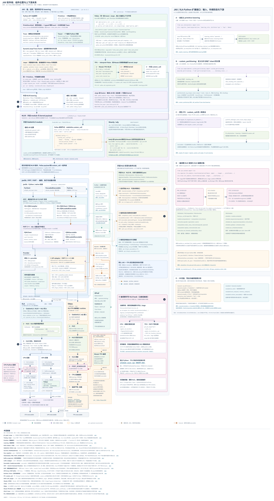
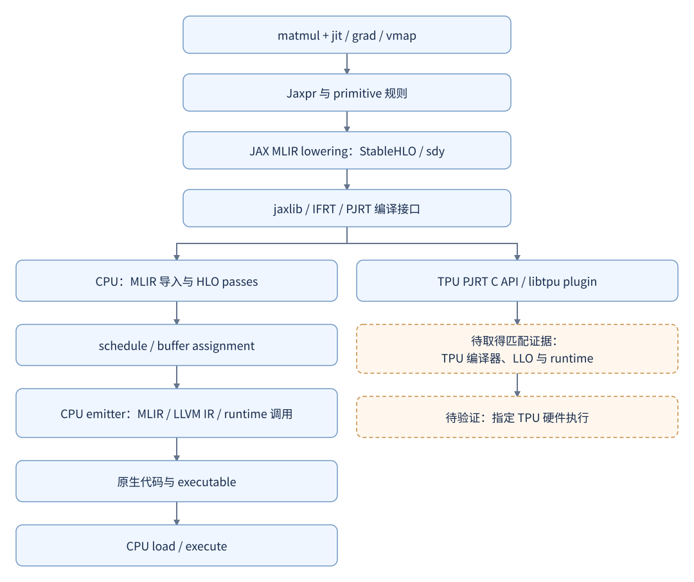
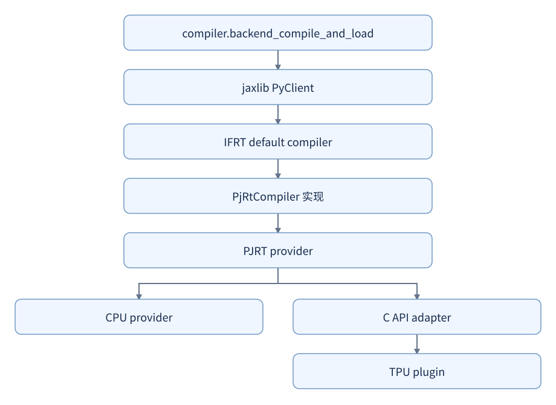
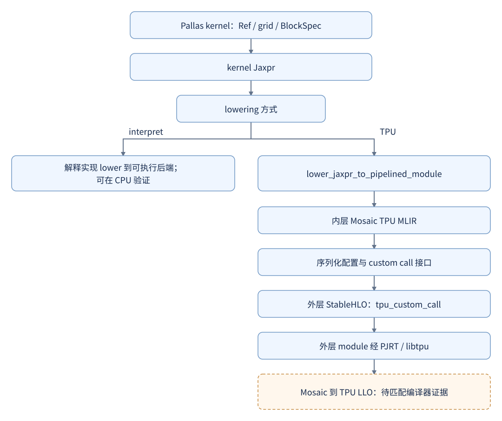

# 软件栈与入口总览

依据 [kickoff revision 51](https://outline.infiscale-tech.com/doc/research-plan-jax-kickoff-ib5QULKSS4)。
当前索引有 219 个经过文件指纹和行号核对的入口、92 条带调用位置的关系，见
[source-index.json](../tools/source-index.json)。这是关键入口索引；[普通 TPU 公开执行/完成链](../runtime/tpu-runtime-boundary.md) 已补充源码依据。私有 libtpu/LLO、
实际推理业务和 TPU 执行验收仍未完成，逐项覆盖见 [coverage-review.md](../history/coverage-review.md)。

## 组件的职责和边界

JAX 大框内按职责展开：数值 API、程序变换、Primitive 规则、Tracing/Jaxpr、
数组与分片、MLIR lowering、编译与执行调度，以及 Pallas 和工具入口。
蓝色实线展示 `jit / lower` 的表示转换及 Compile / Load；橙色实线单独展示已加载
executable 的 Execute，经原生实现或 C API plugin 进入 runtime / 设备，再返回 buffers
和完成状态。紫色虚线表示规则或配置输入；棕色点划线表示尚未确认具体接入阶段的推断关系。
`grad` / `vmap` 使用 primitive 的微分与批量化规则，Pallas 注册自己的变换与 lowering
规则；mesh / sharding 配置进入 lowering 和编译调度。实际 tracing 与变换可以嵌套，
图中按职责归组，不表示这些操作只能各执行一次。

图中面积表示职责覆盖范围，不表示代码量或耗时。MLIR 与 LLVM 分成两层；
StableHLO 与 Shardy 嵌在 MLIR 层内，表示它们基于 MLIR 的方言与 pass 基础设施，
源码仍分别位于独立子模块。LLVM 放在 XLA 下游，接收 CPU 与部分 GPU 路径生成的
LLVM IR，完成优化与目标代码生成，再进入 executable；GPU 其他路径与库调用单独连出。
StableHLO 下游的 **HLO** 在 XLA 框内单独展开：MLIR 导入后创建 `HloModule`，
模块包含 `HloComputation`，计算包含 `HloInstruction`；`HloModuleProto` 用于序列化。
这是 XLA 的内部对象表示。StableHLO、MHLO 是 MLIR 方言，不能与这些 HLO 对象混为一层。
固定源码的转换入口设置 `direct_stablehlo_to_hlo=true`，因此图中没有把完整的
“StableHLO → MHLO → HLO”画成必经路径；输入仍可能包含需要处理的 CHLO/MHLO 操作。
HLO 优化与分片之后分别进入 CPU/GPU 的调度、buffer assignment 和 emitter。
这些方框按职责分组，具体 pass 顺序取决于后端与配置，调度之后也可能继续运行 HLO passes。

Shardy 除了提供分片表示，也提供由 XLA 调用的传播 passes。Triton 位于部分 XLA GPU
代码生成路径。Host、编译 pass、设备执行三类 profiler 事件汇入采集 session / XSpace，
再交给 XProf 分析；实际可采集事件取决于后端与配置。libtpu 的 `0.0.46.*` 是固定 JAX 源码的
依赖约束，不是本地已安装 wheel 的精确版本。

### 默认 TPU 提交路径与开源 HLO 条件分支

图右栏把源码归属与执行位置分开：开源 XLA 提供 HLO IR、分析及大量通用优化 pass，
这些实现可以构建进不同后端库。不能根据 libtpu 的二进制边界判断某个 pass 是否闭源。

针对本地 JAX `2d66622450e2` / XLA `dcf304bc5dca`，本次检查的是普通 `jit / compile()`
在需要新编译、使用 TPU PJRT C API 时的默认提交路径。`from_hlo` 的参数以及 IFRT
`HloProgram` 在这条路径中仍是 MLIR module；公开序列化代码运行 CHLO 合法化、
StableHLO 兼容展开等 MLIR passes，再以 `mlir` 格式调用 plugin。没有在这条已核对路径中
找到提交 libtpu 前独立执行 XLA `HloModule` 优化流水线的步骤。

这不等于开源宿主侧没有 HLO 处理。图中另列出四种调用条件：

- 显式 HLO 导出：[`Lowering.hlo`](../../../upstream/jax/jax/_src/stages.py#L231)
  经 [`PyMlirModuleToXlaComputation`](../../../upstream/jax/jaxlib/mlir.cc#L118)
  在开源代码中转换为 XLA HLO，不是默认 TPU 编译的必经前置步骤。
- 编译后读取优化程序：[`GetHloModules`](../../../upstream/xla/xla/pjrt/c_api_client/pjrt_c_api_client.cc#L2679)
  调用 `PJRT_Executable_OptimizedProgram`，在宿主侧解析或转换成 `HloModule`。
- 编译后的分片元数据：[`GetHloShardings`](../../../upstream/xla/xla/python/pjrt_ifrt/pjrt_executable.cc#L128)
  处理 provider 返回的输出 shardings；这是 `HloSharding` 元数据构造，不是 HLO 图优化。
- **注册的编译期 HLO 变换**：[`register_hlo_module_transformation`](../../../upstream/jax/jax/_src/xla_transform.py#L43)
  按平台选择注册路径：CPU 直接调用 `_xla.register_xla_transform`，TPU 经 PJRT
  XlaTransform 扩展注册到 plugin。`POST_SCHEDULER` 表示 HLO 调度后挂点；
  [`CPU 直接桥接`](../../../upstream/jax/jaxlib/xla.cc#L54)与
  [`TPU C/Python 桥接`](../../../upstream/jax/jaxlib/xla.cc#L128)
  均向宿主 Python 传出序列化 `HloModuleProto`，用户函数可返回修改后的 bytes，也可返回 `None`。
  [公开 adapter](../../../upstream/xla/xla/pjrt/c/pjrt_c_api_xla_transform_internal.cc#L64)
  将结果交给 `UpdateHloModuleFromProto` 后继续编译。这是编译中途的可写回调，
  与前述导出、读回分支不同，不能遗漏。

当前固定版本通过 `from jax.extend import xla` 导出注册 API，宿主 `.venv` 的
`jaxlib.xla_client` 没有 `register_hlo_module_transformation` 与 `PipelineStage`。
`platforms="cpu"` 选择进程内注册；`platforms="tpu"` 选择 TPU plugin，并检查其
XlaTransform 扩展支持。实际新编译经过
挂点时才运行 callback。回调本身在宿主 Python 中运行，处理 XLA HLO，而不是 StableHLO
或设备 kernel。`POST_SCHEDULER` 也不能解释为最终 LLO/VLIW 指令调度之后。
[TPU 调度变换测试定义](../../../upstream/jax/tests/xla_transform_test.py#L452)覆盖了这一用法，
其中回调为同文件的 [schedule_async_ops](../../../upstream/jax/tests/xla_transform_test.py#L366)。
图中使用该上游测试作为示例，本次没有执行该 TPU 测试。

本地 `.venv`（JAX `0.11.1.dev20260818+2d66622450`、jaxlib `0.11.1`）已执行一个
独立的 CPU 探针：关闭持久编译缓存，注册 `POST_SCHEDULER` 回调，编译并执行
`2×3 @ 3×4` float32 matmul。回调触发一次，收到 549 bytes，解析到 `HloSchedule`，
`schedule.verify()` 通过；回调返回 `None`，执行结果与 NumPy 一致，结束后清除注册。
这验证了 CPU 挂点与读取协议，没有验证 DSA 改写逻辑或 TPU 执行。
[CPU 源码位置](../../../upstream/xla/xla/service/cpu/cpu_compiler.cc#L1827)为
`CreateHloSchedule → POST_SCHEDULER → 后续 HLO passes → CreateBufferAssignment`。

### 图中的 Python 扩展接口（A–E）

SVG 最右侧按接口的作用阶段展开输入、处理对象和下游，主图上的同字母标记对应详细卡片。
这些入口可独立使用；它们不是一条必须依次调用的 API 链。

| 标记 | 接口 | 作用与当前核对范围 |
|---|---|---|
| A | [`jax.interpreters.mlir.register_lowering`](../../../upstream/jax/jax/_src/interpreters/mlir.py#L1003) | 注册 primitive 的平台 lowering 规则，在 Jaxpr → MLIR 时构造 IR；本地导出可用。 |
| B | [`custom_partitioning.def_partition`](../../../upstream/jax/jax/_src/custom_partitioning.py#L478) | 定义分片规则及每个 shard 的 `lower_fn`；Shardy 使用 `sharding_rule`，其他分片路径可使用传播与推导回调；本地导出可用。 |
| C | [`jax.ffi.register_ffi_target`](../../../upstream/jax/jax/_src/ffi.py#L47) / [`ffi_call`](../../../upstream/jax/jax/_src/ffi.py#L414) | 注册原生 target，生成 custom call，接入外部实现；本地导出可用，具体平台须支持对应 target 与 ABI。 |
| D | [`jax.extend.xla`](../../../upstream/jax/jax/extend/xla.py#L20) | 注册与清除 HLO callback；当前仅有 `PRE_SCHEDULER`、`POST_SCHEDULER` 两个阶段。CPU 调度后挂点已实测。 |
| D 内部对象 | [`HloModule / HloComputation / HloInstruction / HloSchedule`](../../../upstream/xla/xla/python/_hlo.pyi#L531) | 由 `jax._src.lib.hlo` 访问，支持遍历、替换指令、属性修改及调度读写；本地绑定可用。修改后须通过 callback 返回序列化 bytes 才写回当前编译。 |
| D 源码绑定 | [`_hlo_pass`](../../../upstream/xla/xla/python/_hlo_pass.pyi#L17) | 源码声明 `HloDCE`、`CallInliner`、`FlattenCallGraph`、`TupleSimplifier` 的 `run(module)`；本地 `import jaxlib._hlo_pass` 报 `ModuleNotFoundError`，不是当前已安装接口。 |
| E | [`Lowered.compiler_ir`](../../../upstream/jax/jax/_src/stages.py#L665) / [`Compiled` 分析接口](../../../upstream/jax/jax/_src/stages.py#L732) | 检查 StableHLO、导出 HLO、读取编译结果与分析；当前 StableHLO module 是内部可变对象，不能统一视为只读快照。 |

当前 [`MeshComputation.stablehlo`](../../../upstream/jax/jax/_src/interpreters/pxla.py#L1224)
直接返回 `self._hlo`。在首次 `compile()` 前原地改写 `compiler_ir("stablehlo")` 返回的
module 可以改变编译结果；这描述当前实现，不是稳定的编辑 API，也不会改变已经编译的
executable。`compiler_ir("hlo")` 则另行转换得到 `XlaComputation`，`as_text()` 返回文本。

`PRE_SCHEDULER` 只规定在 HLO 调度前，不表示位于所有 HLO 优化之前。固定源码的
[CPU 插入点](../../../upstream/xla/xla/service/cpu/cpu_compiler.cc#L1178)与
[GPU 插入点](../../../upstream/xla/xla/service/gpu/gpu_compiler.cc#L1026)属于各自的 HLO pipeline。
同阶段多个 callback 按注册顺序执行；`clear_hlo_module_transformation` 按 name、stage、platform
清除注册。除上述 CPU 探针外，本次对新列接口检查了源码和本地导出，没有新增目标设备执行。

普通 JAX → TPU 分支经过 jaxlib / IFRT / PJRT 后进入 libtpu。公开的
[PJRT C API adapter](../../../upstream/xla/xla/pjrt/c_api_client/pjrt_c_api_client.cc#L606)
会将 MLIR 输入序列化为 `mlir` 格式，连同编译选项传给 `PJRT_Client_Compile`。
TPU 分支同样包含 **HLO 导入、HLO 优化与分片、TPU 后端编译**，图中已在 libtpu
框内展开。[OpenXLA 官方文档](https://openxla.org/xla/hlo_passes#tpu-specific-hlo-pass-examples)
明确说明 TPU HLO pipeline 包含多核分片、BF16 处理和操作合法化等阶段。
这里确认的是架构阶段；目标 libtpu 版本的具体 pass 顺序、LLO 与 runtime 实现仍需
匹配源码或实际 dump 核对，本次没有新增 TPU 编译或执行验证。
图中 Mosaic 后端处理使用单独的推断线型，不再从某个编号 HLO 阶段分出或回并；
具体接入位置及与外层编译结果集成的阶段尚未确认。

图中源码 pin 已与当前 `upstream-sources.lock` 和各 checkout HEAD 核对。
关系依据：JAX 的 [API 与变换入口](../../../upstream/jax/jax/_src/api.py)、
[Tracing/Jaxpr/Primitive](../../../upstream/jax/jax/_src/core.py)、
[自动微分规则](../../../upstream/jax/jax/_src/interpreters/ad.py)、
[批量化规则](../../../upstream/jax/jax/_src/interpreters/batching.py)、
[lowering 与编译调度](../../../upstream/jax/jax/_src/interpreters/pxla.py)、
[Pallas 规则注册](../../../upstream/jax/jax/_src/pallas/pallas_call.py)、
[MLIR lowering](../../../upstream/jax/jax/_src/interpreters/mlir.py)、
[jaxlib 编译入口](../../../upstream/jax/jaxlib/py_client.cc)、
[StableHLO/HLO 转换](../../../upstream/xla/xla/hlo/translate/stablehlo.cc#L103)、
[PJRT 的 MLIR 导入](../../../upstream/xla/xla/pjrt/mlir_to_hlo.cc#L99)、
[HLO 模块](../../../upstream/xla/xla/hlo/ir/hlo_module.h#L95)、
[Shardy 往返传播](../../../upstream/xla/xla/service/spmd/shardy/shardy_xla_pass.cc)、
[XLA CPU 编译器](../../../upstream/xla/xla/service/cpu/cpu_compiler.cc)、
[XLA GPU 编译器](../../../upstream/xla/xla/service/gpu/gpu_compiler.cc)、
[TPU plugin 加载](../../../upstream/jax/jax/_src/xla_bridge.py)、
[libtpu 版本约束](../../../upstream/jax/setup.py#L27)、
[JAX profiler](../../../upstream/jax/jax/_src/profiler.py) 与
[XProf 数据入口](../../../upstream/tooling/xprof/README.md)。这些关系核对属于源码检查；
新增执行证据仅限上文的 CPU HLO hook 探针，未新增 GPU 或 TPU 执行验证。

| 组件 | 本次确认的职责 | 已定位的入口 |
|---|---|---|
| JAX Python | 将 NumPy 风格表达、jit/grad/vmap 和 primitive 规则组织成可 lowering 的程序 | [`matmul`](../../../upstream/jax/jax/_src/numpy/tensor_contractions.py#L138)、[`jit`](../../../upstream/jax/jax/_src/api.py#L204)、[`_trace_for_jit`](../../../upstream/jax/jax/_src/pjit.py#L485) |
| JAX MLIR lowering | 根据 Jaxpr、平台、sharding、effects 等上下文创建 MLIR module | [`lower_jaxpr_to_module`](../../../upstream/jax/jax/_src/interpreters/mlir.py#L1324)、[`_dot_general_lower`](../../../upstream/jax/jax/_src/lax/lax.py#L6264) |
| jaxlib | Python/native 绑定、client 与 executable 的包装 | [`PyClient::CompileAndLoad`](../../../upstream/jax/jaxlib/py_client.cc#L475)；此 revision 的源码位于 JAX 仓库 |
| StableHLO | 操作、类型和属性的方言定义；本例矩阵收缩以 dot_general 表达 | [`StableHLO_DotGeneralOp`](../../../upstream/stablehlo/stablehlo/dialect/StablehloOps.td#L2740) |
| Shardy | 分片表示以及 import、propagation、export 的 pass 组织 | [`addPropagationPipeline`](../../../upstream/shardy/shardy/dialect/sdy/transforms/propagation/propagation_pipeline.cc#L62)；[往返、传播与双 CPU 分区对照](../compiler/shardy-round-trip.md) |
| XLA | MLIR/HLO 转换，以及后端 HLO 优化、调度、buffer assignment 和代码生成 | [`MlirToXlaComputation`](../../../upstream/xla/xla/pjrt/mlir_to_hlo.cc#L99)、[`CpuCompiler`](../../../upstream/xla/xla/service/cpu/cpu_compiler.cc#L1188) |
| IFRT/PJRT | 编译、设备和 executable 接口；在具体 provider 上完成 compile/load 等操作 | [`PjRtCompiler`](../../../upstream/xla/xla/python/pjrt_ifrt/pjrt_compiler.cc#L91)、[`PjRtLoadedExecutable::Create`](../../../upstream/xla/xla/python/pjrt_ifrt/pjrt_executable.cc#L744) |
| LLVM/MLIR | CPU 编译器使用 MLIRContext、LLVMContext、LLVM Module 和目标代码生成设施 | [`CompileCpuExecutable`](../../../upstream/xla/xla/service/cpu/cpu_compiler.cc#L1727)；[LLVM/MC/ORC 导读](../compiler/llvm-and-objects.md) 已关联四个内部入口和三个实际对象 |
| Pallas/Mosaic | kernel Jaxpr、grid/Ref/块访问表达，以及 Mosaic TPU module 与外层 custom call 的衔接 | [`pallas_call`](../../../upstream/jax/jax/_src/pallas/pallas_call.py#L1135)、[`pallas_call_tpu_lowering_rule`](../../../upstream/jax/jax/_src/pallas/mosaic/pallas_call_registration.py#L393) |
| libtpu | 公开可读部分是 PJRT plugin 的加载与 C API 边界；内部编译器/runtime 尚未取得对应实现证据 | [`make_tpu_client`](../../../upstream/jax/jax/_src/xla_bridge.py#L198)、[`PjRtCApiClient::CompileAndLoad`](../../../upstream/xla/xla/pjrt/c_api_client/pjrt_c_api_client.cc#L763) |

源码依赖的固定值来自 `upstream-sources.lock`：JAX 的
[`MODULE.bazel`](../../../upstream/jax/MODULE.bazel#L32) 固定 XLA；XLA 的
[StableHLO](../../../upstream/xla/third_party/stablehlo/workspace.bzl#L22)、
[Shardy](../../../upstream/xla/third_party/shardy/workspace.bzl#L21) 和
[LLVM](../../../upstream/xla/third_party/llvm/workspace.bzl#L22) 定义继续固定其依赖。
这些构建定义还列有补丁；固定 pristine checkout 不等于已经证明构建依赖闭包。

## 程序表示与后端分支

下图表示公开源码中的衔接关系。TPU 私有部分只标边界；CPU 原始产物位于
历史 `artifacts/jax-stack/cpu-matmul-003/` 及匹配源码的
`artifacts/jax-stack/source-runtime-002/suite/matmul/`，均不能用来证明 TPU 分支。

`_cached_lowering_to_hlo` 虽然名字含 HLO，当前函数实际调用
`mlir.lower_jaxpr_to_module`。另外，导出路径里的 `StablehloToMhlo` 也不能仅按名称解释：
[`ConvertStablehloToHloProtoInternal`](../../../upstream/xla/xla/hlo/translate/stablehlo.cc#L103)
设置了 `direct_stablehlo_to_hlo=true`。索引需要根据函数体和实际产物建立关系。

## 编译控制链

普通 client 路径中，Python 的
[`backend_compile_and_load`](../../../upstream/jax/jax/_src/compiler.py#L335)
调用 `backend.compile_and_load`。jaxlib 克隆 MLIR module、包装 IFRT HloProgram，
再调用 default compiler。选用 PjRtCompiler 时，它通过 PjRtLoadedExecutable 进入
PJRT provider；只有 provider 是 C API adapter 时，才继续到 `PJRT_Client_Compile`。
这些分支不能画成所有 backend 都必经的单一直线。

### IFRT / PJRT 内部组件

总览 SVG 将接口层展开为以下组件。`ifrt::PjRtLoadedExecutable` 与
`xla::PjRtLoadedExecutable` 属于不同包装层；普通 MLIR 编译路径中的
`ifrt::HloProgram` 仍持有 MLIR module，不能按类名判断已经转换成 XLA HLO。

| 层与组件 | 职责及上下游 | 当前源码入口 |
|---|---|---|
| jaxlib：`PyClient` / `PyLoadedExecutable` / `PyArray` | Python/native 包装；向 IFRT 提交编译和执行，将结果暴露为 Python 对象 | [`py_client.cc`](../../../upstream/jax/jaxlib/py_client.cc#L372)、[`py_array.h`](../../../upstream/jax/jaxlib/py_array.h#L141) |
| IFRT：Client / Compiler / Program / Array / LoadedExecutable | 抽象接口；client 提供默认 compiler，program 与 compile options 作为编译输入 | [`HloProgram`](../../../upstream/xla/xla/python/ifrt/hlo/hlo_program.h#L39)、[`PjRtCompiler`](../../../upstream/xla/xla/python/pjrt_ifrt/pjrt_compiler.cc#L91) |
| IFRT 的 PJRT 实现 | `PjRtCompiler` 经 `PjRtLoadedExecutable::Create` 调用下层 PJRT；`PjRtArray` 包装各设备 buffer，执行返回 outputs 和 status | [`pjrt_executable.cc`](../../../upstream/xla/xla/python/pjrt_ifrt/pjrt_executable.cc#L763)、[`pjrt_array.cc`](../../../upstream/xla/xla/python/pjrt_ifrt/pjrt_array.cc#L626) |
| PJRT：`PjRtClient` / `PjRtDevice` / `PjRtMemorySpace` | 后端服务入口、设备、可寻址内存；提供 compile/load 与 buffer 创建等操作 | [`pjrt_client.h`](../../../upstream/xla/xla/pjrt/pjrt_client.h#L546) |
| PJRT：`PjRtBuffer` / `PjRtExecutable` / `PjRtLoadedExecutable` | 设备数据、编译产物、已加载可执行对象；执行返回 buffers 与 futures，buffer 可独立查询数据就绪 | [`PjRtBuffer`](../../../upstream/xla/xla/pjrt/pjrt_client.h#L1108)、[`PjRtExecutable`](../../../upstream/xla/xla/pjrt/pjrt_executable.h#L353)、[`PjRtLoadedExecutable`](../../../upstream/xla/xla/pjrt/pjrt_client.h#L1390) |
| 原生 provider 与 C API adapter | 原生 CPU/GPU provider 实现 PJRT C++ 接口；`PjRtCApiClient` 等对象将 C++ 调用转换为 plugin 的 C ABI 调用。GPU 也可经 C API plugin 接入 | [`CPU provider`](../../../upstream/xla/xla/pjrt/cpu/cpu_client.h#L218)、[`GPU provider`](../../../upstream/xla/xla/pjrt/gpu/se_gpu_pjrt_client.h#L184)、[`C API adapter`](../../../upstream/xla/xla/pjrt/c_api_client/pjrt_c_api_client.h#L369) |
| C ABI 编译 / 执行 | 序列化程序与编译选项，调用 `PJRT_Client_Compile`；执行使用 `PJRT_LoadedExecutable_Execute` 与 `PJRT_Buffer` 列表 | [`编译桥接`](../../../upstream/xla/xla/pjrt/c_api_client/pjrt_c_api_client.cc#L606)、[`执行桥接`](../../../upstream/xla/xla/pjrt/c_api_client/pjrt_c_api_client.cc#L3481) |
| Plugin 加载与初始化 | TPU 路径加载 `libtpu.so`，通过 `GetPjrtApi` 取得函数表，再初始化 plugin 并创建 client | [`pjrt_api.cc`](../../../upstream/xla/xla/pjrt/pjrt_api.cc#L101)、[`make_tpu_client`](../../../upstream/jax/jax/_src/xla_bridge.py#L198) |

`CompileAndLoad` 可以合并编译与加载，接口也支持独立 `Compile` / `Load`。
执行时，输出句柄返回、buffer 数据就绪、execution status 完成分别跟踪：C API adapter
将 `device_complete_events` 转成执行 futures；`PJRT_Buffer_ReadyEvent` 用于 buffer
就绪。IFRT 分开包装 outputs 与 status，不能把收到输出对象视为设备已完成。

jaxlib 的 [`CompileAndLoadIfrtProgram`](../../../upstream/jax/jaxlib/py_client.cc#L372)
在 IFRT 调用和等待 future 的代码范围内释放 GIL。这是固定源码事实；它不能单独
说明历史挂起案例的触发条件、修复状态或当前 wheel 的线程行为。

## 运行提交与完成

[运行接口导读](../runtime/tpu-runtime-boundary.md) 分开记录 Python `execute_sharded` 与缓存 C++
fastpath，它们在 IFRT 汇合，只有 C API provider 分支进入 plugin。取得输出 wrapper、
output buffer ready 和 execution status ready 是不同观察点。`effects_barrier` 只等待
当前线程记录的 tokens；PJRT 库调用 TraceMe 不能代替 TPU kernel 事件。
这些新增结论都是 SOURCE-ONLY，没有加载 libtpu 或新增设备运行。

## Pallas 的两层表示

[`_pallas_call_lowering`](../../../upstream/jax/jax/_src/pallas/pallas_call.py#L844)
明确区分 interpret 与平台 lowering；CPU 非 interpret 路径报错。TPU lowering 先构建
Mosaic module，再通过 helper 进入 custom call 接口。
[`_tpu_custom_call_lowering`](../../../upstream/jax/jax/_src/tpu_custom_call.py#L409)
把 backend config、effects、alias 与 layout 信息放到外层调用。**Mosaic TPU MLIR 不是 LLO。**

## 本轮可以验证到哪里

- 源码：219 个入口和 92 条调用/分派关系的路径、revision、行号与 SHA-256，含已锁定的 XProf tooling 源码。
- CPU：四组 matmul 变换的数值、实际 native HLO dump、部分 MLIR/LLVM 代码生成、
  ELF 目标文件，以及四个序列化 executable 的同进程重新加载。
- Pallas/profiling：两种解释路径、host 生命周期及统计、现有 wheel 的编译 pass 事件，
  以及开放源码 TPU lowering 生成的配对 Mosaic 标记，见 [profiling.md](../profiling/profiling.md)。
- 属性/cost：六种 metadata 情形、直接编辑 IR 的属性传递边界、native HLO 属性 API、
  add→subtract 改写后的真实执行，以及已定位的 XProf roofline 处理链，见 [attributes-and-cost.md](../compiler/attributes-and-cost.md)。
- Fusion/memory：11 组 CPU 对照，包含实际 pass 前后结构、独占/外部 view donation、reshape
  counterfactual、allocation/offset/liveness 与 peak 诊断重算，见 [fusion-and-memory.md](../performance/fusion-and-memory.md)。
- 源码构建与 Hack：[003 基线](source-runtime-baseline.md) 的 18 组 CPU 对照已通过；
  [自建编译器标记](../compiler/pass-event-acceptance.md) 已完成 25 个 C++ 测试、构建/加载、事件/数值对照与回滚。
- Host 关联：[原始 XSpace](../profiling/xspace-contexts.md) 的 49 组关联、13 组跨线程通过，包含异常终点；
  这些 host 时间不等于设备 kernel latency。
- 仍未证明：libtpu 编译与 TPU runtime/LLO、真实业务 fusion/Pallas 注入、split 降低运行峰值、
  通信 overlap、TPU 设备 trace。Shardy 的 [往返/传播/分区](../compiler/shardy-round-trip.md) 已有双 CPU 对照；
  mixed-IR fallback、V3 和 tuple/alias 恢复仍只按源码边界解释。

宿主机旧 wheel 和历史 captures 保留 `VERSION-SKEW`。新增源码 003 基线、metadata、
CPU thunk 与 host context captures 单独绑定成功构建和实际 native 字节；不能只凭事件名称
宣称运行了固定 revision。完整范围与待确认输入仍以
[PLAN.md](../history/PLAN.md) 为准。
