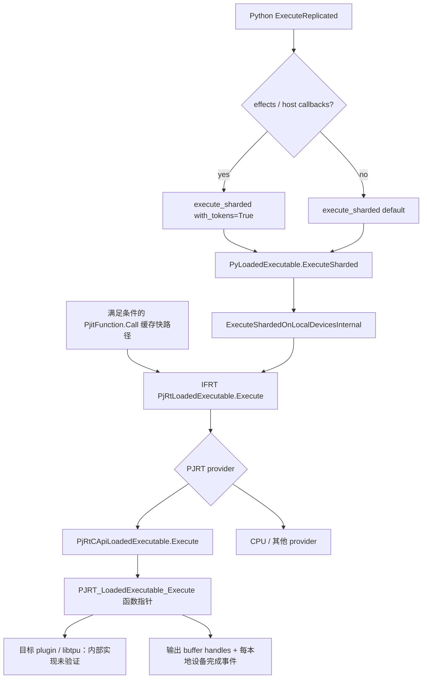
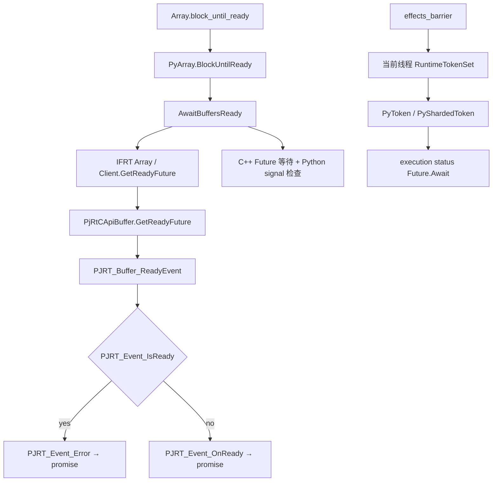

# 普通 TPU 路径：公开执行接口与完成语义

**取得输出对象、输出 buffer ready、整个执行的 status ready，是不同的观察点。**
固定 JAX/XLA 源码中，Python 调用与 C++ JIT 快路径在 IFRT 汇合；普通 TPU client
通过 PJRT C API 进入 libtpu plugin。公共接口足以定位提交和等待代码，不能证明
plugin 内部的调度、设备执行线程、LLO 或实际耗时。

本节全部为 `SOURCE-ONLY`。JAX `5832e866`、XLA `496bd4bd`，来源由
[source-index.json](source-index.json) 的完整 revision、路径、行号与文件指纹约束。
本次增加 32 个入口、24 条关系；[runtime-chain-results.json](runtime-chain-results.json)
保存 12 项结论和检索保护条件。没有新增 CPU/TPU 编译或运行；已有 CPU trace 的证据
继续按 [CPU executable](cpu-executable-and-trace.md) 和 [XSpace](xspace-contexts.md) 阅读。

## 1. 两个提交分支在 IFRT 汇合



[ExecuteReplicated.__call__](../../upstream/jax/jax/_src/interpreters/pxla.py#L400)
先应用输入 handler，再按 ordered effects、unordered effects 或 host callbacks
选择 `with_tokens=True`；普通无 effect 分支使用默认值。
[PyLoadedExecutable::ExecuteSharded](../../upstream/jax/jaxlib/py_executable.cc#L485)
设置 launch ID、`fill_status=with_tokens`、execution stream 和调用位置。
其 [内部 helper](../../upstream/jax/jaxlib/py_executable.cc#L426) 检查 addressable shard
数量，将 PyArray 转为 IFRT Array，释放 GIL 后调用 `Execute`，再包装输出与可选 token。

缓存快路径不同：[PjitFunction::Call](../../upstream/jax/jaxlib/pjit.cc#L632)
准备 IFRT inputs 后直接调用 `ifrt_executable()->Execute`，不经过上面的 Python wrapper。
[_get_fastpath_data](../../upstream/jax/jax/_src/pjit.py#L190) 排除 ordered/unordered/ref
效果、部分 PGLE 状态、no_execution 和非 Array 输出等情况；缓存缺失或输入准备失败
也会回退。因此不能说“所有 warm 调用都走同一条 C++ 路径”，也不能只 patch Python
`execute_sharded` 就宣称覆盖全部 JIT 提交。

[make_tpu_client](../../upstream/jax/jax/_src/xla_bridge.py#L198) 在首次加载时动态载入
TPU plugin、注册 profiler，并取得 C API client。上图只描述 provider 为 C API adapter
时的分支；CPU provider 不必绕行 libtpu。

## 2. `fill_status=False` 不等于没有设备完成 future

固定 [PjRtLoadedExecutable::Execute](../../upstream/xla/xla/python/pjrt_ifrt/pjrt_executable.cc#L840)
把输入转为按 addressable device 分组的 PJRT buffer 列表。普通非 portable 分支总是先
`returned_pjrt_futures.emplace()`，调用底层 PJRT `Execute`，再对 futures 做 `JoinFutures`。
portable 分支则请求单设备 future。最后只有 `options.fill_status` 为真才把该 status
放入 IFRT `ExecuteResult`；内部 future 也用于延长 callback/context 的寿命。

因此必须区分三件事：

| 对象或状态 | 覆盖范围 | 能据此判断什么 |
|---|---|---|
| 返回的 PyArray / PJRT_Buffer handle | 输出对象与其后端存储引用 | 已取得对象；不承诺数据已经 ready |
| Array 的 ready future | 该 Array 持有的本地 buffers；批量接口是所传入 values | 所选结果已 ready 或失败 |
| ExecuteResult.status / runtime token | 本次 PJRT 各 addressable device 执行完成 future 的汇总 | 本次执行的汇总完成/错误状态，不提供 kernel 时间 |

[IFRT Execute 合同](../../upstream/xla/xla/python/ifrt/executable.h#L300) 明确没有严格的
输入/输出 barrier 语义：backend 可以分步处理输入或使输出逐步 ready。不能将一个输出
ready 推广为任意副作用或其他输出均完成，也不能承诺所有 backend 都异步返回。

Python adapter 在 `with_tokens=True` 时可把同一个 IFRT joined status 复制到多个
PyShardedToken future 位置。这些 token 的数量不能再解释为独立的每设备计时样本。

## 3. C API 交界处的形状与所有权

[C++ C API adapter](../../upstream/xla/xla/pjrt/c_api_client/pjrt_c_api_client.cc#L3412)
创建 C 参数和输出列表 backing storage，再通过 API 表中的函数指针提交。
[PJRT_LoadedExecutable_Execute_Args](../../upstream/xla/xla/pjrt/c/pjrt_c_api.h#L2051)
规定：

- 输入形状为 `[num_devices][num_args]`；这里只涉及 client 可寻址的设备。
- 输出的两层指针列表由 caller 分配/释放，输出 buffer handle 还需 `PJRT_Buffer_Destroy`。
- 若请求 `device_complete_events`，每设备填一个 event；caller 负责 `PJRT_Event_Destroy`。
- Execute 直接返回错误时，不会填充这组完成事件；不能继续当作成功结果读取。
- `execute_device=nullptr` 使用编译时设备；指定单设备是另一组约束，不能冒充多 host 全局 barrier。

adapter 用 [ConvertCEventToCppFuture](../../upstream/xla/xla/pjrt/c/pjrt_c_api_helpers.cc#L374)
将完成事件接到 C++ promise。成功注册后，OnReady 回调处理完成 status，释放传入的
PJRT_Error 和 event，再释放保存 callback 的对象。send/recv/HLO callback 的 backing
state 会由 future 回调延长寿命，不能只让它存活到提交函数返回。

错误路径还需单独审查：该 helper 在 `PJRT_Event_OnReady` 注册调用自身返回错误时，
另返一个 error future；这条分支没有显式执行上面成功回调中的清理。本轮没有注入此
失败或验证 plugin 对注册失败时 callback 的行为，因而不声称全部错误支路已完成生命周期验收，
也没有修改该源文件。

[开源 wrapper_impl](../../upstream/xla/xla/pjrt/c/pjrt_c_api_wrapper_impl.cc#L2313)
提供另一侧 C→C++ 的参考适配：检查 struct size，调用内层 provider，再把 futures
封装为 C events。**它没有被确认为此目标 libtpu.so 的实际实现。** 索引刻意不添加
“TPU C API 函数指针必然进入 wrapper_impl”的调用边。

## 4. Array 等待与 token 等待



[PyArray::BlockUntilReady](../../upstream/jax/jaxlib/py_array.cc#L858) 释放 GIL，调用
[AwaitBuffersReady](../../upstream/jax/jaxlib/util.cc#L56)。一个 Array 直接取 ready future；
多个 Array 由 IFRT client 聚合传入 values。PjRtArray 再汇总其本地 PJRT buffers。
这里没有自动纳入其他线程、其他主机或没传入的数组。

[C API buffer readiness](../../upstream/xla/xla/pjrt/c_api_client/pjrt_c_api_client.cc#L3993)
缓存 event/promise：先检查是否删除，再查询 `IsReady`；已 ready 则读取 Error，
否则注册 OnReady。**ready 包含错误完成**；只有读取 status 才能判断成功。
[PJRT_Buffer_ReadyEvent 合同](../../upstream/xla/xla/pjrt/c/pjrt_c_api.h#L2641) 还区分先取得
event 再删除与删除后取 event 的时序。不能把删除、捐赠、ready 统一解释成计算成功。

本等待链通过 C++ future 进行阻塞，没有直接调用 C API 的 `PJRT_Event_Await`。
[BlockUntilReadyWithCancel](../../upstream/jax/jaxlib/util.cc#L40) 每 200 ms 检查 Python
signals；这个函数体没有调用 `CancelExecution`。捕获 KeyboardInterrupt 或退出 host
等待，不等于设备执行已取消。

[effects_barrier](../../upstream/jax/jax/_src/api.py#L2747) 调用
[RuntimeTokenSet.block_until_ready](../../upstream/jax/jax/_src/dispatch.py#L115)，其类继承
`threading.local`，等待当前线程记录的 effect/runtime tokens 后清空。多线程任务应在
各自提交线程完成所需等待；不能把主线程调用一次 effects_barrier 当作任意工作线程的
全局完成屏障。这是源码合同，本轮未新增多线程 effect 运行实验。

## 5. 运行选项与 profiling 的边界

`launch_id`、`execution_stream_id` 和 XSpace context ID 是不同字段。
[IFRT options](../../upstream/xla/xla/python/ifrt/executable.h#L125) 用 stream ID 描述同一
执行序列的顺序合同，IFRT adapter 将它赋给 C++ PJRT options。但本 pin 的
[PJRT_ExecuteOptions](../../upstream/xla/xla/pjrt/c/pjrt_c_api.h#L1992) 没有此字段，
`GetCommonExecuteArgs` 也没有相应直接映射。由此只能确认公开转接处的缺口；不能推导
TPU 没有顺序保证、自动产生并发，或某个新版 plugin 没有其他机制。

[CreatePjrtProfilerExtension](../../upstream/xla/xla/pjrt/c/pjrt_c_api_helpers.cc#L1055)
创建一个短 host TraceMeProducer，类型为 `kPjrtLibraryCall=14`，把 context ID 放入
Args extension。开源参考 wrapper 从 Args extension 取得 ID 并创建 consumer；C++
adapter 自身另从 API extension 读取其入口 context。两组 extension 不能混作同一来源。
缺少 extension 时 helper 返回 `-1`，不能把这个缺省值当作唯一的真实关联 ID。

这些标记描述库接口关联，未提供 TPU kernel 的 start/stop。此前
[XSpace matcher](xspace-contexts.md) 只覆盖 type 0/15，49 组已验证关联没有包含这里的
C API type 14；新增 SOURCE-ONLY 入口不会改变那批运行结果。

若要插入诊断，提交侧需要覆盖 Python 与 C++ 两分支，或选择 IFRT 汇合点；完成侧应明确
选择输出 ready、执行 status 还是具体设备 profiler 事件。host 回调的触发线程与设备时间
需要实际采集，不可从函数名或一个 TraceMe 的 duration 推导。

## 6. 如何复查及尚缺什么

```bash
.venv/bin/python -B research/software-stack/build_source_index.py
.venv/bin/python -B research/software-stack/audit_runtime_chain.py --selftest --check-saved
.venv/bin/python -B research/software-stack/verify_research.py
```

审计核对固定 source revision、干净工作树、32 个选定入口和 24 条调用位置，以及 15 个
源码片段检索条件。九个结构反例拒绝把 SOURCE-ONLY 提升为 RUN-TPU、把 buffer wait
当全局 barrier、合并快路径、虚构 C API stream 字段、缺失引用及添加未证明的私有调用边。
这些检查用于来源与结论范围的完整性；**不能自动证明 C++ 语义，更不能代替执行验收。**

下一阶段仍需 U03 的实际 TPU/libtpu 环境，才能确认实际 client/API 版本、提交与设备
完成事件、回调线程、普通/Pallas 产物和 LLO。业务 fusion/split 还需 U01/U02。
本节完成公开接口子项，完整范围继续见 [覆盖复查](coverage-review.md) 和 [PLAN](PLAN.md)。
